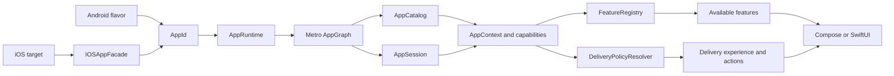
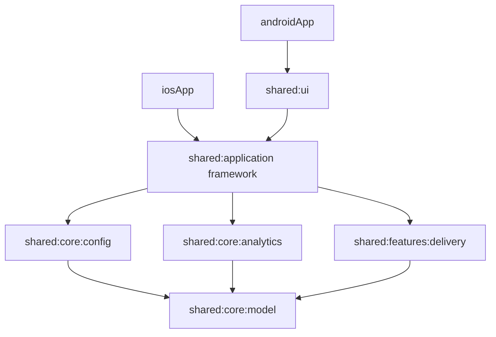
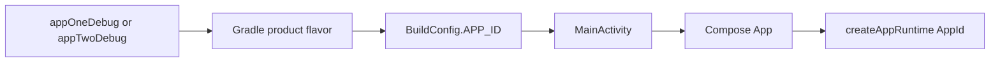
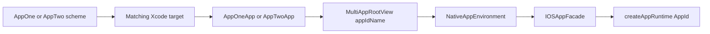
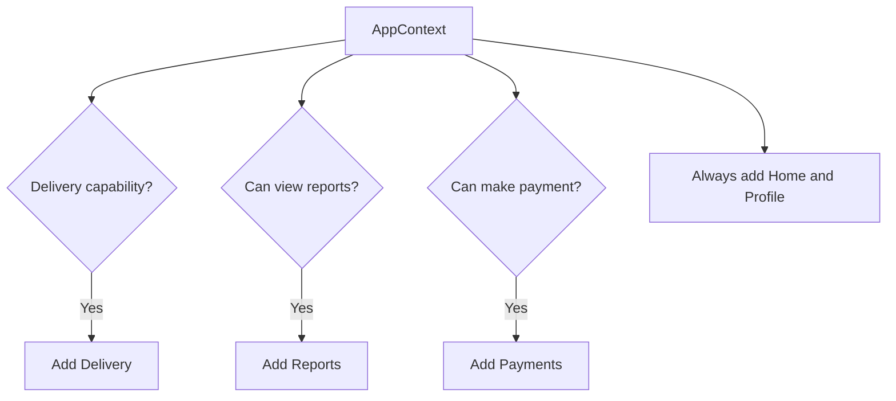
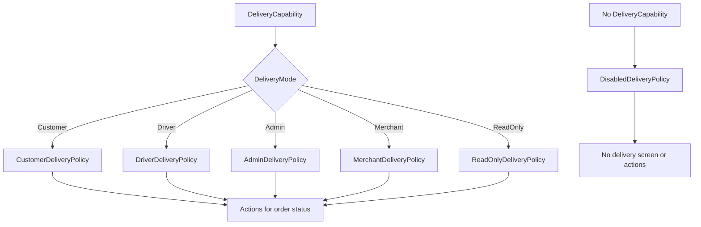
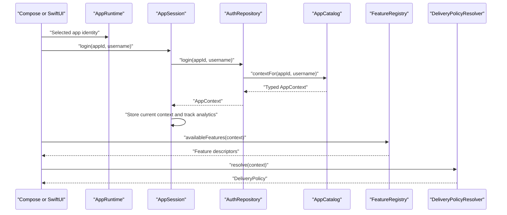

# Kotlin Multiplatform Multi-App Architecture

This project demonstrates how two independently packaged Android and iOS applications can share Kotlin Multiplatform business logic while presenting different features and delivery experiences.

The important distinction is that this is **not a single app with an app switcher**:

- AppOne and AppTwo have different Android application IDs.
- AppOne and AppTwo have different iOS bundle IDs and Xcode targets.
- Both apps can be installed on the same device.
- The selected Android flavor or iOS target supplies the app identity.
- Shared configuration converts app identity and user identity into typed capabilities.
- Features and actions are derived from capabilities rather than scattered app-name checks.

## Technology

| Area | Technology |
|---|---|
| Shared language | Kotlin 2.4.0 |
| Build system | Gradle 9.5.0 |
| Android | Android Gradle Plugin 9.2.1, Jetpack Compose |
| Shared UI toolkit | Compose Multiplatform 1.11.1 |
| iOS | SwiftUI with a Kotlin facade |
| Dependency injection | Metro 1.1.1 |
| Shared targets | Android, iOS arm64, iOS Simulator arm64 |

## Applications

| App | Purpose | Android ID | iOS bundle ID | Default user |
|---|---|---|---|---|
| AppOne | Customer and driver delivery app | `com.aeshma.appone` | `com.aeshma.appone` | `customer` |
| AppTwo | Admin and merchant operations app | `com.aeshma.apptwo` | `com.aeshma.apptwo` | `admin` |

Both applications use the same shared modules. Their identities and user profiles produce different capability sets, which produce different feature lists and delivery policies.

> The feature implementations are present in the shared binary. This sample demonstrates runtime capability-based availability, not per-app binary feature exclusion. Separate per-app dependency graphs or app modules would be required when a feature must be physically absent from one binary.

## Architecture Overview



The UI is intentionally near the end of the flow. It receives features and actions that have already been selected by shared logic.

## Module Structure

```text
androidApp/
  Android shell, product flavors and launcher activity

iosApp/
  AppOne and AppTwo SwiftUI targets
  Shared SwiftUI state, actions, store and views

shared/
  core/
    model/          AppId, AppContext, FeatureId and capability contracts
    config/         App definitions, profiles, presets, catalog and local auth
    analytics/      Analytics interface and local implementation
  features/
    delivery/       Delivery models, repository, policies and resolver
  application/      Session, feature registry, Metro graph, snapshots and iOS facade
  ui/               Android Compose presentation
```

### Module Dependency Diagram



Dependency rules:

- Platform shells know the selected app identity.
- `shared:application` composes use cases and dependencies.
- Feature modules own feature-specific models and behavior.
- Core modules do not depend on UI or platform APIs.
- Metro is limited to the application wiring layer.
- Business logic remains ordinary constructor-based Kotlin.

## Multi-App Selection Mechanism

App selection happens before login. Login does not choose AppOne or AppTwo.

### Android Selection

Android uses one `androidApp` module with two product flavors:

```kotlin
productFlavors {
    create("appOne") {
        applicationId = "com.aeshma.appone"
        resValue("string", "app_name", "AppOne")
        buildConfigField("String", "APP_ID", "\"AppOne\"")
    }
    create("appTwo") {
        applicationId = "com.aeshma.apptwo"
        resValue("string", "app_name", "AppTwo")
        buildConfigField("String", "APP_ID", "\"AppTwo\"")
    }
}
```

The selected Build Variant generates a different `BuildConfig.APP_ID`. `MainActivity` converts that string into `AppId` and passes it into the Compose app:

```kotlin
setContent {
    App(appId = AppId.fromExternalName(BuildConfig.APP_ID))
}
```



### iOS Selection

iOS uses separate Xcode targets and shared schemes:

- `AppOne` starts `AppOneApp.swift` and passes `"AppOne"`.
- `AppTwo` starts `AppTwoApp.swift` and passes `"AppTwo"`.

```swift
// AppOne target
MultiAppRootView(appIdName: "AppOne")

// AppTwo target
MultiAppRootView(appIdName: "AppTwo")
```

`NativeAppEnvironment` creates `IOSAppFacade`, which converts the supplied name into the shared `AppId` and creates the same `AppRuntime` used by Android.



## Runtime Composition With Metro

`AppGraph` is the application dependency graph. Its factory receives two runtime values:

- The app identity selected by the platform.
- The app catalog containing registered app definitions.

```kotlin
@DependencyGraph
interface AppGraph {
    val appId: AppId
    val appCatalog: AppCatalog
    val session: AppSession

    @DependencyGraph.Factory
    fun interface Factory {
        fun create(
            @Provides appId: AppId,
            @Provides appCatalog: AppCatalog,
        ): AppGraph
    }
}
```

The graph binds:

| Interface or service | Implementation |
|---|---|
| `AuthRepository` | `LocalAuthRepository` |
| `AnalyticsClient` | `ConsoleAnalyticsClient` |
| `DeliveryRepository` | `SampleDeliveryRepository` |
| Feature selection | `FeatureRegistry` |
| Delivery strategy selection | `DeliveryPolicyResolver` |
| Session orchestration | `AppSession` |

Metro is useful here because it validates the dependency graph at compile time. It is not used inside domain models or delivery policies, keeping those classes simple to construct and test.

## Shared Configuration

Configuration has four levels:

```text
AppDefinition
  -> user profile
      -> UserType
      -> UserCapabilities
          -> DeliveryCapability
          -> ReportsCapability
          -> PaymentsCapability
```

### App Definition

Each app definition contains:

```kotlin
data class AppDefinition(
    val id: AppId,
    val displayName: String,
    val configKey: String,
    val defaultUsername: String,
    val profiles: Map<String, UserProfile>,
)
```

`AppCatalog` performs case-insensitive app lookup, normalizes usernames, validates definitions and creates the final `AppContext`.

Unknown values do not silently become another user:

- Unknown app: `UnknownAppException`
- Unknown username: `UnknownProfileException`
- Session used before login: `SessionNotStartedException`

### AppOne Sample Configuration

```kotlin
fun appOneDefinition() = AppDefinition(
    id = AppId.AppOne,
    displayName = "AppOne",
    configKey = "appOne",
    defaultUsername = "customer",
    profiles = linkedMapOf(
        "customer" to UserProfile(UserType.Customer, CapabilityPresets.customer()),
        "driver" to UserProfile(UserType.Driver, CapabilityPresets.driver()),
        "readonly" to UserProfile(UserType.Customer, CapabilityPresets.readOnly()),
        "admin" to UserProfile(UserType.Customer, CapabilityPresets.none()),
        "merchant" to UserProfile(UserType.Customer, CapabilityPresets.none()),
        "nod" to UserProfile(UserType.Customer, CapabilityPresets.none()),
    ),
)
```

### AppTwo Sample Configuration

```kotlin
fun appTwoDefinition() = AppDefinition(
    id = AppId.AppTwo,
    displayName = "AppTwo",
    configKey = "appTwo",
    defaultUsername = "admin",
    profiles = linkedMapOf(
        "admin" to UserProfile(UserType.Admin, CapabilityPresets.admin()),
        "merchant" to UserProfile(UserType.Merchant, CapabilityPresets.merchant()),
        "readonly" to UserProfile(UserType.Merchant, CapabilityPresets.readOnly()),
        "driver" to UserProfile(UserType.Merchant, CapabilityPresets.none()),
        "customer" to UserProfile(UserType.Merchant, CapabilityPresets.none()),
        "nod" to UserProfile(UserType.Merchant, CapabilityPresets.none()),
    ),
)
```

## App And User Behavior Matrix

### AppOne

| Username | User type | Visible features | Delivery experience | Payments | Reports |
|---|---|---|---|---|---|
| `customer` | Customer | Home, Delivery, Payments, Profile | Customer Delivery | Make payment and history | No |
| `driver` | Driver | Home, Delivery, Profile | Driver Delivery | No | No |
| `readonly` | Customer | Home, Delivery, Profile | Read Only Delivery | No | No |
| `admin` | Customer | Home, Profile | Delivery Disabled | No | No |
| `merchant` | Customer | Home, Profile | Delivery Disabled | No | No |
| `nod` | Customer | Home, Profile | Delivery Disabled | No | No |

### AppTwo

| Username | User type | Visible features | Delivery experience | Payments | Reports |
|---|---|---|---|---|---|
| `admin` | Admin | Home, Delivery, Reports, Profile | Admin Delivery | No | Global and merchant reports |
| `merchant` | Merchant | Home, Delivery, Reports, Profile | Merchant Delivery | No | Merchant reports |
| `readonly` | Merchant | Home, Delivery, Profile | Read Only Delivery | No | No |
| `driver` | Merchant | Home, Profile | Delivery Disabled | No | No |
| `customer` | Merchant | Home, Profile | Delivery Disabled | No | No |
| `nod` | Merchant | Home, Profile | Delivery Disabled | No | No |

The `nod` username is a normal profile with `UserCapabilities.none()`. It is not a special conditional in authentication.

## Capability-Based Feature Selection

`FeatureRegistry` applies these rules:

| Feature | Stable ID | Availability rule |
|---|---|---|
| Home | `home` | Always available after login |
| Delivery | `delivery` | `capabilities.delivery != null` |
| Reports | `reports` | `reports.canViewReports == true` |
| Payments | `payments` | `payments.canMakePayment == true` |
| Profile | `profile` | Always available after login |

Feature ID and display title are separate. Navigation uses stable IDs, while UI displays titles. Changing `Delivery` to another title does not break navigation or analytics.



## Experience-Based Delivery Behavior

Feature availability and feature behavior are separate decisions:

- `FeatureRegistry` decides whether Delivery is visible.
- `DeliveryPolicyResolver` decides how Delivery behaves.
- A `DeliveryPolicy` decides which actions are allowed for each order status.



### Delivery Action Matrix

| Experience | Created | Assigned | Picked up | Delivered | Cancelled |
|---|---|---|---|---|---|
| Customer | Cancel, Edit Address, Track | Track | Track | View Only | View Only |
| Driver | Accept | Mark Picked Up, Track | Mark Delivered, Track | View Only | View Only |
| Admin | Cancel, Edit Address, Track | Cancel, Edit Address, Track | Track | View Only | View Only |
| Merchant | Track | Track | Track | View Only | View Only |
| Read Only | View Only | View Only | View Only | View Only | View Only |
| Disabled | No actions | No actions | No actions | No actions | No actions |

The resolver checks `DeliveryMode`, not AppOne/AppTwo. AppThree could reuse `CustomerDeliveryPolicy` simply by receiving a customer delivery capability.

## Login And Session Flow



`AppSession` is the application-facing API. It owns the current context, exposes available features, delivery policy and sample orders, and records login/feature analytics through `AnalyticsClient`.

## iOS Facade And Snapshots

Swift could call every Kotlin repository and policy directly, but that would expose too much KMP implementation detail. `IOSAppFacade` provides one small boundary:

```kotlin
class IOSAppFacade(appIdName: String) {
    val appName: String
    val defaultUsername: String
    val supportedUsernames: List<String>

    suspend fun login(username: String): SharedSessionSnapshot
}
```

The facade:

1. Creates the shared runtime for the selected app.
2. Exposes usernames from the app definition.
3. Runs shared login.
4. Resolves features and delivery policies.
5. Maps Kotlin domain objects into immutable Swift-friendly snapshots.

```text
SharedSessionSnapshot
  userSummary
  availableFeatures[]
    id
    title
  deliveryExperienceName
  deliveryOrders[]
    id
    title
    status
    actions[]
```

SwiftUI only renders the snapshot. It does not contain AppOne/AppTwo permission matrices or delivery action rules.

## Running Android Apps In Android Studio

### Prerequisites

- Android Studio with Android SDK 36 installed.
- JDK 21 is recommended. Kotlin bytecode currently targets JVM 11.
- An Android emulator or connected device with API 30 or newer.

### Run AppOne

1. Open the repository root in Android Studio.
2. Allow Gradle sync to finish.
3. Open **View > Tool Windows > Build Variants**.
4. Find the `androidApp` module.
5. Select `appOneDebug`.
6. Select an emulator or connected device.
7. Choose the `androidApp` run configuration.
8. Click **Run**.

Expected result:

- Launcher name: AppOne
- Package: `com.aeshma.appone`
- Default user: `customer`
- Customer, driver and read-only delivery experiences are available through the sample profiles.

### Run AppTwo

1. Open **Build Variants** again.
2. Change `androidApp` to `appTwoDebug`.
3. Keep the same `androidApp` run configuration.
4. Click **Run**.

Expected result:

- Launcher name: AppTwo
- Package: `com.aeshma.apptwo`
- Default user: `admin`
- Admin, merchant and read-only delivery experiences are available through the sample profiles.

Because the application IDs differ, AppOne and AppTwo can remain installed together.

### Android Command Line

Build APKs:

```bash
./gradlew :androidApp:assembleAppOneDebug
./gradlew :androidApp:assembleAppTwoDebug
```

Install on a running emulator or connected device:

```bash
./gradlew :androidApp:installAppOneDebug
./gradlew :androidApp:installAppTwoDebug
```

Compile only:

```bash
./gradlew :androidApp:compileAppOneDebugKotlin
./gradlew :androidApp:compileAppTwoDebugKotlin
```

## Running iOS Apps In Xcode

### Prerequisites

- Full Xcode installation.
- An installed iOS Simulator runtime.
- JDK 21 available to the Xcode build script. The current script expects Homebrew OpenJDK at `/opt/homebrew/opt/openjdk@21/libexec/openjdk.jdk/Contents/Home`; update the Xcode build phase if your JDK is elsewhere.

Make sure command-line tools point to full Xcode rather than only `/Library/Developer/CommandLineTools`:

```bash
sudo xcode-select -s /Applications/Xcode.app/Contents/Developer
xcodebuild -version
```

If using Xcode Beta, use its path instead:

```bash
sudo xcode-select -s /Applications/Xcode-beta.app/Contents/Developer
```

### Run AppOne

1. Open `iosApp/iosApp.xcodeproj` in Xcode.
2. Use the scheme selector in the top toolbar.
3. Select the shared `AppOne` scheme.
4. Select an iPhone simulator.
5. Click **Run** or press `Cmd+R`.

Expected result:

- Product: AppOne
- Bundle ID: `com.aeshma.appone`
- Entry point: `AppOne/AppOneApp.swift`
- Injected identity: `AppOne`
- Default profile: `customer`

### Run AppTwo

1. Change the Xcode scheme to `AppTwo`.
2. Keep or select an iPhone simulator.
3. Click **Run** or press `Cmd+R`.

Expected result:

- Product: AppTwo
- Bundle ID: `com.aeshma.apptwo`
- Entry point: `AppTwo/AppTwoApp.swift`
- Injected identity: `AppTwo`
- Default profile: `admin`

Both Xcode targets run this Gradle task from their build phase:

```bash
./gradlew :shared:application:embedAndSignAppleFrameworkForXcode
```

The produced framework is named `SharedLogic.framework` and is imported by Swift as:

```swift
import SharedLogic
```

### iOS Troubleshooting

If Xcode reports stale Kotlin/Swift symbols:

1. Select **Product > Clean Build Folder** using `Shift+Cmd+K`.
2. Build again.
3. Confirm `SharedLogic.framework` was rebuilt by the Gradle build phase.

Compile the shared iOS Kotlin target directly:

```bash
./gradlew :shared:application:compileKotlinIosSimulatorArm64
```

Link a debug simulator framework:

```bash
./gradlew :shared:application:linkDebugFrameworkIosSimulatorArm64
```

If `xcrun` cannot find `xcodebuild`, correct `xcode-select` using the commands above.

## Testing

Run the focused shared tests:

```bash
./gradlew :shared:core:config:testAndroidHostTest
./gradlew :shared:features:delivery:testAndroidHostTest
./gradlew :shared:application:testAndroidHostTest
```

Run tests and compile every active app path:

```bash
./gradlew \
  :shared:core:config:testAndroidHostTest \
  :shared:features:delivery:testAndroidHostTest \
  :shared:application:testAndroidHostTest \
  :shared:application:compileKotlinIosSimulatorArm64 \
  :androidApp:compileAppOneDebugKotlin \
  :androidApp:compileAppTwoDebugKotlin
```

Current tests cover:

- App definition defaults and profile lookup.
- Username normalization.
- `nod` as a normal no-capability profile.
- Typed failures for unknown apps and profiles.
- Adding AppThree without changing core behavior.
- Delivery policy selection by capability rather than app identity.
- Delivery actions by order status.
- Stable feature IDs.
- Table-driven feature availability.
- Metro graph creation for the selected app.

## Adding A New App

Suppose the new app is AppThree.

1. Create the identity:

```kotlin
val appThree = AppId("AppThree")
```

2. Create `AppThreeDefinition.kt`:

```kotlin
fun appThreeDefinition() = AppDefinition(
    id = AppId("AppThree"),
    displayName = "AppThree",
    configKey = "appThree",
    defaultUsername = "viewer",
    profiles = linkedMapOf(
        "viewer" to UserProfile(UserType.Customer, CapabilityPresets.readOnly()),
    ),
)
```

3. Register it in `defaultAppDefinitions()`.
4. Add an Android flavor with `APP_ID = "AppThree"`.
5. Add an iOS target and entry point passing `"AppThree"`.
6. Add catalog, feature and behavior tests.

No authentication branch, feature availability branch, delivery resolver branch or Swift permission matrix is needed when AppThree reuses existing capabilities.

## Adding A New Feature

Create a separate feature module when the feature has meaningful independent behavior.

1. Add `shared/features/<feature>`.
2. Add a stable `FeatureId`.
3. Add typed capability data to the shared model.
4. Add a descriptor to `FeatureRegistry`.
5. Add repositories or policies inside the feature module.
6. Bind interfaces in `AppGraph`.
7. Add Compose and SwiftUI presentation.
8. Add feature-level and application-level tests.

Avoid creating empty modules for static screens. Home and Profile remain application-level descriptors because they currently have no independent domain logic.

## Design Principles

- **App identity selects configuration, not UI branches.**
- **Capabilities describe what the user may do.**
- **Feature registry controls availability.**
- **Policies control behavior and actions.**
- **Platform targets own packaging and entry points.**
- **Shared application code owns orchestration.**
- **Facades protect native code from KMP implementation detail.**
- **Stable IDs are separate from display text.**
- **Unknown configuration fails explicitly.**
- **DI remains at the composition boundary.**
