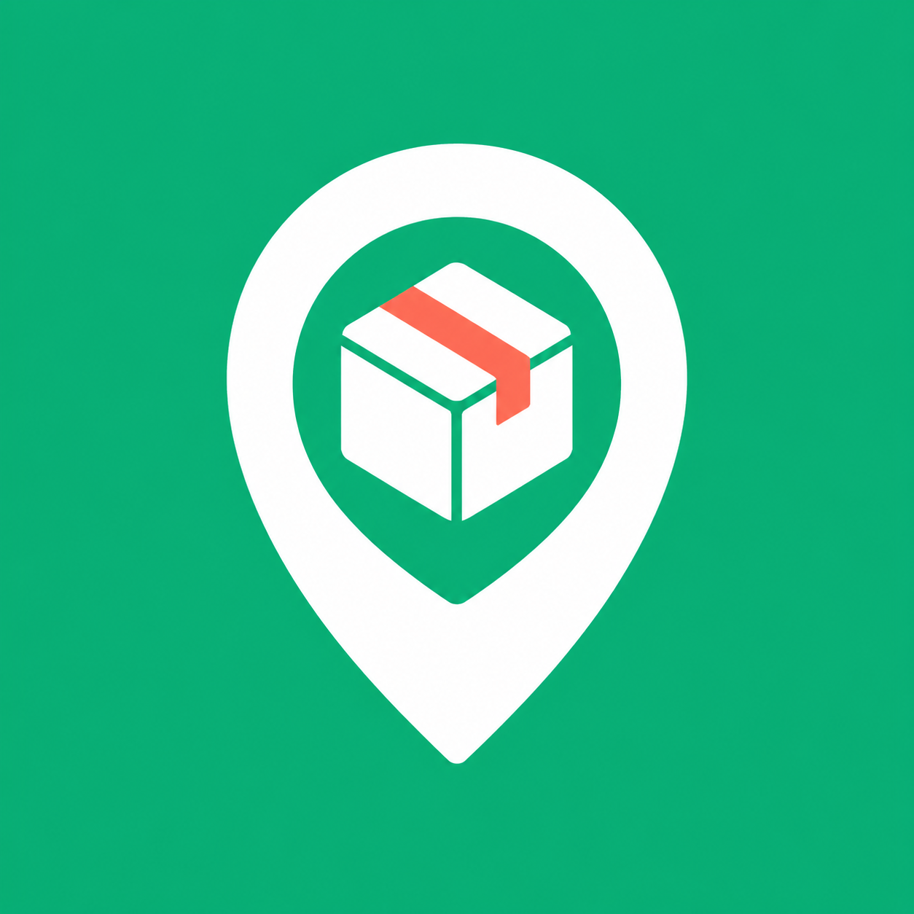
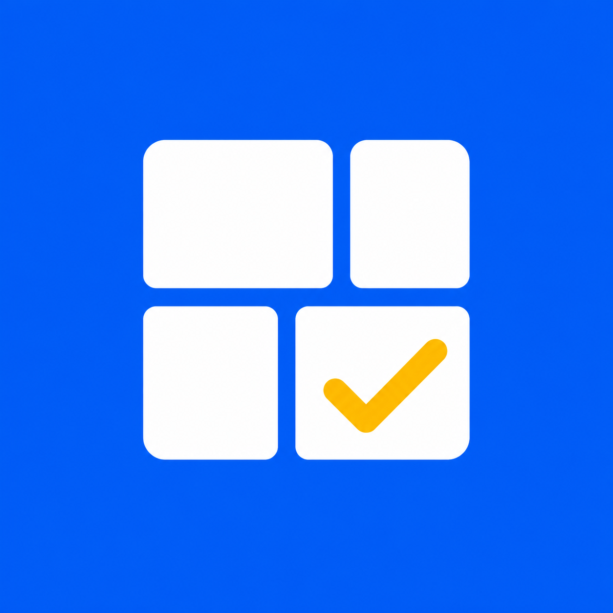
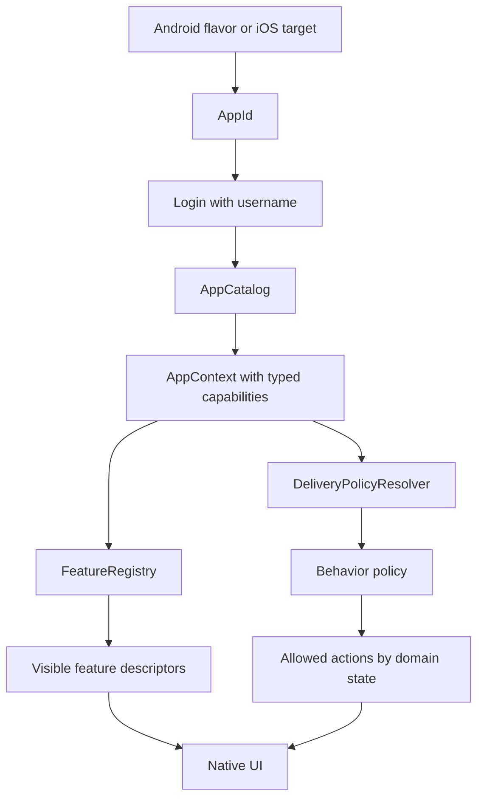
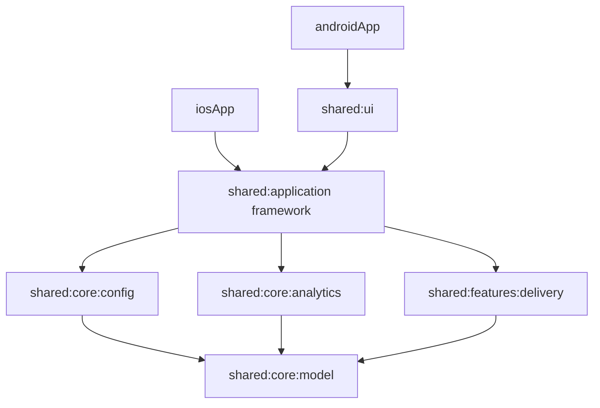
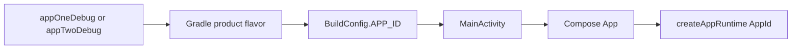
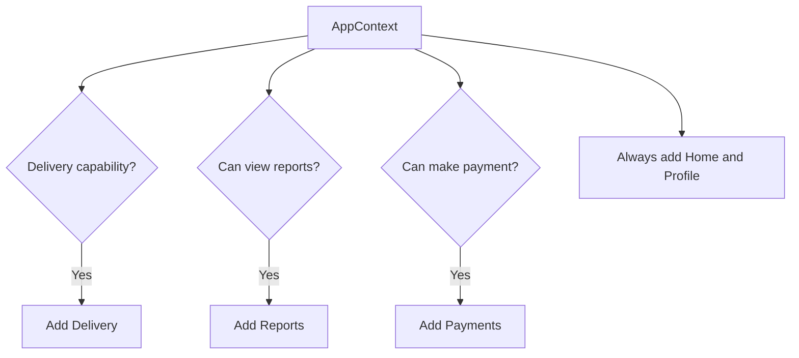
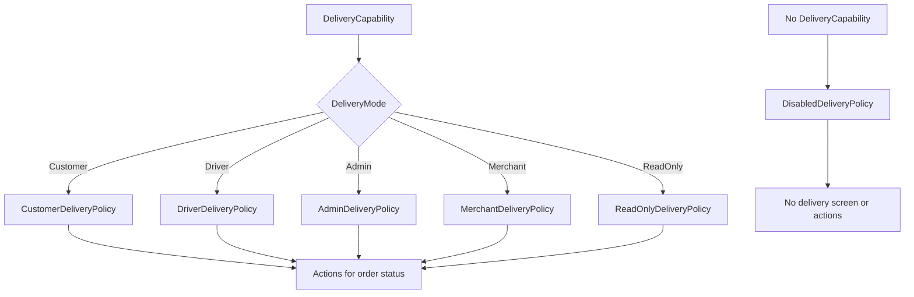
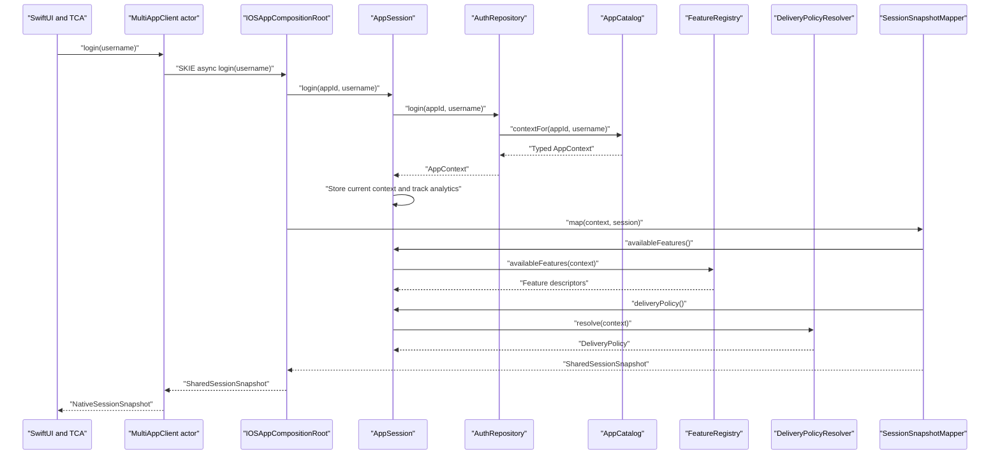

# Kotlin Multiplatform Multi-App Architecture

This project demonstrates how two independently packaged Android and iOS applications can share Kotlin Multiplatform business logic while presenting different features and delivery experiences.

The important distinction is that this is **not a single app with an app switcher**:

- AppOne and AppTwo have different Android application IDs.
- AppOne and AppTwo have different iOS bundle IDs and Xcode targets.
- Both apps can be installed on the same device.
- The selected Android flavor or iOS target supplies the app identity.
- Shared configuration converts app identity and user identity into typed capabilities.
- Features and actions are derived from capabilities rather than scattered app-name checks.

## Current Status

The architecture is implemented end to end on both platforms:

| Area | Current implementation | Verification |
|---|---|---|
| Android products | `appOne` and `appTwo` product flavors inject `BuildConfig.APP_ID` | Both debug variants compile |
| iOS products | Independent AppOne and AppTwo targets/schemes inject `appIdName` | Both simulator builds pass |
| Shared composition | Metro builds `AppGraph`, `AppRuntime` and `AppSession` | Shared application tests pass |
| iOS presentation | SwiftUI driven by a real TCA reducer and Point-Free Dependencies | Local TCA package tests pass |
| Kotlin/Swift interop | SKIE exposes Kotlin suspend APIs as Swift `async` functions | Simulator framework links successfully |
| Session lifecycle | Login and logout update the same shared `AppSession` | Lifecycle and cancellation tests pass |

The earlier limitations no longer apply: iOS does not mirror feature or experience rules in Swift, and it no longer uses a hand-written TCA-shaped store or a continuation-based Kotlin callback adapter. Swift calls the shared composition root through an actor-isolated dependency client.

## Technology

| Area | Technology |
|---|---|
| Shared language | Kotlin 2.3.21 |
| Build system | Gradle 9.5.0 |
| Android | Android Gradle Plugin 9.2.1, Jetpack Compose |
| Shared UI toolkit | Compose Multiplatform 1.11.1 |
| iOS | SwiftUI, The Composable Architecture 1.25.5, Dependencies 1.14.1 |
| Kotlin/Swift interop | SKIE 0.10.12 |
| Dependency injection | Metro 1.1.1 |
| Shared targets | Android, iOS arm64, iOS Simulator arm64 |

## Applications

| App | Purpose | Android ID | iOS bundle ID | Default user |
|---|---|---|---|---|
| AppOne | Customer and driver delivery app | `com.aeshma.appone` | `com.aeshma.appone` | `customer` |
| AppTwo | Admin and merchant operations app | `com.aeshma.apptwo` | `com.aeshma.apptwo` | `admin` |

Both applications use the same shared modules. Their identities and user profiles produce different capability sets, which produce different feature lists and delivery policies.

> The feature implementations are present in the shared binary. This sample demonstrates runtime capability-based availability, not per-app binary feature exclusion. Separate per-app dependency graphs or app modules would be required when a feature must be physically absent from one binary.

### App Icons

Each application has its own generated icon and matching iOS accent color:

| App | Icon concept | Android resources | iOS asset catalog |
|---|---|---|---|
| AppOne | Emerald location pin and parcel | `androidApp/src/appOne/res` | `iosApp/AppOne/Assets.xcassets` |
| AppTwo | Blue operations grid and gold check | `androidApp/src/appTwo/res` | `iosApp/AppTwo/Assets.xcassets` |

| AppOne | AppTwo |
|---|---|
|  |  |

The original 1254px generated masters are retained in `design/app-icons`. Android contains density-specific legacy icons plus adaptive-icon resources; iOS uses a target-specific 1024px App Store icon. Because each flavor/target owns an `AppIcon` resource with the same logical name, platform manifests and Swift code do not need app-specific icon branches.

The icons were generated with the built-in image generation tool using simple logo prompts: AppOne combines a delivery location pin and parcel on emerald, while AppTwo combines an operations grid and completion check on cobalt. Both prompts requested centered, text-free artwork with sufficient safe space for Android adaptive masks.

## Core Mechanism: Identity, Features And Experience

The architecture separates three decisions that are often mixed together in multi-app projects:

| Decision | Question | Input | Output |
|---|---|---|---|
| App selection | Which installed product is running? | Android flavor or iOS target | `AppId` |
| Feature selection | Which features may this user enter? | `AppContext.capabilities` | `List<FeatureDescriptor>` |
| Experience selection | How does an available feature behave? | Feature capability and mode | Policy/strategy such as `DeliveryPolicy` |

The complete pipeline is:

```text
Android flavor / iOS target
    -> injects AppId
    -> login resolves AppId + username into AppContext
    -> FeatureRegistry returns available features
    -> DeliveryPolicyResolver returns a behavior policy
    -> UI renders only the returned features and actions
```



The central rule is:

> `AppId` selects configuration. Capabilities select features. Policies select behavior. UI renders the result.

`AppId` should not become a global switch used throughout the application. After login, most shared and UI code should work from `AppContext` and typed capabilities.

### Step 1: The Platform Injects App Identity

App identity belongs to packaging and composition, not login UI.

On Android, selecting a flavor generates a different `BuildConfig.APP_ID`:

```kotlin
// androidApp/build.gradle.kts
productFlavors {
    create("appOne") {
        applicationId = "com.aeshma.appone"
        buildConfigField("String", "APP_ID", "\"AppOne\"")
    }
    create("appTwo") {
        applicationId = "com.aeshma.apptwo"
        buildConfigField("String", "APP_ID", "\"AppTwo\"")
    }
}
```

`MainActivity` passes the generated value into shared UI:

```kotlin
setContent {
    App(appId = AppId.fromExternalName(BuildConfig.APP_ID))
}
```

On iOS, each target has its own entry point:

```swift
// AppOne/AppOneApp.swift
MultiAppRootView(appIdName: "AppOne")

// AppTwo/AppTwoApp.swift
MultiAppRootView(appIdName: "AppTwo")
```

Both platforms eventually create the same shared runtime:

```kotlin
fun createAppRuntime(
    appId: AppId,
    appCatalog: AppCatalog = AppCatalog(defaultAppDefinitions()),
): AppRuntime =
    AppRuntime(
        createGraphFactory<AppGraph.Factory>()
            .create(appId, appCatalog),
    )
```

This is the only point where the running product identity enters the shared application graph.

### Step 2: Login Creates A Typed AppContext

Login combines two independent inputs:

- `AppId`: the installed product.
- `username`: the current user/profile.

The result is an `AppContext`:

```kotlin
data class AppContext(
    val appId: AppId,
    val userId: String,
    val userType: UserType,
    val capabilities: UserCapabilities,
)
```

`LocalAuthRepository` does not contain AppOne/AppTwo branches. It delegates configuration resolution to `AppCatalog`:

```kotlin
class LocalAuthRepository(
    private val appCatalog: AppCatalog,
) : AuthRepository {
    override suspend fun login(
        appId: AppId,
        username: String,
    ): AppContext = appCatalog.contextFor(appId, username)
}
```

`AppCatalog` finds the app definition, then finds the user profile inside that definition:

```kotlin
fun contextFor(appId: AppId, username: String): AppContext {
    val definition = definition(appId)
    val normalizedUsername = username.trim().lowercase()
    val profile = definition.profileFor(normalizedUsername)

    return AppContext(
        appId = definition.id,
        userId = "${definition.configKey}-$normalizedUsername",
        userType = profile.userType,
        capabilities = profile.capabilities,
    )
}
```

For example:

```text
AppOne + customer
    -> UserType.Customer
    -> DeliveryCapability(mode = Customer, ...)
    -> PaymentsCapability(...)
    -> no ReportsCapability

AppTwo + merchant
    -> UserType.Merchant
    -> DeliveryCapability(mode = Merchant, ...)
    -> ReportsCapability(merchant reports = true)
    -> no PaymentsCapability
```

The rest of the app consumes these typed results. It does not need to know which configuration file or server response produced them.

In a production project, `LocalAuthRepository` can be replaced with a remote implementation:

```text
API response / remote config
    -> DTO validation
    -> domain mapper
    -> AppContext with typed capabilities
```

The feature registry and policies remain unchanged because they depend on `AppContext`, not the source of configuration.

### Step 3: FeatureRegistry Selects Visibility

A feature descriptor owns its stable ID, display title and availability rule:

```kotlin
class FeatureDescriptor(
    val id: FeatureId,
    val title: String,
    private val availability: (AppContext) -> Boolean,
) {
    fun isAvailable(context: AppContext): Boolean = availability(context)
}
```

The registry contains the complete feature menu and filters it using the current context:

```kotlin
class FeatureRegistry {
    private val features = listOf(
        FeatureDescriptor(FeatureId.Home, "Home") { true },
        FeatureDescriptor(FeatureId.Delivery, "Delivery") {
            it.capabilities.delivery != null
        },
        FeatureDescriptor(FeatureId.Reports, "Reports") {
            it.capabilities.reports?.canViewReports == true
        },
        FeatureDescriptor(FeatureId.Payments, "Payments") {
            it.capabilities.payments?.canMakePayment == true
        },
        FeatureDescriptor(FeatureId.Profile, "Profile") { true },
    )

    fun availableFeatures(context: AppContext): List<FeatureDescriptor> =
        features.filter { it.isAvailable(context) }
}
```

Notice what is deliberately absent:

```kotlin
// Avoid this pattern.
if (appId == AppId.AppOne && userType == UserType.Customer) {
    showDelivery()
}
```

The registry asks only whether the required capability exists. This makes feature availability reusable across new apps and new user types.

Examples:

```text
AppOne customer capabilities
    -> Home, Delivery, Payments, Profile

AppTwo merchant capabilities
    -> Home, Delivery, Reports, Profile

AppTwo nod capabilities
    -> Home, Profile
```

### Step 4: A Policy Selects Feature Behavior

Feature visibility answers whether Delivery can be opened. It does not describe what the user can do inside Delivery.

That second question is handled by the Strategy pattern:

```kotlin
interface DeliveryPolicy {
    val experienceName: String
    fun availableActions(order: DeliveryOrder): List<DeliveryAction>
    fun canOpenDeliveryDetails(order: DeliveryOrder): Boolean
}
```

`DeliveryPolicyResolver` converts the typed delivery mode into one policy:

```kotlin
class DeliveryPolicyResolver {
    fun resolve(context: AppContext): DeliveryPolicy {
        val delivery = context.capabilities.delivery
            ?: return DisabledDeliveryPolicy

        return when (delivery.mode) {
            DeliveryMode.Customer -> CustomerDeliveryPolicy(delivery)
            DeliveryMode.Driver -> DriverDeliveryPolicy(delivery)
            DeliveryMode.Admin -> AdminDeliveryPolicy(delivery)
            DeliveryMode.Merchant -> MerchantDeliveryPolicy(delivery)
            DeliveryMode.ReadOnly -> ReadOnlyDeliveryPolicy
        }
    }
}
```

Again, there are no AppOne/AppTwo checks. Two different apps can reuse the same experience by receiving the same capability mode.

The selected policy then combines capability flags with domain state:

```kotlin
// Simplified customer policy example
override fun availableActions(order: DeliveryOrder): List<DeliveryAction> =
    when (order.status) {
        DeliveryStatus.Created -> buildList {
            if (capability.canCancelDelivery) add(DeliveryAction.Cancel)
            if (capability.canEditAddress) add(DeliveryAction.EditAddress)
            if (capability.showLiveTracking) add(DeliveryAction.Track)
        }
        DeliveryStatus.Assigned,
        DeliveryStatus.PickedUp -> listOf(DeliveryAction.Track)
        DeliveryStatus.Delivered,
        DeliveryStatus.Cancelled -> listOf(DeliveryAction.ViewOnly)
    }
```

This produces two levels of control:

```text
DeliveryCapability exists
    -> Delivery appears in navigation

DeliveryCapability.mode and flags + DeliveryOrder.status
    -> Customer/Driver/Admin/Merchant/ReadOnly experience
    -> Allowed actions for that specific order
```

### Step 5: UI Only Renders The Decisions

Compose asks `AppSession` for available features after login:

```kotlin
coroutineScope.launch {
    context = session.login(runtime.appId, selectedUser)
    features = session.availableFeatures()
    screen = Screen.Features
}
```

It renders the returned descriptors without reconstructing permission rules:

```kotlin
items(features, key = { it.id.value }) { feature ->
    Card(
        modifier = Modifier.clickable {
            onFeatureTapped(feature)
        },
    ) {
        Text(feature.title)
    }
}
```

The Delivery screen renders actions returned by the selected policy:

```kotlin
val policy = session.deliveryPolicy()

DeliveryView(
    policyName = policy.experienceName,
    orders = session.deliveryOrders(),
    actionsForOrder = policy::availableActions,
)
```

The same rule applies on iOS. `IOSAppCompositionRoot` returns `SharedSessionSnapshot`, containing already-selected features, experience name and order actions. The TCA dependency client maps that snapshot into native state and SwiftUI renders it.

The UI may switch on stable `FeatureId` for navigation to the correct screen. It should not switch on `AppId`, `UserType` or raw permission strings to decide availability or behavior.

### Two End-To-End Examples

#### AppOne Customer

```text
appOneDebug flavor / AppOne Xcode target
    -> AppId("AppOne")
    -> login("customer")
    -> AppCatalog selects AppOne.customer profile
    -> AppContext contains Customer delivery + Payments
    -> FeatureRegistry returns Home, Delivery, Payments, Profile
    -> DeliveryPolicyResolver returns CustomerDeliveryPolicy
    -> Created order returns Cancel, EditAddress, Track
    -> UI renders those four features and three order actions
```

#### AppTwo Merchant

```text
appTwoDebug flavor / AppTwo Xcode target
    -> AppId("AppTwo")
    -> login("merchant")
    -> AppCatalog selects AppTwo.merchant profile
    -> AppContext contains Merchant delivery + Merchant reports
    -> FeatureRegistry returns Home, Delivery, Reports, Profile
    -> DeliveryPolicyResolver returns MerchantDeliveryPolicy
    -> Non-terminal order returns Track
    -> UI renders those four features and the Track action
```

### Why This Scales To Other Projects

The architecture changes for different reasons in different places:

| Change | Where to modify | What should remain unchanged |
|---|---|---|
| Add a separately packaged app | Platform flavor/target and `AppDefinition` | Existing screens and policies |
| Add a user/profile | The relevant app definition | Platform entry points and UI |
| Change permissions | Capability configuration or remote mapping | UI navigation implementation |
| Add a feature | Capability, descriptor and feature module | Other feature policies |
| Add a new delivery experience | New `DeliveryMode`, policy and resolver mapping | Feature registry and platform selection |
| Change order-state actions | The selected delivery policy | App definitions and navigation |

Use these boundaries in another project:

```text
ProductIdentity                 // injected by platform packaging
SessionContext                  // identity + user + typed capabilities
FeatureRegistry                 // context -> visible features
ExperienceResolver              // context -> feature strategy
Policy                          // capability + domain state -> actions
PresentationSnapshot            // platform-friendly rendered state
```

The feature does not have to be Delivery. The same pattern works for:

- Customer checkout versus staff checkout.
- Viewer, editor and approver document experiences.
- Retail, merchant and warehouse inventory workflows.
- Free, premium and enterprise reporting.
- Patient, clinician and administrator healthcare workflows.

### Rules To Preserve

1. Inject product identity at the platform composition boundary.
2. Convert external configuration into typed domain capabilities once.
3. Keep app-name and username checks out of screens.
4. Use a registry for feature availability.
5. Use policies/strategies for behavior that varies by capability or role.
6. Let policies evaluate domain state and return allowed actions.
7. Give UI stable IDs, display models and actions to render.
8. Test capability matrices and policies independently from UI.
9. Fail explicitly for unknown apps/profiles instead of choosing an unsafe fallback.
10. Keep DI at the composition boundary so business classes stay framework-independent.

## Architecture Overview

```mermaid
flowchart LR
    Android["Android flavor"] --> Identity["AppId"]
    IOS["iOS target"] --> TCA["TCA Store"]
    TCA --> Contract["MultiAppClient contract"]
    Contract --> Gateway["actor-isolated live gateway"]
    Gateway --> IOSRoot["IOSAppCompositionRoot"]
    IOSRoot --> Identity
    Identity --> Runtime["AppRuntime"]
    Runtime --> Graph["Metro AppGraph"]
    Graph --> Catalog["AppCatalog"]
    Graph --> Session["AppSession"]
    Catalog --> Context["AppContext and capabilities"]
    Session --> Context
    Context --> Registry["FeatureRegistry"]
    Context --> Resolver["DeliveryPolicyResolver"]
    Registry --> Features["Available features"]
    Resolver --> Experience["Delivery experience and actions"]
    Features --> NativeUI["Compose or TCA-driven SwiftUI"]
    Experience --> NativeUI
```



The UI is intentionally near the end of the flow. It receives features and actions that have already been selected by shared logic.

## Module Structure

```text
androidApp/
  Android shell, product flavors and launcher activity

iosApp/
  AppOne and AppTwo SwiftUI targets
  SharedIOS/
    NativeModels.swift         Native snapshot models
    MultiAppClient.swift       TCA dependency contract
    LiveMultiAppClient.swift   Actor-isolated SKIE/KMP implementation
    MultiAppFeature.swift      Reducer, state, actions and effects
    MultiAppView.swift         SwiftUI rendering
  SharedIOSTests/              TCA reducer tests
  Package.swift                Local testable SharedIOSCore package

shared/
  core/
    model/          AppId, AppContext, FeatureId and capability contracts
    config/         App definitions, profiles, presets, catalog and local auth
    analytics/      Analytics interface and local implementation
  features/
    delivery/       Delivery models, repository, policies and resolver
  application/      Session, feature registry, Metro graph, snapshots and iOS composition root
  ui/               Android Compose presentation
```

### Module Dependency Diagram



Dependency rules:

- Platform shells know the selected app identity.
- `shared:application` composes use cases and dependencies.
- Feature modules own feature-specific models and behavior.
- Core modules do not depend on UI or platform APIs.
- Metro is limited to the application wiring layer.
- Business logic remains ordinary constructor-based Kotlin.

## Multi-App Selection Mechanism

App selection happens before login. Login does not choose AppOne or AppTwo.

### Android Selection

Android uses one `androidApp` module with two product flavors:

```kotlin
productFlavors {
    create("appOne") {
        applicationId = "com.aeshma.appone"
        resValue("string", "app_name", "AppOne")
        buildConfigField("String", "APP_ID", "\"AppOne\"")
    }
    create("appTwo") {
        applicationId = "com.aeshma.apptwo"
        resValue("string", "app_name", "AppTwo")
        buildConfigField("String", "APP_ID", "\"AppTwo\"")
    }
}
```

The selected Build Variant generates a different `BuildConfig.APP_ID`. `MainActivity` converts that string into `AppId` and passes it into the Compose app:

```kotlin
setContent {
    App(appId = AppId.fromExternalName(BuildConfig.APP_ID))
}
```



### iOS Selection

iOS uses separate Xcode targets and shared schemes:

- `AppOne` starts `AppOneApp.swift` and passes `"AppOne"`.
- `AppTwo` starts `AppTwoApp.swift` and passes `"AppTwo"`.

```swift
// AppOne target
MultiAppRootView(appIdName: "AppOne")

// AppTwo target
MultiAppRootView(appIdName: "AppTwo")
```

`MultiAppRootView` creates the live `MultiAppClient` and injects it into TCA's `DependencyValues`. Its live implementation creates an `IOSAppGateway` actor, which owns `IOSAppCompositionRoot`. The composition root converts the supplied name into the shared `AppId` and creates the same `AppRuntime` used by Android.

```mermaid
flowchart LR
    Scheme["AppOne or AppTwo scheme"] --> Target["Matching Xcode target"]
    Target --> Entry["AppOneApp or AppTwoApp"]
    Entry --> Root["MultiAppRootView appIdName"]
    Root --> Store["TCA Store and MultiAppFeature"]
    Store --> Client["MultiAppClient dependency"]
    Client --> Gateway["IOSAppGateway actor"]
    Gateway --> Composition["IOSAppCompositionRoot"]
    Composition --> Runtime["createAppRuntime AppId"]
```



## Runtime Composition With Metro

`AppGraph` is the application dependency graph. Its factory receives two runtime values:

- The app identity selected by the platform.
- The app catalog containing registered app definitions.

```kotlin
@DependencyGraph
interface AppGraph {
    val appId: AppId
    val appCatalog: AppCatalog
    val session: AppSession

    @DependencyGraph.Factory
    fun interface Factory {
        fun create(
            @Provides appId: AppId,
            @Provides appCatalog: AppCatalog,
        ): AppGraph
    }
}
```

The graph binds:

| Interface or service | Implementation |
|---|---|
| `AuthRepository` | `LocalAuthRepository` |
| `AnalyticsClient` | `ConsoleAnalyticsClient` |
| `DeliveryRepository` | `SampleDeliveryRepository` |
| Feature selection | `FeatureRegistry` |
| Delivery strategy selection | `DeliveryPolicyResolver` |
| Session orchestration | `AppSession` |

Metro is useful here because it validates the dependency graph at compile time. It is not used inside domain models or delivery policies, keeping those classes simple to construct and test.

## Shared Configuration

Configuration has four levels:

```text
AppDefinition
  -> user profile
      -> UserType
      -> UserCapabilities
          -> DeliveryCapability
          -> ReportsCapability
          -> PaymentsCapability
```

### App Definition

Each app definition contains:

```kotlin
data class AppDefinition(
    val id: AppId,
    val displayName: String,
    val configKey: String,
    val defaultUsername: String,
    val profiles: Map<String, UserProfile>,
)
```

`AppCatalog` performs case-insensitive app lookup, normalizes usernames, validates definitions and creates the final `AppContext`.

Unknown values do not silently become another user:

- Unknown app: `UnknownAppException`
- Unknown username: `UnknownProfileException`
- Session used before login: `SessionNotStartedException`

### AppOne Sample Configuration

```kotlin
fun appOneDefinition() = AppDefinition(
    id = AppId.AppOne,
    displayName = "AppOne",
    configKey = "appOne",
    defaultUsername = "customer",
    profiles = linkedMapOf(
        "customer" to UserProfile(UserType.Customer, CapabilityPresets.customer()),
        "driver" to UserProfile(UserType.Driver, CapabilityPresets.driver()),
        "readonly" to UserProfile(UserType.Customer, CapabilityPresets.readOnly()),
        "admin" to UserProfile(UserType.Customer, CapabilityPresets.none()),
        "merchant" to UserProfile(UserType.Customer, CapabilityPresets.none()),
        "nod" to UserProfile(UserType.Customer, CapabilityPresets.none()),
    ),
)
```

### AppTwo Sample Configuration

```kotlin
fun appTwoDefinition() = AppDefinition(
    id = AppId.AppTwo,
    displayName = "AppTwo",
    configKey = "appTwo",
    defaultUsername = "admin",
    profiles = linkedMapOf(
        "admin" to UserProfile(UserType.Admin, CapabilityPresets.admin()),
        "merchant" to UserProfile(UserType.Merchant, CapabilityPresets.merchant()),
        "readonly" to UserProfile(UserType.Merchant, CapabilityPresets.readOnly()),
        "driver" to UserProfile(UserType.Merchant, CapabilityPresets.none()),
        "customer" to UserProfile(UserType.Merchant, CapabilityPresets.none()),
        "nod" to UserProfile(UserType.Merchant, CapabilityPresets.none()),
    ),
)
```

## App And User Behavior Matrix

### AppOne

| Username | User type | Visible features | Delivery experience | Payments | Reports |
|---|---|---|---|---|---|
| `customer` | Customer | Home, Delivery, Payments, Profile | Customer Delivery | Make payment and history | No |
| `driver` | Driver | Home, Delivery, Profile | Driver Delivery | No | No |
| `readonly` | Customer | Home, Delivery, Profile | Read Only Delivery | No | No |
| `admin` | Customer | Home, Profile | Delivery Disabled | No | No |
| `merchant` | Customer | Home, Profile | Delivery Disabled | No | No |
| `nod` | Customer | Home, Profile | Delivery Disabled | No | No |

### AppTwo

| Username | User type | Visible features | Delivery experience | Payments | Reports |
|---|---|---|---|---|---|
| `admin` | Admin | Home, Delivery, Reports, Profile | Admin Delivery | No | Global and merchant reports |
| `merchant` | Merchant | Home, Delivery, Reports, Profile | Merchant Delivery | No | Merchant reports |
| `readonly` | Merchant | Home, Delivery, Profile | Read Only Delivery | No | No |
| `driver` | Merchant | Home, Profile | Delivery Disabled | No | No |
| `customer` | Merchant | Home, Profile | Delivery Disabled | No | No |
| `nod` | Merchant | Home, Profile | Delivery Disabled | No | No |

The `nod` username is a normal profile with `UserCapabilities.none()`. It is not a special conditional in authentication.

## Capability-Based Feature Selection

`FeatureRegistry` applies these rules:

| Feature | Stable ID | Availability rule |
|---|---|---|
| Home | `home` | Always available after login |
| Delivery | `delivery` | `capabilities.delivery != null` |
| Reports | `reports` | `reports.canViewReports == true` |
| Payments | `payments` | `payments.canMakePayment == true` |
| Profile | `profile` | Always available after login |

Feature ID and display title are separate. Navigation uses stable IDs, while UI displays titles. Changing `Delivery` to another title does not break navigation or analytics.



## Experience-Based Delivery Behavior

Feature availability and feature behavior are separate decisions:

- `FeatureRegistry` decides whether Delivery is visible.
- `DeliveryPolicyResolver` decides how Delivery behaves.
- A `DeliveryPolicy` decides which actions are allowed for each order status.



### Delivery Action Matrix

| Experience | Created | Assigned | Picked up | Delivered | Cancelled |
|---|---|---|---|---|---|
| Customer | Cancel, Edit Address, Track | Track | Track | View Only | View Only |
| Driver | Accept | Mark Picked Up, Track | Mark Delivered, Track | View Only | View Only |
| Admin | Cancel, Edit Address, Track | Cancel, Edit Address, Track | Track | View Only | View Only |
| Merchant | Track | Track | Track | View Only | View Only |
| Read Only | View Only | View Only | View Only | View Only | View Only |
| Disabled | No actions | No actions | No actions | No actions | No actions |

The resolver checks `DeliveryMode`, not AppOne/AppTwo. AppThree could reuse `CustomerDeliveryPolicy` simply by receiving a customer delivery capability.

## Login And Session Flow

The sequence below shows the current iOS login path. Android uses the same `AppSession`, registry and policy resolver directly through `shared:ui`.



`AppSession` is the application-facing API. It owns the current context, exposes available features, delivery policy and sample orders, and records login, logout and feature analytics through `AnalyticsClient`.

## iOS Composition With TCA, Dependencies And SKIE

Swift should not call every Kotlin repository and policy independently because that would recreate orchestration in the platform layer. `IOSAppCompositionRoot` owns the shared `AppRuntime` and `AppSession`, and exposes one small snapshot boundary:

```kotlin
class IOSAppCompositionRoot(appIdName: String) {
    private val runtime = createAppRuntime(AppId.fromExternalName(appIdName))

    val appName: String
    val defaultUsername: String
    val supportedUsernames: List<String>

    suspend fun login(username: String): SharedSessionSnapshot {
        val context = runtime.session.login(runtime.appId, username)
        return snapshotMapper.map(context, runtime.session)
    }

    fun logout() {
        runtime.session.logout()
    }
}
```

The composition root:

1. Creates the shared runtime for the selected app.
2. Exposes usernames from the app definition.
3. Runs login through the shared `AppSession`.
4. Resolves features and delivery policies.
5. Maps Kotlin domain objects into immutable Swift-friendly snapshots.
6. Clears the shared `AppSession` when native logout occurs.

`IOSAppFacade` remains as a deprecated compatibility wrapper, but new Swift code calls `IOSAppCompositionRoot`.

```text
SharedSessionSnapshot
  userSummary
  availableFeatures[]
    id
    title
  deliveryExperienceName
  deliveryOrders[]
    id
    title
    status
    actions[]
```

SKIE is applied only to `shared:application`, the module that produces `SharedLogic.framework`:

```kotlin
plugins {
    alias(libs.plugins.kotlinMultiplatform)
    alias(libs.plugins.skie)
}
```

SKIE generates a Swift concurrency overlay for Kotlin suspend functions. The Swift dependency client therefore uses normal `async`/`await`; there is no callback adapter or `withCheckedThrowingContinuation` in application code:

```swift
let snapshot = try await compositionRoot.login(username: username)
```

`LiveMultiAppClient` owns the composition root inside an actor. This serializes access to the mutable shared session without relying on `@unchecked Sendable`.

```swift
private actor IOSAppGateway {
    private let compositionRoot: IOSAppCompositionRoot
    nonisolated let appName: String
    nonisolated let defaultUsername: String
    nonisolated let supportedUsernames: [String]

    init(appIdName: String) {
        let root = IOSAppCompositionRoot(appIdName: appIdName)
        compositionRoot = root
        appName = root.appName
        defaultUsername = root.defaultUsername
        supportedUsernames = root.supportedUsernames
    }

    func login(username: String) async throws -> NativeSessionSnapshot {
        let snapshot = try await compositionRoot.login(username: username)
        return NativeSessionSnapshot(
            userSummary: snapshot.userSummary,
            availableFeatures: snapshot.availableFeatures.map {
                NativeFeature(id: $0.id, title: $0.title)
            },
            deliveryExperienceName: snapshot.deliveryExperienceName,
            deliveryOrders: snapshot.deliveryOrders.map {
                NativeDeliveryOrder(
                    id: $0.id,
                    title: $0.title,
                    status: $0.status,
                    actions: $0.actions
                )
            }
        )
    }

    func logout() {
        compositionRoot.logout()
    }
}
```

Only immutable app metadata is exposed as `nonisolated`. All operations touching `AppSession` remain actor-isolated.

`MultiAppClient` is the Point-Free Dependencies boundary. It hides KMP types from the reducer and makes the effect replaceable in tests:

```swift
struct MultiAppClient: Sendable {
    let appName: String
    let defaultUsername: String
    let supportedUsernames: [String]
    var login: @Sendable (String) async throws -> NativeSessionSnapshot
    var logout: @Sendable () async -> Void
}

extension DependencyValues {
    var multiAppClient: MultiAppClient {
        get { self[MultiAppClientKey.self] }
        set { self[MultiAppClientKey.self] = newValue }
    }
}
```

Each target injects its app name at the root. `MultiAppRootView` creates one live client and installs it into the TCA store:

```swift
let client = MultiAppClient.live(appIdName: appIdName)

store = Store(
    initialState: MultiAppFeature.State(
        appName: client.appName,
        supportedUsernames: client.supportedUsernames,
        selectedUsername: client.defaultUsername
    )
) {
    MultiAppFeature()
} withDependencies: {
    $0.multiAppClient = client
}
```

`MultiAppFeature` owns state transitions and asynchronous effects. Login asks only the injected client for a shared snapshot:

```swift
@Reducer
struct MultiAppFeature {
    @Dependency(\.multiAppClient) private var client

    var body: some ReducerOf<Self> {
        Reduce { state, action in
            switch action {
            case .loginTapped:
                state.isLoading = true
                let username = state.selectedUsername
                return .run { [client] send in
                    do {
                        await send(.loginSucceeded(try await client.login(username)))
                    } catch {
                        guard !Task.isCancelled else { return }
                        await send(.loginFailed(error.localizedDescription))
                    }
                }
                .cancellable(id: CancelID.login, cancelInFlight: true)

            case let .loginSucceeded(snapshot):
                state.availableFeatures = snapshot.availableFeatures
                state.deliveryExperienceName = snapshot.deliveryExperienceName
                state.deliveryOrders = snapshot.deliveryOrders
                state.selectedScreen = .features
                state.isLoading = false
                return .none

            case .logoutTapped:
                state.loggedInUserSummary = nil
                state.availableFeatures = []
                state.loginError = nil
                state.deliveryExperienceName = "Delivery Disabled"
                state.deliveryOrders = []
                state.isLoading = false
                state.selectedScreen = .login
                return .concatenate(
                    .cancel(id: CancelID.login),
                    .run { [client] _ in await client.logout() }
                )

            default:
                return .none
            }
        }
    }
}
```

The complete iOS path is:

```text
Xcode target
    -> appIdName
    -> TCA Store installs MultiAppClient
    -> actor-isolated LiveMultiAppClient owns IOSAppCompositionRoot
    -> SKIE exposes compositionRoot.login as async
    -> AppSession creates AppContext and resolves shared rules
    -> SharedSessionSnapshot returns selected features and behavior
    -> reducer updates State
    -> SwiftUI renders State and sends Actions
```

SwiftUI contains no AppOne/AppTwo permission matrices, user-role branching or delivery action rules. TCA controls presentation flow; shared Kotlin controls product configuration and business behavior.

The reducer, native models and dependency contract also form the `SharedIOSCore` local Swift package. `LiveMultiAppClient.swift` and `MultiAppView.swift` are excluded from that package, allowing reducer tests to run on macOS without linking an application host or the KMP framework. The Xcode targets continue compiling all five `SharedIOS` source files, so production still uses the live actor and shared Kotlin runtime.

### Login And Logout Lifecycle

```text
loginTapped
    -> cancel any older login effect
    -> actor calls SKIE async login
    -> AppSession stores AppContext
    -> reducer receives loginSucceeded or loginFailed

logoutTapped
    -> immediately clear presentation state
    -> cancel an in-flight login effect
    -> actor calls IOSAppCompositionRoot.logout()
    -> AppSession clears currentContext and records logout analytics
```

This prevents a late login response from reopening the feature screen after the user has logged out.

## Running Android Apps In Android Studio

### Prerequisites

- Android Studio with Android SDK 36 installed.
- JDK 21 is recommended. Kotlin bytecode currently targets JVM 11.
- An Android emulator or connected device with API 30 or newer.

### Run AppOne

1. Open the repository root in Android Studio.
2. Allow Gradle sync to finish.
3. Open **View > Tool Windows > Build Variants**.
4. Find the `androidApp` module.
5. Select `appOneDebug`.
6. Select an emulator or connected device.
7. Choose the `androidApp` run configuration.
8. Click **Run**.

Expected result:

- Launcher name: AppOne
- Package: `com.aeshma.appone`
- Default user: `customer`
- Customer, driver and read-only delivery experiences are available through the sample profiles.

### Run AppTwo

1. Open **Build Variants** again.
2. Change `androidApp` to `appTwoDebug`.
3. Keep the same `androidApp` run configuration.
4. Click **Run**.

Expected result:

- Launcher name: AppTwo
- Package: `com.aeshma.apptwo`
- Default user: `admin`
- Admin, merchant and read-only delivery experiences are available through the sample profiles.

Because the application IDs differ, AppOne and AppTwo can remain installed together.

### Android Command Line

Build APKs:

```bash
./gradlew :androidApp:assembleAppOneDebug
./gradlew :androidApp:assembleAppTwoDebug
```

Install on a running emulator or connected device:

```bash
./gradlew :androidApp:installAppOneDebug
./gradlew :androidApp:installAppTwoDebug
```

Compile only:

```bash
./gradlew :androidApp:compileAppOneDebugKotlin
./gradlew :androidApp:compileAppTwoDebugKotlin
```

## Running iOS Apps In Xcode

### Prerequisites

- Full Xcode installation.
- An installed iOS Simulator runtime.
- JDK 21 available to the Xcode build script. The current script expects Homebrew OpenJDK at `/opt/homebrew/opt/openjdk@21/libexec/openjdk.jdk/Contents/Home`; update the Xcode build phase if your JDK is elsewhere.
- Allow Xcode to resolve the pinned `ComposableArchitecture` Swift package and approve its Point-Free compiler macros when prompted.

Make sure command-line tools point to full Xcode rather than only `/Library/Developer/CommandLineTools`:

```bash
sudo xcode-select -s /Applications/Xcode.app/Contents/Developer
xcodebuild -version
```

If using Xcode Beta, use its path instead:

```bash
sudo xcode-select -s /Applications/Xcode-beta.app/Contents/Developer
```

### Run AppOne

1. Open `iosApp/iosApp.xcodeproj` in Xcode.
2. Use the scheme selector in the top toolbar.
3. Select the shared `AppOne` scheme.
4. Select an iPhone simulator.
5. Click **Run** or press `Cmd+R`.

Expected result:

- Product: AppOne
- Bundle ID: `com.aeshma.appone`
- Entry point: `AppOne/AppOneApp.swift`
- Injected identity: `AppOne`
- Default profile: `customer`

### Run AppTwo

1. Change the Xcode scheme to `AppTwo`.
2. Keep or select an iPhone simulator.
3. Click **Run** or press `Cmd+R`.

Expected result:

- Product: AppTwo
- Bundle ID: `com.aeshma.apptwo`
- Entry point: `AppTwo/AppTwoApp.swift`
- Injected identity: `AppTwo`
- Default profile: `admin`

Both Xcode targets run this Gradle task from their build phase:

```bash
./gradlew :shared:application:embedAndSignAppleFrameworkForXcode
```

The produced framework is named `SharedLogic.framework` and is imported by Swift as:

```swift
import SharedLogic
```

SKIE compiles its Swift concurrency overlay into the same framework, so no extra iOS package or runtime setup is required for SKIE.

Command-line simulator builds for both products:

```bash
xcodebuild -project iosApp/iosApp.xcodeproj \
  -scheme AppOne \
  -destination 'generic/platform=iOS Simulator' \
  -skipMacroValidation \
  CODE_SIGNING_ALLOWED=NO build

xcodebuild -project iosApp/iosApp.xcodeproj \
  -scheme AppTwo \
  -destination 'generic/platform=iOS Simulator' \
  -skipMacroValidation \
  CODE_SIGNING_ALLOWED=NO build
```

Do not add a global `-sdk iphonesimulator` argument when building TCA from the command line. Xcode must build the app for the simulator while building compiler macro executables for the Mac host.

### iOS Troubleshooting

If Xcode reports stale Kotlin/Swift symbols:

1. Select **Product > Clean Build Folder** using `Shift+Cmd+K`.
2. Build again.
3. Confirm `SharedLogic.framework` was rebuilt by the Gradle build phase.

Some Xcode 26.x installations have a SwiftSyntax prebuilt-module issue that reports missing `SwiftSyntax`, `SwiftCompilerPlugin`, or malformed macro responses. Disable the prebuilt optimization and clear this project's DerivedData before rebuilding:

```bash
defaults write com.apple.dt.Xcode IDEPackageEnablePrebuilts -bool NO
```

This affects only Swift package build performance; it does not change the application architecture or runtime. To restore Xcode's default later:

```bash
defaults delete com.apple.dt.Xcode IDEPackageEnablePrebuilts
```

Compile the shared iOS Kotlin target directly:

```bash
./gradlew :shared:application:compileKotlinIosSimulatorArm64
```

Link a debug simulator framework:

```bash
./gradlew :shared:application:linkDebugFrameworkIosSimulatorArm64
```

If `xcrun` cannot find `xcodebuild`, correct `xcode-select` using the commands above.

## Testing

### Test Layers

| Layer | Command | What it validates |
|---|---|---|
| Shared configuration | `:shared:core:config:testAndroidHostTest` | App definitions, profiles and capability mapping |
| Delivery feature | `:shared:features:delivery:testAndroidHostTest` | Policy selection and allowed actions |
| Shared application | `:shared:application:testAndroidHostTest` | Metro runtime, iOS composition metadata and session lifecycle |
| iOS TCA core | `xcrun swift test --package-path iosApp` | Reducer state, effects, dependency calls and cancellation |
| Platform integration | Android compile tasks and Xcode schemes | Flavor/target wiring and framework integration |

Run the focused shared tests:

```bash
./gradlew :shared:core:config:testAndroidHostTest
./gradlew :shared:features:delivery:testAndroidHostTest
./gradlew :shared:application:testAndroidHostTest
```

Run the iOS TCA reducer tests on macOS:

```bash
DEVELOPER_DIR=/Applications/Xcode.app/Contents/Developer \
  xcrun swift test --package-path iosApp
```

The local package reuses `NativeModels.swift`, `MultiAppClient.swift` and `MultiAppFeature.swift`. The live SKIE gateway and SwiftUI views remain owned by the Xcode application targets.

The current TCA suite contains five tests and runs without an iOS simulator because the reducer core has no dependency on SwiftUI or `SharedLogic.framework`.

Run tests and compile every active app path:

```bash
./gradlew \
  :shared:core:config:testAndroidHostTest \
  :shared:features:delivery:testAndroidHostTest \
  :shared:application:testAndroidHostTest \
  :shared:application:compileKotlinIosSimulatorArm64 \
  :androidApp:compileAppOneDebugKotlin \
  :androidApp:compileAppTwoDebugKotlin
```

Build both iOS products after linking the framework:

```bash
DEVELOPER_DIR=/Applications/Xcode.app/Contents/Developer \
  xcodebuild -project iosApp/iosApp.xcodeproj \
  -scheme AppOne \
  -destination 'generic/platform=iOS Simulator' \
  -skipMacroValidation \
  CODE_SIGNING_ALLOWED=NO build

DEVELOPER_DIR=/Applications/Xcode.app/Contents/Developer \
  xcodebuild -project iosApp/iosApp.xcodeproj \
  -scheme AppTwo \
  -destination 'generic/platform=iOS Simulator' \
  -skipMacroValidation \
  CODE_SIGNING_ALLOWED=NO build
```

Current tests cover:

- App definition defaults and profile lookup.
- Username normalization.
- `nod` as a normal no-capability profile.
- Typed failures for unknown apps and profiles.
- Adding AppThree without changing core behavior.
- Delivery policy selection by capability rather than app identity.
- Delivery actions by order status.
- Stable feature IDs.
- Table-driven feature availability.
- Metro graph creation for the selected app.
- AppOne/AppTwo iOS composition-root metadata.
- Shared logout clearing `AppSession` and recording lifecycle analytics.
- TCA login success and failure state transitions.
- Native logout invoking the dependency client.
- Logout cancelling an in-flight login effect.
- Feature detail navigation and back navigation.

## Adding A New App

Suppose the new app is AppThree.

1. Create the identity:

```kotlin
val appThree = AppId("AppThree")
```

2. Create `AppThreeDefinition.kt`:

```kotlin
fun appThreeDefinition() = AppDefinition(
    id = AppId("AppThree"),
    displayName = "AppThree",
    configKey = "appThree",
    defaultUsername = "viewer",
    profiles = linkedMapOf(
        "viewer" to UserProfile(UserType.Customer, CapabilityPresets.readOnly()),
    ),
)
```

3. Register it in `defaultAppDefinitions()`.
4. Add an Android flavor with `APP_ID = "AppThree"`.
5. Add an iOS target and entry point passing `"AppThree"`.
6. Add catalog, feature and behavior tests.

No authentication branch, feature availability branch, delivery resolver branch or Swift permission matrix is needed when AppThree reuses existing capabilities.

## Adding A New Feature

Create a separate feature module when the feature has meaningful independent behavior.

1. Add `shared/features/<feature>`.
2. Add a stable `FeatureId`.
3. Add typed capability data to the shared model.
4. Add a descriptor to `FeatureRegistry`.
5. Add repositories or policies inside the feature module.
6. Bind interfaces in `AppGraph`.
7. Add Compose and SwiftUI presentation.
8. Add feature-level and application-level tests.

Avoid creating empty modules for static screens. Home and Profile remain application-level descriptors because they currently have no independent domain logic.

## Design Principles

- **App identity selects configuration, not UI branches.**
- **Capabilities describe what the user may do.**
- **Feature registry controls availability.**
- **Policies control behavior and actions.**
- **Platform targets own packaging and entry points.**
- **Shared application code owns orchestration.**
- **Facades protect native code from KMP implementation detail.**
- **Stable IDs are separate from display text.**
- **Unknown configuration fails explicitly.**
- **DI remains at the composition boundary.**
