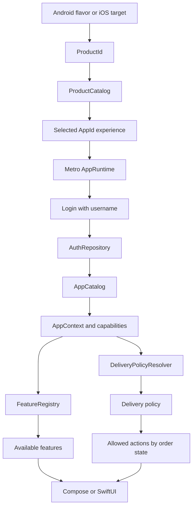
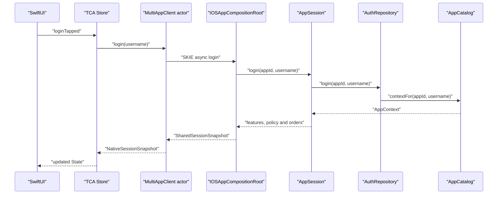

# Kotlin Multiplatform Multi-App Architecture

This sample builds standalone products and a Super App product from one Kotlin Multiplatform codebase:

| Product | Android application ID | iOS bundle ID | Product ID | Experiences |
|---|---|---|---|---|
| AppOne | `com.aeshma.appone` | `com.aeshma.appone` | `AppOneStandalone` | AppOne |
| AppTwo | `com.aeshma.apptwo` | `com.aeshma.apptwo` | `AppTwoStandalone` | AppTwo |
| Super App | `com.aeshma.superapp` | `com.aeshma.superapp` | `SuperApp` | AppOne, AppTwo |

Standalone apps still create focused binaries for one app experience. The Super App is an installable product that acts as a gateway to multiple precompiled app experiences.

The selected binary injects a `ProductId`. Shared Kotlin configuration resolves that product into one or more supported `AppId` experiences. A standalone product auto-enters its only experience; the Super App shows an experience picker before login.

The feature implementations are present in the shared binary. This sample demonstrates runtime capability-based availability, not per-app binary exclusion.

## Architecture In One View

```text
Android flavor / iOS target
    -> injects ProductId
    -> ProductCatalog resolves supported AppId experiences
    -> standalone products auto-select, Super App shows a picker
    -> Metro creates the selected experience runtime
    -> login calls AuthRepository
    -> AppCatalog resolves AppId + username
    -> AppContext contains typed capabilities
    -> FeatureRegistry selects visible features
    -> DeliveryPolicyResolver selects delivery behavior
    -> SharedSessionSnapshot crosses the iOS boundary
    -> TCA stores presentation state
    -> SwiftUI renders the returned features and actions
```



The central rule is:

> `ProductId` selects the installed product. `AppId` selects the active experience. Capabilities select features. Policies select behavior. Native UI renders the result.

## The Four Decisions

| Decision | Question | Implemented by |
|---|---|---|
| Product selection | Which installed product is running? | Android flavor or iOS target |
| Experience selection | Which app experience is active inside this product? | `ProductCatalog` and the Super App picker |
| Profile resolution | Which configuration belongs to this app and user? | `AppCatalog` |
| Feature selection | Which features may the user enter? | `FeatureRegistry` |
| Behavior selection | What may the user do inside a feature? | `DeliveryPolicyResolver` and `DeliveryPolicy` |

These decisions are separate deliberately. Screens do not contain scattered checks for app names, usernames, or roles.

## 1. Product Selection

The platform packaging layer supplies the product identity.

Android flavors define `BuildConfig.PRODUCT_ID` in `androidApp/build.gradle.kts`:

```kotlin
productFlavors {
    create("appOne") {
        applicationId = "com.aeshma.appone"
        buildConfigField("String", "PRODUCT_ID", "\"AppOneStandalone\"")
    }
    create("appTwo") {
        applicationId = "com.aeshma.apptwo"
        buildConfigField("String", "PRODUCT_ID", "\"AppTwoStandalone\"")
    }
    create("superApp") {
        applicationId = "com.aeshma.superapp"
        buildConfigField("String", "PRODUCT_ID", "\"SuperApp\"")
    }
}
```

`MainActivity` passes that identity into shared Compose UI:

```kotlin
ProductApp(productId = ProductId.fromExternalName(BuildConfig.PRODUCT_ID))
```

iOS has three native entry points:

```swift
// iosApp/AppOne/AppOneApp.swift
private let store = MultiAppStoreFactory.make(appIdName: "AppOne")

// iosApp/AppTwo/AppTwoApp.swift
private let store = MultiAppStoreFactory.make(appIdName: "AppTwo")

// iosApp/AppSuper/SuperAppApp.swift
private let productRoot = IOSProductCompositionRoot(productIdName: "SuperApp")
```

Each standalone `@main` app owns its store and passes it to `MultiAppRootView`. The Super App owns a small gateway view that reads supported experiences from shared Kotlin, then creates the selected experience store with the same `MultiAppStoreFactory` path used by standalone apps.

`ProductId` is used at the packaging boundary. `AppId` is used after a product has selected an experience. They should stay separate: a Super App is not itself an `AppId`; it is a product that may launch multiple `AppId` experiences.

### ProductCatalog

`ProductCatalog` maps installable products to their supported experiences:

```kotlin
ProductDefinition(
    id = ProductId.SuperApp,
    displayName = "Super App",
    supportedExperiences = setOf(AppId.AppOne, AppId.AppTwo),
    defaultExperience = null,
    showsExperiencePicker = true,
)
```

`ProductRuntime` validates every selected experience against this allowlist. That keeps standalone apps locked to one experience while allowing the Super App to route into AppOne or AppTwo.

## 2. AppCatalog And AppContext

`AppCatalog` is still part of the current architecture and is required by the sample. It is not an obsolete step and it is not a service locator.

Its focused responsibility is:

```text
(AppId, username) -> validated AppDefinition/UserProfile -> AppContext
```

Each `AppDefinition` contains the app metadata, default username, and available user profiles. Each `UserProfile` contains a `UserType` and typed `UserCapabilities`.

```kotlin
data class AppDefinition(
    val id: AppId,
    val displayName: String,
    val configKey: String,
    val defaultUsername: String,
    val profiles: Map<String, UserProfile>,
)
```

During login, `LocalAuthRepository` delegates profile lookup to the catalog:

```kotlin
class LocalAuthRepository(
    private val appCatalog: AppCatalog,
) : AuthRepository {
    override suspend fun login(appId: AppId, username: String): AppContext =
        appCatalog.contextFor(appId, username)
}
```

The catalog validates the app, normalizes the username, resolves the profile, and creates the session context:

```kotlin
fun contextFor(appId: AppId, username: String): AppContext {
    val definition = definition(appId)
    val normalizedUsername = username.normalizedUsername()
    val profile = definition.profileFor(normalizedUsername)

    return AppContext(
        appId = definition.id,
        userId = "${definition.configKey}-$normalizedUsername",
        userType = profile.userType,
        capabilities = profile.capabilities,
    )
}
```

`AppContext` is the authenticated source of truth used by downstream shared logic:

```kotlin
data class AppContext(
    val appId: AppId,
    val userId: String,
    val userType: UserType,
    val capabilities: UserCapabilities,
)
```

In production, `LocalAuthRepository` could be replaced by a remote repository that maps an API response into the same `AppContext`. `FeatureRegistry` and delivery policies would not need to change.

## 3. Capabilities And Feature Selection

A capability is typed data describing what a user is allowed to access or do. It is more precise than using a role name as permission logic.

```kotlin
data class UserCapabilities(
    val delivery: DeliveryCapability? = null,
    val reports: ReportsCapability? = null,
    val payments: PaymentsCapability? = null,
)
```

`FeatureRegistry` uses those capabilities to select visible features:

```kotlin
private val features = listOf(
    FeatureDescriptor(FeatureId.Home, "Home") { true },
    FeatureDescriptor(FeatureId.Delivery, "Delivery") {
        it.capabilities.delivery != null
    },
    FeatureDescriptor(FeatureId.Reports, "Reports") {
        it.capabilities.reports?.canViewReports == true
    },
    FeatureDescriptor(FeatureId.Payments, "Payments") {
        it.capabilities.payments?.canMakePayment == true
    },
    FeatureDescriptor(FeatureId.Profile, "Profile") { true },
)
```

Feature selection answers only: **may this feature be shown and opened?**

| Profile | Available features |
|---|---|
| AppOne `customer` | Home, Delivery, Payments, Profile |
| AppOne `driver` | Home, Delivery, Profile |
| AppTwo `admin` | Home, Delivery, Reports, Profile |
| AppTwo `merchant` | Home, Delivery, Reports, Profile |
| `readonly` | Home, Delivery, Profile |
| `nod` or a no-capability profile | Home, Profile |

The UI may switch on a stable `FeatureId` to navigate to the appropriate screen. It should not reproduce capability checks to decide visibility.

## 4. Policies And Experiences

A policy is a replaceable business-rule object. All delivery experiences implement the same contract:

```kotlin
interface DeliveryPolicy {
    val experienceName: String
    fun availableActions(order: DeliveryOrder): List<DeliveryAction>
    fun canOpenDeliveryDetails(order: DeliveryOrder): Boolean
}
```

Feature availability and experience behavior are different:

- `FeatureRegistry` decides whether Delivery is visible.
- `DeliveryPolicyResolver` selects how Delivery behaves.
- The selected `DeliveryPolicy` calculates actions for each order state.

```kotlin
class DeliveryPolicyResolver {
    fun resolve(context: AppContext): DeliveryPolicy {
        val delivery = context.capabilities.delivery
            ?: return DisabledDeliveryPolicy

        return when (delivery.mode) {
            DeliveryMode.Customer -> CustomerDeliveryPolicy(delivery)
            DeliveryMode.Driver -> DriverDeliveryPolicy(delivery)
            DeliveryMode.Admin -> AdminDeliveryPolicy(delivery)
            DeliveryMode.Merchant -> MerchantDeliveryPolicy(delivery)
            DeliveryMode.ReadOnly -> ReadOnlyDeliveryPolicy
        }
    }
}
```

The resolver examines `DeliveryMode`, not `AppId`. Another app can reuse an existing delivery experience by assigning the same capability mode.

The policy then combines capability flags with current domain state. For example, a created order may produce:

| Experience | Possible actions |
|---|---|
| Customer | Cancel, EditAddress, Track |
| Driver | Accept |
| Admin | Cancel, EditAddress, Track |
| Merchant | Track |
| ReadOnly | ViewOnly |

This is the Strategy pattern: calling code depends on one interface while the resolver supplies the correct implementation.

## Shared Session And Metro

Metro creates the shared object graph in `AppGraph`:

```text
AppGraph
  AppCatalog
  AuthRepository
  FeatureRegistry
  DeliveryPolicyResolver
  DeliveryRepository
  AnalyticsClient
  AppSession
```

`AppSession` is the shared application-facing API. It logs in, stores the current `AppContext`, exposes available features, resolves the delivery policy, returns sample orders, tracks analytics, and clears the context on logout.

Metro performs construction and dependency injection. It does not decide feature availability or business behavior; those responsibilities remain in the registry and policies.

## iOS: KMP, TCA, Dependencies And SKIE

The iOS application is native SwiftUI backed by shared Kotlin business logic.

### Ownership Boundary

| Shared KMP owns | Native iOS owns |
|---|---|
| Product, app definitions and profile lookup | AppOne/AppTwo/SuperApp entry targets |
| `AppCatalog` and `AppContext` | SwiftUI views and controls |
| Capabilities and feature selection | TCA state, actions and navigation |
| Delivery policies and actions | Native snapshot models |
| Session lifecycle and analytics | KMP client bridge and actor isolation |
| Metro dependency graph | Point-Free dependency injection |

SwiftUI does not contain AppOne/AppTwo permission matrices or delivery business rules.

### iOS Login Sequence



`IOSAppCompositionRoot` is the small facade-like boundary exposed to Swift. It owns the same shared runtime used by Android and returns immutable platform-friendly snapshots:

```kotlin
class IOSAppCompositionRoot(appIdName: String) {
    private val runtime = createAppRuntime(AppId.fromExternalName(appIdName))

    suspend fun login(username: String): SharedSessionSnapshot {
        val context = runtime.session.login(runtime.appId, username)
        return snapshotMapper.map(context, runtime.session)
    }

    fun logout() {
        runtime.session.logout()
    }
}
```

`SessionSnapshotMapper` obtains visible features and delivery actions from the shared session. Swift receives results, not rule objects that it must reinterpret.

### What Each iOS Tool Does

- **SwiftUI** renders screens and sends user events.
- **TCA State** stores the values currently displayed by SwiftUI.
- **TCA Action** represents an event such as login, logout, or feature selection.
- **TCA Reducer** updates state and starts asynchronous effects.
- **Point-Free Dependencies** injects `MultiAppClient` into the reducer and allows tests to replace it.
- **SKIE** exposes Kotlin `suspend` login as a normal Swift `async` function.
- **`IOSAppGateway` actor** serializes access to the mutable shared `AppSession`.

The native path is:

```text
AppOneApp/AppTwoApp/SuperAppApp
    -> MultiAppRootView
    -> TCA Store with live MultiAppClient
    -> IOSAppGateway actor
    -> IOSAppCompositionRoot in SharedLogic.framework
    -> AppSession and shared business rules
    -> snapshot mapped to native Swift models
    -> reducer updates State
    -> SwiftUI re-renders
```

The current delivery view displays the action names selected by shared policies. Executing complete delivery workflows is outside this sample.

## Module Structure

```text
androidApp/                    Android shell and product flavors
iosApp/
  AppOne/                     AppOne SwiftUI entry point and assets
  AppTwo/                     AppTwo SwiftUI entry point and assets
  AppSuper/                   Super App SwiftUI gateway entry point and assets
  SharedIOS/
    NativeModels.swift        Native presentation snapshots
    MultiAppClient.swift      TCA dependency contract
    LiveMultiAppClient.swift  Actor-isolated KMP implementation
    MultiAppStoreFactory.swift Native store and dependency composition
    MultiAppFeature.swift     TCA reducer, state and actions
    MultiAppView.swift        SwiftUI views
  SharedIOSTests/             TCA reducer tests
shared/
  core/model/                 App, capability and feature contracts
  core/config/                Definitions, profiles, presets and catalog
  core/analytics/             Analytics abstraction
  features/delivery/          Delivery domain, repository and policies
  application/                Product runtime, Metro graph, session and iOS composition roots
  ui/                         Shared Compose presentation used by Android
```

## End-To-End Examples

### AppOne Customer

```text
AppOne target/flavor
    -> ProductId("AppOneStandalone")
    -> default AppId("AppOne")
    -> login("customer")
    -> AppCatalog selects AppOne customer profile
    -> AppContext receives Customer delivery and Payments capabilities
    -> FeatureRegistry returns Home, Delivery, Payments, Profile
    -> DeliveryPolicyResolver returns CustomerDeliveryPolicy
    -> SwiftUI/Compose renders those features and customer actions
```

### AppTwo Merchant

```text
AppTwo target/flavor
    -> ProductId("AppTwoStandalone")
    -> default AppId("AppTwo")
    -> login("merchant")
    -> AppCatalog selects AppTwo merchant profile
    -> AppContext receives Merchant delivery and Reports capabilities
    -> FeatureRegistry returns Home, Delivery, Reports, Profile
    -> DeliveryPolicyResolver returns MerchantDeliveryPolicy
    -> SwiftUI/Compose renders those features and merchant actions
```

### Super App Customer

```text
SuperApp flavor
    -> ProductId("SuperApp")
    -> ProductCatalog exposes AppOne and AppTwo
    -> user selects AppOne
    -> login("customer")
    -> AppCatalog selects AppOne customer profile
    -> AppContext receives Customer delivery and Payments capabilities
    -> FeatureRegistry returns Home, Delivery, Payments, Profile
```

## Running Android

Prerequisites: Android Studio, Android SDK 36, JDK 21, and an emulator or device running API 30 or newer.

1. Open the repository root in Android Studio.
2. Wait for Gradle sync.
3. Open **View > Tool Windows > Build Variants**.
4. Select `appOneDebug`, `appTwoDebug`, or `superAppDebug` for `androidApp`.
5. Select the `androidApp` run configuration and a device.
6. Click **Run**.

Command-line builds:

```bash
./gradlew :androidApp:assembleAppOneDebug
./gradlew :androidApp:assembleAppTwoDebug
./gradlew :androidApp:assembleSuperAppDebug
```

## Running iOS

Prerequisites: full Xcode, an iOS Simulator runtime, JDK 21, and permission for Xcode to resolve and run the pinned Point-Free package macros.

1. Open `iosApp/iosApp.xcodeproj` in Xcode.
2. Select the `AppOne`, `AppTwo`, or `SuperApp` scheme.
3. Select an iPhone simulator.
4. Press `Cmd+R`.

All iOS targets build `SharedLogic.framework` with:

```bash
./gradlew :shared:application:embedAndSignAppleFrameworkForXcode
```

If Kotlin/Swift symbols are stale, use **Product > Clean Build Folder** and rebuild. Confirm that the Gradle framework build phase completes successfully.

Command-line simulator builds:

```bash
xcodebuild -project iosApp/iosApp.xcodeproj \
  -scheme AppOne \
  -destination 'generic/platform=iOS Simulator' \
  -skipMacroValidation \
  CODE_SIGNING_ALLOWED=NO build

xcodebuild -project iosApp/iosApp.xcodeproj \
  -scheme AppTwo \
  -destination 'generic/platform=iOS Simulator' \
  -skipMacroValidation \
  CODE_SIGNING_ALLOWED=NO build

xcodebuild -project iosApp/iosApp.xcodeproj \
  -scheme SuperApp \
  -destination 'generic/platform=iOS Simulator' \
  -skipMacroValidation \
  CODE_SIGNING_ALLOWED=NO build
```

## Testing

Run shared tests:

```bash
./gradlew \
  :shared:core:config:testAndroidHostTest \
  :shared:features:delivery:testAndroidHostTest \
  :shared:application:testAndroidHostTest
```

Run native TCA reducer tests:

```bash
DEVELOPER_DIR=/Applications/Xcode.app/Contents/Developer \
  xcrun swift test --package-path iosApp
```

The tests cover catalog lookup and validation, capability-based feature selection, policy selection and actions, Metro composition, session lifecycle, iOS composition metadata, TCA login/logout, cancellation, and navigation.

## Extending The Architecture

### Add A New App

1. Add an `AppId`.
2. Create an `AppDefinition` with profiles and capability presets.
3. Register it in `defaultAppDefinitions()`.
4. Decide which products can launch it and update `defaultProductDefinitions()`.
5. Add an Android flavor only if this app should also ship as a standalone product.
6. Add an iOS target and entry point only if this app should also ship as a standalone product.
7. Add catalog and platform wiring tests.

No new feature or policy branch is needed when the app reuses existing capabilities.

### Add A New Feature

1. Add a stable `FeatureId`.
2. Add typed capability data.
3. Add a descriptor to `FeatureRegistry`.
4. Create a feature module when it has meaningful independent domain logic.
5. Add its repository, policy, or use cases.
6. Bind dependencies in `AppGraph`.
7. Add Compose and SwiftUI presentation.
8. Add shared and platform tests.

## Rules To Preserve

1. Platform packaging injects product identity.
2. `ProductCatalog` resolves supported experiences; `AppCatalog` resolves app and profile configuration.
3. `AppContext` is the typed authenticated source of truth.
4. Capabilities control access; role names do not act as permission checks.
5. `FeatureRegistry` controls feature visibility.
6. Policies control behavior inside a feature.
7. Native UI renders shared decisions instead of rebuilding them.
8. Metro constructs shared dependencies; TCA Dependencies injects native clients.
9. Unknown apps and profiles fail explicitly.
10. Stable IDs remain separate from display text.
11. `ProductId`, `AppId`, and tenant/customer IDs stay separate.
