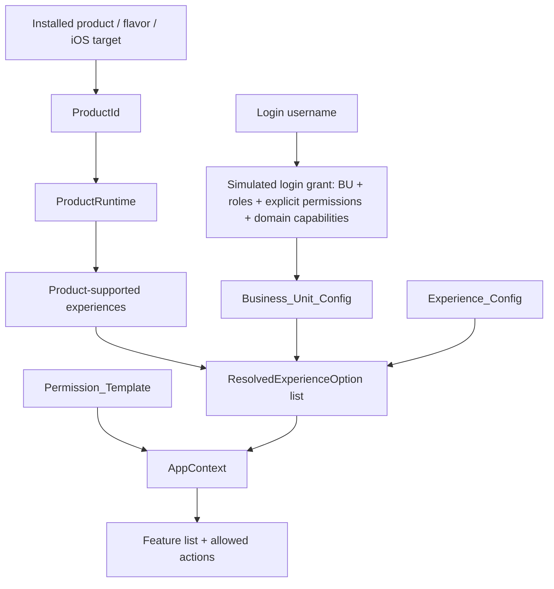

# MultiAppDemo

Kotlin Multiplatform sample that demonstrates how multiple installed products can share business logic while resolving product, business unit, configured experience, permissions, feature visibility, and allowed actions at runtime.

The important distinction in this branch:

```text
Product/App shell != configured experience
```

`AppOne`, `AppTwo`, and `SuperApp` are installed app shells/products. A configured experience is a business/runtime profile such as `Newport&Buckhead` or `Shop`.

## Current Products

| Product | Android application ID | iOS bundle ID | Product ID | Supported configured experiences |
|---|---|---|---|---|
| AppOne | `com.aeshma.appone` | `com.aeshma.appone` | `AppOneStandalone` | `Shop` |
| AppTwo | `com.aeshma.apptwo` | `com.aeshma.apptwo` | `AppTwoStandalone` | `Newport&Buckhead` |
| Super App | `com.aeshma.superapp` | `com.aeshma.superapp` | `SuperApp` | `Newport&Buckhead`, `Shop` |

Single-app products still use the shared product resolver, but each supports only one configured experience. Super App supports both and may show an experience switcher after login.

## Current Experience Config

| Experience ID | Display name | Host app shell | Supported BUs | Supported features | Sites | Theme |
|---|---|---|---|---|---|---|
| `newport-buckhead` | Newport&Buckhead | `AppTwo` | `SSMG`, `CABL` | Orders, Lists, Delivery | `BHNP` | SSMG Boutique Theme |
| `shop` | Shop | `AppOne` | `USBL`, `CABL` | Orders, Catalog, Product Details, Delivery | `USBL`, `CABL` | Broadline Theme |

The host app shell is the app runtime used to launch the shared session. It is not the experience identity.

## Current BU Config

| Business unit | Allowed configured experiences |
|---|---|
| `SSMG` | `Newport&Buckhead` |
| `USBL` | `Shop` |
| `CABL` | `Newport&Buckhead`, `Shop` |

`CABL` exists to simulate a BU that is eligible for multiple experiences. In Super App, this is the path that shows the switcher.

## Reliable Demo Logins

| Product | Username | Simulated BU | Result |
|---|---|---|---|
| `AppOneStandalone` | any supported user | `USBL` | Directly launches `Shop`. |
| `AppTwoStandalone` | any supported user | `SSMG` | Directly launches `Newport&Buckhead`. |
| `SuperApp` | `admin` | `CABL` | Shows switcher with `Newport&Buckhead` and `Shop`. |
| `SuperApp` | other users | `SSMG`, `USBL`, or `CABL` | Random-but-stable per username. |

The current hardcoded login response lives in:

```text
shared/core/config/src/commonMain/kotlin/com/aeshma/multiapp/core/config/HardcodedLoginConfig.kt
```

## Resolution Flow



Resolution keeps an experience only when:

```text
experience is supported by the product
AND experience is allowed by the login BU
AND login BU is supported by the experience
```

Commerce capabilities are then resolved by intersection:

```text
resolved capabilities =
  (role template capabilities + explicit login permissions)
  intersect BU capability ceiling
  intersect experience capability ceiling
```

The final `AppContext` drives feature visibility, feature tweaks, and allowed actions.

## Themes

Theme is tied to the configured experience and cannot be freely switched.

| Experience | UI theme |
|---|---|
| Newport&Buckhead | Boutique |
| Shop | Broadline |
| fallback | Operations |

## Features And Actions

Feature visibility is table-driven through `FeatureRegistry`.

Each feature defines:

- a stable `FeatureId`
- a required permission
- optional tweak permissions
- an availability predicate

Non-delivery feature detail screens are generated from a structured feature/action table. Each action declares a label, required permission, and simulated result. The UI filters actions from the resolved `AppContext.commerceCapabilities`.

Delivery is stateful because order status changes affect available actions. Delivery actions come from `DeliveryPolicyResolver`, which reads the resolved domain `DeliveryCapability`.

## Build-Time Feature Union Simulation

Build product metadata is centralized in:

```text
config/product-feature-bundles.json
```

Android flavors are generated from this config in `androidApp/build.gradle.kts`. The same config generates `iosApp/SharedIOS/ProductFeatureBundles.generated.swift` through:

```bash
./gradlew generateIOSProductFeatureBundles
```

Each `ExperienceDefinition` declares coarse `supportedFeatures`, such as Orders or Delivery. This is different from fine-grained permissions such as `orders.view`.

Each dummy commerce feature now has its own KMP module and owns a `FeatureDefinitionSpec`:

| Feature | Module |
|---|---|
| Orders | `shared/features/orders` |
| Lists | `shared/features/lists` |
| Catalog | `shared/features/catalog` |
| Product Details | `shared/features/productdetails` |
| Delivery | `shared/features/delivery` |

The application layer imports those module definitions in `FeatureRegistry`. The UI receives `FeatureDescriptor` values from the session and renders permission rows/actions from the feature definitions instead of maintaining a separate UI-side table.

`ProductRuntime.bundledFeatures` returns the union of all coarse features for the experiences a product can launch:

| Product | Bundled feature union |
|---|---|
| `AppOneStandalone` | Orders, Catalog, Product Details, Delivery |
| `AppTwoStandalone` | Orders, Lists, Delivery |
| `SuperApp` | Orders, Lists, Catalog, Product Details, Delivery |

This models what product-specific Android/iOS builds would physically include. Runtime filtering still happens from `AppContext.supportedFeatures` plus resolved permissions.

The app surfaces this build metadata on the login screen as `Build bundle: ...` so the packaged feature union can be compared against the selected experience’s runtime feature list.

## Android Entry

Android flavors inject `BuildConfig.PRODUCT_ID`.

```kotlin
ProductApp(productId = ProductId.fromExternalName(BuildConfig.PRODUCT_ID))
```

Common commands:

```bash
./gradlew :androidApp:assembleAppOneDebug
./gradlew :androidApp:assembleAppTwoDebug
./gradlew :androidApp:assembleSuperAppDebug
```

## iOS Entry

All iOS targets use the product-aware native SwiftUI/TCA store:

```swift
// AppOne
MultiAppStoreFactory.makeProduct(productIdName: "AppOneStandalone")

// AppTwo
MultiAppStoreFactory.makeProduct(productIdName: "AppTwoStandalone")

// SuperApp
MultiAppStoreFactory.makeProduct(productIdName: "SuperApp")
```

iOS uses native SwiftUI views backed by shared KMP resolution APIs through `IOSProductCompositionRoot`.

Common schemes:

- `AppOne`
- `AppTwo`
- `SuperApp`

Example Xcode build commands:

```bash
xcodebuild \
  -project iosApp/iosApp.xcodeproj \
  -scheme AppOne \
  -destination 'platform=iOS Simulator,name=iPhone 16' \
  build

xcodebuild \
  -project iosApp/iosApp.xcodeproj \
  -scheme AppTwo \
  -destination 'platform=iOS Simulator,name=iPhone 16' \
  build

xcodebuild \
  -project iosApp/iosApp.xcodeproj \
  -scheme SuperApp \
  -destination 'platform=iOS Simulator,name=iPhone 16' \
  build
```

## Important Files

| Area | Files |
|---|---|
| Product definitions | `shared/core/config/.../ProductCatalog.kt`, `ProductDefinition.kt` |
| Build feature bundle config | `config/product-feature-bundles.json` |
| iOS generated bundle constants | `iosApp/SharedIOS/ProductFeatureBundles.generated.swift` |
| Experience and BU config | `shared/core/config/.../ExperienceCatalog.kt`, `ExperienceDefinition.kt` |
| Hardcoded login grants | `shared/core/config/.../HardcodedLoginConfig.kt` |
| Product resolver | `shared/application/.../ProductRuntime.kt` |
| Session lifecycle | `shared/application/.../AppSession.kt` |
| Feature registry | `shared/application/.../FeatureRegistry.kt` |
| Dummy feature modules | `shared/features/orders`, `shared/features/lists`, `shared/features/catalog`, `shared/features/productdetails` |
| Delivery policies | `shared/features/delivery/.../DeliveryPolicy.kt` |
| Android UI | `shared/ui/.../App.kt` |
| iOS KMP bridge | `shared/application/.../IOSProductCompositionRoot.kt` |
| iOS SwiftUI/TCA | `iosApp/SharedIOS/*` |

## Docs

- [Hardcoded Experience Resolution Flow](docs/hardcoded-experience-resolution-flow.md)
- [Commerce Permission And Feature Resolution](docs/commerce-permission-feature-resolution.md)

## Verification

The command used for the shared Android/KMP checks in this branch:

```bash
./gradlew shared:application:testAndroidHostTest shared:core:config:testAndroidHostTest shared:ui:compileAndroidMain
```

This environment cannot run iOS Xcode verification because `xcrun xcodebuild -version` reports that `xcodebuild` is unavailable.

## Future Network Integration

The future backend seam is:

```text
HardcodedLoginConfig.loginGrants(productId, username)
```

Replace that with a real auth/session response that returns:

- BU
- roles
- explicit permissions
- domain capabilities

The product/BU/experience eligibility checks and capability intersection can remain the same.
