# Feature Bundling Build Mechanism POC

Status: POC documentation
Audience: Mobile platform, iOS, Android, KMP, release engineering
Last updated: 2026-07-06
Repository area: Android app, KMP shared modules, native iOS Swift package, product build config

## 1. Executive Summary

This POC demonstrates how a multi-product mobile codebase can support feature bundling in two ways:

1. Runtime-only feature filtering, where every feature is compiled into the app, but the app hides or shows features based on product, experience, permissions, or customer context.
2. True physical feature bundling, where each product build compiles and links only the feature modules selected for that product.

The implemented POC focuses on true physical bundling. Product feature membership is declared once in:

```text
config/product-feature-bundles.json
```

That config now drives:

- Android flavor dependencies.
- Generated Android `ProductFeatureBundle.kt` files.
- KMP iOS feature dependencies inside `SharedLogic.framework`.
- Generated iOS KMP `PlatformFeatureDefinitions.ios.kt`.
- Native iOS Swift package products in `iosApp/Package.swift`.
- Generated native iOS `CommerceFeatureRegistry.<product>` files.
- Generated native iOS product bundle constants.

The key outcome is that a product such as AppTwo can include Orders, Lists, and Delivery while physically excluding Catalog and Product Details from Android, KMP iOS, and native iOS Swift feature UI composition.

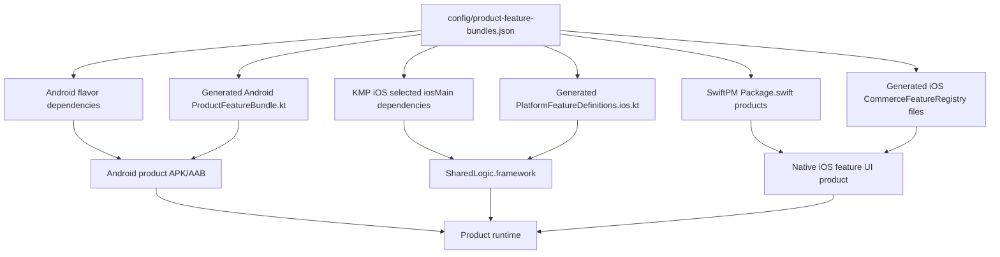

## 2. Problem Statement

The project has multiple products that share a common commerce platform but should not all ship the same feature set.

Current product examples:

| Product | Intended features |
|---|---|
| AppOneStandalone | Orders, Catalog, Product Details, Delivery |
| AppTwoStandalone | Orders, Lists, Delivery |
| SuperApp | Orders, Lists, Catalog, Product Details, Delivery |

The important distinction is between hiding a feature and not shipping a feature.

Runtime filtering can hide a tab, but it cannot prove the feature code is absent from the build. Physical bundling can.

## 3. Goals

This POC was designed to answer these questions:

- Can product-specific feature bundles be expressed once and reused across Android, KMP iOS, and native iOS?
- Can excluded feature modules be kept out of product compile/link graphs?
- Can shared application code avoid direct imports of every feature?
- Can feature-owned runtime behavior move into feature modules instead of living in the common application layer?
- Can native iOS feature UI be split in the same conceptual way as KMP feature modules?
- Can the add/remove feature workflow be predictable enough for another project to adopt?

## 4. Non-Goals

This POC does not attempt to solve every production concern yet.

| Non-goal | Reason |
|---|---|
| Remote delivery of feature modules | This POC is compile-time/product-time bundling, not dynamic feature download. |
| Runtime plugin loading | Product feature sets are known at build time. |
| Full Xcode project generation | SwiftPM product membership is automated, but Xcode target membership/exclusion rules may still need project-level care in a real app. |
| Binary size measurement | The POC proves dependency absence, but does not benchmark final IPA/APK size deltas. |
| CI workflow implementation | Verification commands exist; a future task can wrap them in CI tasks. |

## 5. Terms

| Term | Meaning |
|---|---|
| Feature id | Stable id such as `orders`, `catalog`, or `delivery`. |
| Feature module | KMP module such as `:shared:features:orders`. |
| Feature definition | Shared metadata describing tab title, permissions, rows, actions, and UI blocks. |
| Runtime contributor | Optional feature-owned provider for runtime feature-specific data. |
| Product bundle | The list of features intended to ship inside a product. |
| Runtime filtering | User/session/experience permission filtering after the app launches. |
| Physical bundling | Build dependency selection that determines whether feature code is compiled and linked. |
| Native iOS feature target | SwiftPM target such as `FeatureOrders` or `FeatureDelivery`. |
| Product registry | Platform-specific list of feature definitions/renderers injected into the app. |

## 6. Runtime Filtering vs Physical Bundling

### 6.1 Runtime-Only Bundling

Runtime-only bundling compiles all features into the application and then filters what the user can see.

Typical shape:

```kotlin
private val features = listOf(
    descriptor(OrdersFeature.definition),
    descriptor(ListsFeature.definition),
    descriptor(CatalogFeature.definition),
    descriptor(ProductDetailsFeature.definition),
    descriptor(DeliveryFeature.definition),
)

fun availableFeatures(context: AppContext): List<FeatureDescriptor> =
    features.filter { it.id in context.supportedFeatures && it.isAvailable(context) }
```

The user experience is correct because tabs or screens can be hidden. The build output is not physically isolated because all features are still dependencies.

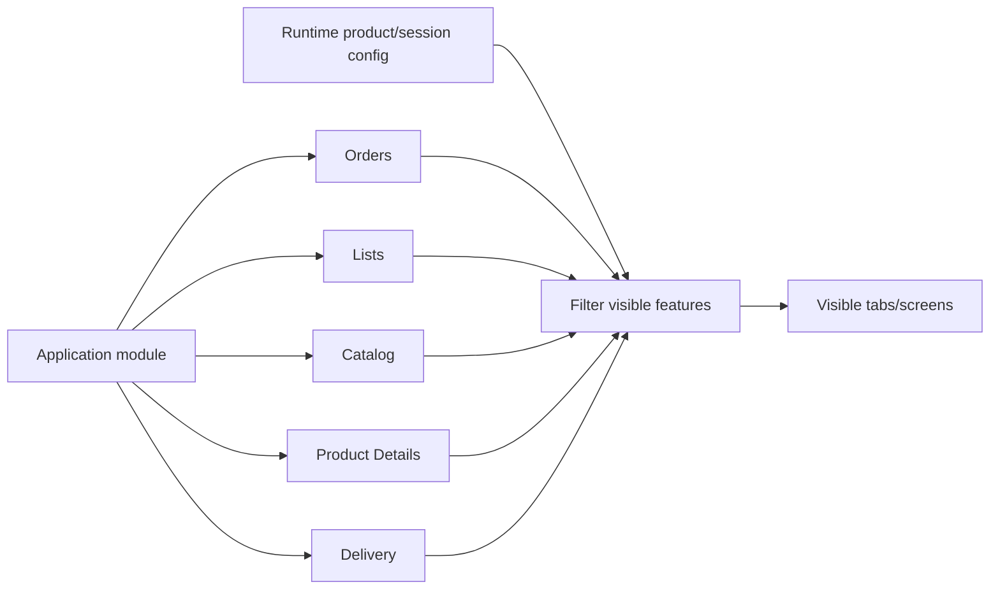

Runtime-only bundling is useful when:

- The only concern is UI visibility.
- The product difference is temporary or experimental.
- It is acceptable for all feature code to ship in every app.
- The team wants a simpler implementation.

Runtime-only bundling is not enough when:

- A product must not ship a feature for contractual, size, security, or app-store positioning reasons.
- Feature-specific code has dependencies that should not be present in every product.
- Native iOS feature UI should not be compiled for products that do not use it.

### 6.2 True Physical Bundling

True physical bundling changes the build graph. Instead of compiling every feature and filtering later, the product build only depends on selected feature modules.

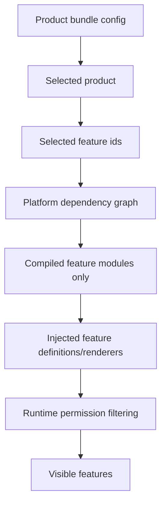

Physical bundling and runtime filtering are complementary:

| Layer | Question answered | Example |
|---|---|---|
| Physical bundle | Can this product ship this feature code? | AppTwo does not compile Catalog. |
| Runtime availability | Can this session see/use this feature? | User lacks `orders.edit`, so edit action is hidden. |

The physical layer protects the binary. The runtime layer protects the session.

## 7. Current POC Product Matrix

| Product | Android flavor | iOS bundle | Bundled feature ids | Native iOS feature targets |
|---|---|---|---|---|
| AppOneStandalone | `appOne` | `appOne` | `orders`, `catalog`, `product-details`, `delivery` | `FeatureOrders`, `FeatureCatalog`, `FeatureProductDetails`, `FeatureDelivery` |
| AppTwoStandalone | `appTwo` | `appTwo` | `orders`, `lists`, `delivery` | `FeatureOrders`, `FeatureLists`, `FeatureDelivery` |
| SuperApp | `superApp` | `superApp` | `orders`, `lists`, `catalog`, `product-details`, `delivery` | all current feature targets |

## 8. Source Of Truth

All product feature membership is centralized in:

```text
config/product-feature-bundles.json
```

The config contains four important sections.

### 8.1 KMP Feature Module Paths

```json
{
  "featureModules": {
    "orders": ":shared:features:orders",
    "lists": ":shared:features:lists",
    "catalog": ":shared:features:catalog",
    "product-details": ":shared:features:productdetails",
    "delivery": ":shared:features:delivery"
  }
}
```

Rationale:

- Gradle dependencies need project paths.
- Product builds should not manually repeat module paths.
- The same feature id should map to the same KMP module everywhere.

### 8.2 Kotlin Feature Object References

```json
{
  "featureKotlinObjects": {
    "orders": "com.aeshma.multiapp.feature.orders.OrdersFeature",
    "lists": "com.aeshma.multiapp.feature.lists.ListsFeature",
    "catalog": "com.aeshma.multiapp.feature.catalog.CatalogFeature",
    "product-details": "com.aeshma.multiapp.feature.productdetails.ProductDetailsFeature",
    "delivery": "com.aeshma.multiapp.feature.delivery.DeliveryFeature"
  }
}
```

Rationale:

- Generated Kotlin source must import the selected feature objects.
- The application layer should not statically import every feature.
- The generated product bundle should be the only place where product-specific feature object imports appear.

### 8.3 Native iOS Swift Target Metadata

```json
{
  "featureSwiftTargets": {
    "orders": {
      "libraryName": "FeatureOrders",
      "targetName": "FeatureOrders",
      "moduleName": "OrdersFeatureModule",
      "path": "SharedIOS/Features/Orders"
    },
    "delivery": {
      "libraryName": "FeatureDelivery",
      "targetName": "FeatureDelivery",
      "moduleName": "DeliveryFeatureModule",
      "path": "SharedIOS/Features/Delivery"
    }
  }
}
```

Rationale:

- SwiftPM needs target/product names and source paths.
- Generated product registries need the Swift module enum name.
- KMP feature membership and native Swift feature UI membership should be driven by the same feature ids.

### 8.4 Product Definitions

```json
{
  "products": [
    {
      "flavorName": "appTwo",
      "swiftName": "appTwo",
      "iosFeatureProductName": "AppTwoIOSFeatures",
      "iosFeatureRegistryFile": "AppTwo/AppTwoFeatureRegistry.swift",
      "productId": "AppTwoStandalone",
      "displayName": "AppTwo",
      "androidApplicationId": "com.aeshma.apptwo",
      "supportedExperiences": ["newport-buckhead"],
      "bundledFeatures": ["orders", "lists", "delivery"]
    }
  ]
}
```

Rationale:

- Android needs `flavorName`, `applicationId`, display name, and build config values.
- iOS/KMP needs `swiftName` to select the bundle with `-PiosProductBundle`.
- Native iOS needs `iosFeatureProductName` and `iosFeatureRegistryFile`.
- `bundledFeatures` is the single list used by all platforms.

## 9. High-Level Build Flow

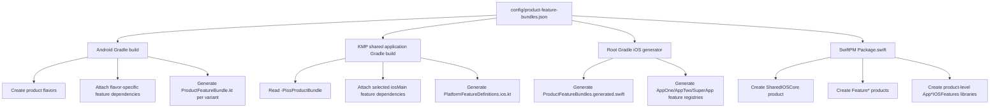

### 9.1 Lifecycle Summary

The mechanism has two kinds of lifecycle events:

1. Build-time lifecycle events, where Gradle or SwiftPM reads product metadata and produces compiled code or generated source.
2. Runtime lifecycle events, where the launched app consumes the compiled/generated feature lists and applies session permissions.

| Lifecycle phase | Trigger | Reads | Produces | Consumed by |
|---|---|---|---|---|
| Android Gradle configuration | Any Android Gradle task configures `:androidApp` | `config/product-feature-bundles.json` | Android product flavors, `BuildConfig` fields, flavor dependencies | Android variant compile/package tasks |
| Android generated source | Android variant compile, for example `compileAppTwoDebugKotlin` | Selected product features and Kotlin object refs | `ProductFeatureBundle.kt` for that variant | `MainActivity` / `ProductApp` |
| KMP iOS Gradle configuration | Any `:shared:application` iOS Gradle task | `config/product-feature-bundles.json`, `-PiosProductBundle` | Selected `iosMain` dependencies | Kotlin/Native compiler |
| KMP iOS generated actuals | `compileKotlinIos*` or `embedAndSignAppleFrameworkForXcode` | Selected iOS feature ids and Kotlin object refs | `PlatformFeatureDefinitions.ios.kt` | `IOSAppCompositionRoot` / shared runtime |
| Native iOS generated files | Explicit `./gradlew generateIOSProductFeatureBundles` | Product config and Swift target metadata | Product bundle constants and `CommerceFeatureRegistry` files | Native iOS app targets |
| SwiftPM manifest evaluation | `swift build`, Xcode package resolution, or `swift package describe` | `config/product-feature-bundles.json` | SwiftPM products and targets | Swift compiler / Xcode |
| App runtime startup | User launches product app | Generated/compiled feature registries | `AppGraph`, `FeatureRegistry`, `AppSession` | UI and runtime permission flow |

The important operational difference is that Android and KMP iOS generate source as part of platform compile tasks, while native iOS product registry files are generated by an explicit Gradle task because those files are checked into the iOS app target folders.

### 9.2 Android Build Lifecycle

Android has a Gradle configuration phase and a variant execution phase.

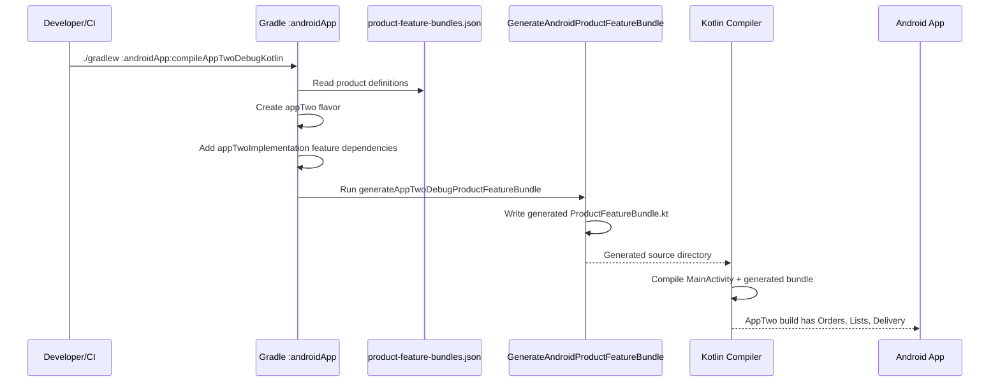

Android lifecycle details:

| Step | When it is triggered | What runs | What it produces |
|---|---|---|---|
| Parse product config | Gradle configures `:androidApp` | `JsonSlurper().parse(rootProject.file("config/product-feature-bundles.json"))` | `productBuildConfigs`, `featureModulePaths`, `featureKotlinObjectRefs` |
| Create flavors | During `android { productFlavors { ... } }` configuration | `create(product.getValue("flavorName").toString())` | `appOne`, `appTwo`, `superApp` Android flavors |
| Add dependencies | During dependency configuration | `add("${flavorName}Implementation", project(featureModulePaths.getValue(featureId)))` | Flavor-specific compile classpaths |
| Register generator | During Android Components variant configuration | `androidComponents { onVariants { ... } }` | One generator task per Android variant |
| Generate bundle source | Before variant Kotlin compile | `GenerateAndroidProductFeatureBundle` | `androidApp/build/generated/productFeatureBundles/<variant>/kotlin/.../ProductFeatureBundle.kt` |
| Compile variant | When `compile<Flavor><BuildType>Kotlin` runs | Kotlin compiler | Android product code and generated feature bundle compiled together |

Relevant generator registration:

```kotlin
androidComponents {
    onVariants { variant ->
        val flavorName = variant.productFlavors
            .firstOrNull { it.first == "app" }
            ?.second
            ?: return@onVariants
        val taskName = "generate${variant.name.replaceFirstChar { it.uppercase() }}ProductFeatureBundle"
        val generateBundle = tasks.register<GenerateAndroidProductFeatureBundle>(taskName) {
            featureIds.set(productFeaturesByFlavor.getValue(flavorName))
            featureKotlinObjects.set(featureKotlinObjectRefs)
            outputDir.set(layout.buildDirectory.dir("generated/productFeatureBundles/${variant.name}/kotlin"))
        }

        variant.sources.java?.addGeneratedSourceDirectory(
            generateBundle,
            GenerateAndroidProductFeatureBundle::outputDir,
        )
    }
}
```

Example AppTwo output:

```text
androidApp/build/generated/productFeatureBundles/appTwoDebug/kotlin/com/aeshma/multiapp/android/ProductFeatureBundle.kt
```

The generated file is compiled into the AppTwo variant only. It imports `OrdersFeature`, `ListsFeature`, and `DeliveryFeature`. If someone adds `CatalogFeature` to that file without adding the Catalog dependency to AppTwo, AppTwo compilation should fail.

### 9.3 KMP iOS Framework Build Lifecycle

KMP iOS has a selected product bundle property:

```bash
-PiosProductBundle=appTwo
```

That property decides what feature modules go into the `SharedLogic.framework` build.

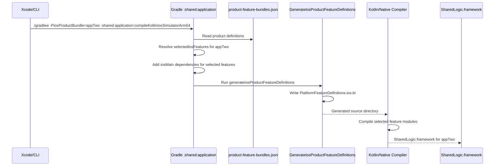

KMP iOS lifecycle details:

| Step | When it is triggered | What runs | What it produces |
|---|---|---|---|
| Parse product config | Gradle configures `:shared:application` | `JsonSlurper` reads the JSON | Product list, feature modules, Kotlin object refs |
| Resolve selected bundle | Gradle reads `iosProductBundle` | `iosFeatureBundles[iosProductBundle.get()]` | `selectedIosFeatures` |
| Attach dependencies | During `iosMain.dependencies` configuration | `api(project(featureModulePaths.getValue(featureId)))` | Product-specific iOS compile dependency graph |
| Generate actuals | Before `compileKotlinIos*` or `compileTestKotlinIos*` | `GenerateIosProductFeatureDefinitions` | Generated `PlatformFeatureDefinitions.ios.kt` |
| Compile framework | Kotlin/Native compile or Xcode embed/sign task | Kotlin/Native compiler | `SharedLogic.framework` containing selected features |

Relevant task dependency:

```kotlin
tasks.configureEach {
    if (name.startsWith("compileKotlinIos") || name.startsWith("compileTestKotlinIos")) {
        dependsOn(generateIosProductFeatureDefinitions)
    }
}
```

Generated output path:

```text
shared/application/build/generated/iosProductFeatureDefinitions/<iosProductBundle>/kotlin/com/aeshma/multiapp/application/PlatformFeatureDefinitions.ios.kt
```

For `-PiosProductBundle=appTwo`, the generated actuals reference Orders, Lists, and Delivery. Catalog/Product Details are not imported and are not attached as selected `iosMain` dependencies.

### 9.4 Native iOS Generated Files Lifecycle

Native iOS has one explicit generation step:

```bash
./gradlew generateIOSProductFeatureBundles
```

This task is not automatically run by `swift build`. It should be run when `config/product-feature-bundles.json` changes, especially when product membership or Swift feature metadata changes.

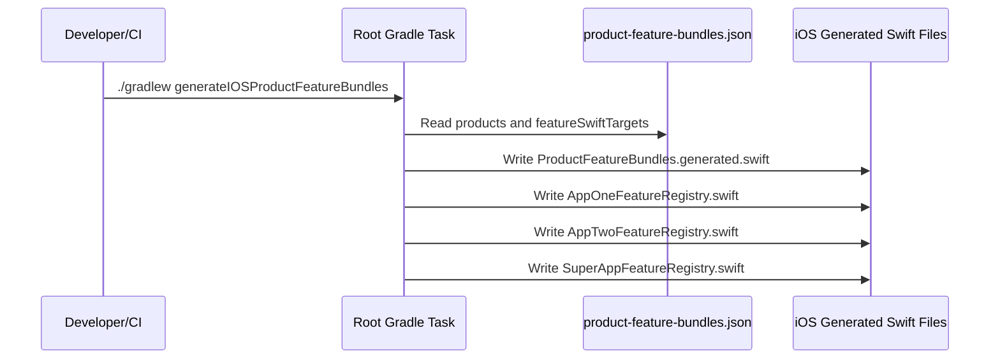

Native iOS generation details:

| Step | When it is triggered | What runs | What it produces |
|---|---|---|---|
| Run generator | Developer/CI runs `./gradlew generateIOSProductFeatureBundles` | `GenerateIOSProductFeatureBundles` in root `build.gradle.kts` | Checked-in generated Swift files |
| Generate product constants | During generator task | Product metadata from JSON | `iosApp/SharedIOS/Core/ProductFeatureBundles.generated.swift` |
| Generate registries | During generator task | `bundledFeatures` plus `featureSwiftTargets.<id>.moduleName` | `AppOneFeatureRegistry.swift`, `AppTwoFeatureRegistry.swift`, `SuperAppFeatureRegistry.swift` |
| Compile native Swift | `swift build`, Xcode build, or package resolution | Swift compiler / Xcode | Native Swift modules and app target code |

Generated product constants:

```swift
enum ProductFeatureBundles {
    static let appTwo = ProductFeatureBundle(
        productId: "AppTwoStandalone",
        displayName: "AppTwo",
        supportedExperiences: ["newport-buckhead"],
        bundledFeatures: ["orders", "lists", "delivery"]
    )
}
```

Generated AppTwo renderer registry:

```swift
@MainActor
extension CommerceFeatureRegistry {
    static let appTwo = CommerceFeatureRegistry(
        modules: [
            OrdersFeatureModule.module,
            ListsFeatureModule.module,
            DeliveryFeatureModule.module,
        ]
    )
}
```

### 9.5 SwiftPM Manifest Lifecycle

`iosApp/Package.swift` is evaluated by SwiftPM and Xcode before Swift package compilation.

Triggers include:

- `swift package --package-path iosApp describe`
- `swift build --package-path iosApp`
- Xcode resolving package products
- Xcode building a target that depends on a SwiftPM product

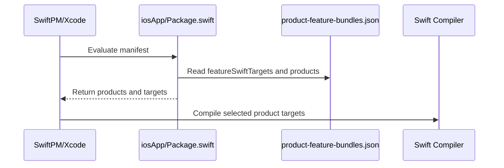

SwiftPM lifecycle details:

| Step | When it is triggered | What runs | What it produces |
|---|---|---|---|
| Manifest evaluation | Before SwiftPM build/describe/package resolution | `loadFeatureBundleConfig()` inside `Package.swift` | In-memory `FeatureBundleConfig` |
| Feature product creation | During manifest evaluation | `swiftFeatures.values.map { Product.library(...) }` | `FeatureOrders`, `FeatureLists`, etc. |
| Product feature library creation | During manifest evaluation | `featureBundleConfig.products.map { Product.library(...) }` | `AppOneIOSFeatures`, `AppTwoIOSFeatures`, `SuperAppIOSFeatures` |
| Target creation | During manifest evaluation | `Target.target(...)` for each Swift feature | SwiftPM target graph |
| Swift compilation | SwiftPM/Xcode build | Swift compiler | Compiled Swift feature modules |

Relevant manifest code:

```swift
private let packageProducts: [Product] = [
    .library(name: "SharedIOSCore", targets: ["SharedIOSCore"]),
] +
    swiftFeatures.values
        .sorted { $0.libraryName < $1.libraryName }
        .map { feature in
            Product.library(name: feature.libraryName, targets: [feature.targetName])
        } +
    featureBundleConfig.products.map { product in
        Product.library(
            name: product.iosFeatureProductName,
            targets: ["SharedIOSCore"] + product.bundledFeatures.map { featureTarget(for: $0).targetName }
        )
    }
```

For AppTwo, `swift package describe` should show:

```text
AppTwoIOSFeatures
  SharedIOSCore
  FeatureOrders
  FeatureLists
  FeatureDelivery
```

It should not list `FeatureCatalog` or `FeatureProductDetails`.

### 9.6 Runtime Startup Lifecycle

Once the platform build has produced product-specific artifacts, runtime startup consumes them.

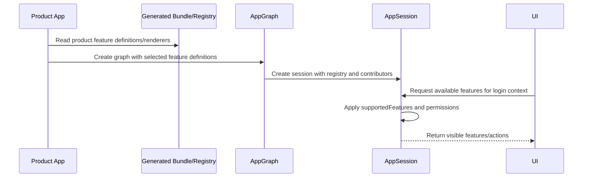

Runtime lifecycle details:

| Step | Android | iOS KMP | Native iOS |
|---|---|---|---|
| Product identity | `BuildConfig.PRODUCT_ID` | Xcode target passes product id into shared facade/root | `ProductFeatureBundles.<product>.productId` |
| Build feature bundle | `BuildConfig.BUNDLED_FEATURES` | `platformFeatureDefinitions()` result | `ProductFeatureBundles.<product>.bundledFeatures` |
| Feature definitions | Generated `ProductFeatureBundle.featureDefinitions` | Generated `platformFeatureDefinitions()` | Shared runtime model from KMP |
| Runtime contributors | Generated `ProductFeatureBundle.featureRuntimeContributors` | Generated `platformFeatureRuntimeContributors()` | Shared runtime model from KMP |
| Native renderers | Compose/shared UI | Not applicable inside framework | Generated `CommerceFeatureRegistry.<product>` |
| Runtime filter | `FeatureRegistry.availableFeatures(context)` | Same shared runtime | Same shared runtime plus native renderer lookup |

Android runtime entry:

```kotlin
ProductApp(
    productId = ProductId.fromExternalName(BuildConfig.PRODUCT_ID),
    buildFeatureBundle = BuildConfig.BUNDLED_FEATURES.toFeatureIds(),
    featureDefinitions = ProductFeatureBundle.featureDefinitions,
    featureRuntimeContributors = ProductFeatureBundle.featureRuntimeContributors,
)
```

Native iOS runtime entry:

```swift
private let store = MultiAppStoreFactory.makeProduct(
    productIdName: ProductFeatureBundles.appTwo.productId,
    buildFeatureBundle: ProductFeatureBundles.appTwo.bundledFeatures
)
private let featureRegistry = CommerceFeatureRegistry.appTwo

MultiAppRootView(store: store, featureRegistry: featureRegistry)
```

At this point, physical bundling has already happened. Runtime filtering can only work with the features included by the product build.

## 10. Shared Feature Contract

Every KMP feature module exposes a common contract:

```kotlin
interface CommerceFeatureModule {
    val definition: FeatureDefinitionSpec
    val runtimeContributor: FeatureRuntimeContributor?
        get() = null
}
```

The static feature definition describes the feature:

```kotlin
data class FeatureDefinitionSpec(
    val id: FeatureId,
    val title: String,
    val requiredPermission: PermissionId,
    val tweakPermissions: List<PermissionId> = emptyList(),
    val permissionRows: List<FeaturePermissionRow> = emptyList(),
    val actions: List<FeatureActionDefinition> = emptyList(),
    val uiBlocks: List<FeatureUiBlock> = emptyList(),
)
```

Rationale:

- The app can render and permission-check features without knowing feature internals.
- Each feature owns its metadata.
- The app graph receives a list of feature definitions instead of importing every feature.

## 11. Feature Runtime Contributors

Some features need runtime state or domain logic. Delivery is the current example.

Instead of keeping Delivery policy/repository APIs in the shared application layer, the feature can provide a runtime contributor:

```kotlin
interface FeatureRuntimeContributor {
    val featureId: FeatureId

    fun snapshot(context: AppContext): FeatureRuntimeSnapshot
}
```

Application code accesses these contributors generically:

```kotlin
fun featureRuntimeSnapshot(featureId: FeatureId): FeatureRuntimeSnapshot? =
    featureRuntimeContributors
        .firstOrNull { it.featureId == featureId }
        ?.snapshot(context)
```

Rationale:

- A future product can exclude Delivery without the shared application module still depending on Delivery classes.
- Feature-specific runtime logic travels with the feature.
- Every feature can use the same mechanism if it needs runtime data.

## 12. Metro DI / AppGraph Link

Metro still owns graph creation and dependency wiring. The key change is that the product build injects feature definitions and runtime contributors into the graph.

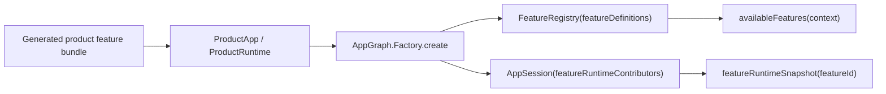

Feature registry shape:

```kotlin
class FeatureRegistry(featureDefinitions: List<FeatureDefinitionSpec>) {
    private val features = featureDefinitions.map(::descriptor)

    fun availableFeatures(context: AppContext): List<FeatureDescriptor> =
        features.filter { it.id in context.supportedFeatures && it.isAvailable(context) }
}
```

Rationale:

- Metro still creates the application graph.
- The product build decides which feature modules exist.
- Runtime filtering remains a normal session-level operation.

## 13. Android Build Mechanism

Android uses generated product flavors and flavor-specific dependencies.

Relevant file:

```text
androidApp/build.gradle.kts
```

### 13.1 Product Flavor Creation

The JSON drives flavor creation:

```kotlin
productFlavors {
    productBuildConfigs.forEach { product ->
        create(product.getValue("flavorName").toString()) {
            dimension = "app"
            applicationId = product.getValue("androidApplicationId").toString()
            resValue("string", "app_name", product.getValue("displayName").toString())
            buildConfigField("String", "PRODUCT_ID", quotedBuildConfig(product.getValue("productId").toString()))
            buildConfigField("String", "BUNDLED_FEATURES", quotedBuildConfig(csvBuildConfig(product["bundledFeatures"])))
        }
    }
}
```

### 13.2 Flavor-Specific Dependencies

Each product receives only the selected feature modules:

```kotlin
dependencies {
    productBuildConfigs.forEach { product ->
        val configurationName = "${product.getValue("flavorName")}Implementation"
        productFeatures(product).forEach { featureId ->
            add(configurationName, project(featureModulePaths.getValue(featureId)))
        }
    }
}
```

For AppTwo, this resolves to:

```text
appTwoImplementation -> :shared:features:orders
appTwoImplementation -> :shared:features:lists
appTwoImplementation -> :shared:features:delivery
```

Catalog and Product Details are not on the AppTwo compile classpath.

### 13.3 Generated Android Product Bundle

Each Android variant gets a generated source file:

```text
androidApp/build/generated/productFeatureBundles/<variant>/kotlin/com/aeshma/multiapp/android/ProductFeatureBundle.kt
```

Example AppTwo generated shape:

```kotlin
object ProductFeatureBundle {
    val featureDefinitions: List<FeatureDefinitionSpec> = listOf(
        OrdersFeature.definition,
        ListsFeature.definition,
        DeliveryFeature.definition,
    )

    val featureRuntimeContributors: List<FeatureRuntimeContributor> = listOfNotNull(
        OrdersFeature.runtimeContributor,
        ListsFeature.runtimeContributor,
        DeliveryFeature.runtimeContributor,
    )
}
```

`MainActivity` passes these generated lists into shared UI/runtime:

```kotlin
ProductApp(
    productId = ProductId.fromExternalName(BuildConfig.PRODUCT_ID),
    buildFeatureBundle = BuildConfig.BUNDLED_FEATURES.toFeatureIds(),
    featureDefinitions = ProductFeatureBundle.featureDefinitions,
    featureRuntimeContributors = ProductFeatureBundle.featureRuntimeContributors,
)
```

### 13.4 Android Build Diagram

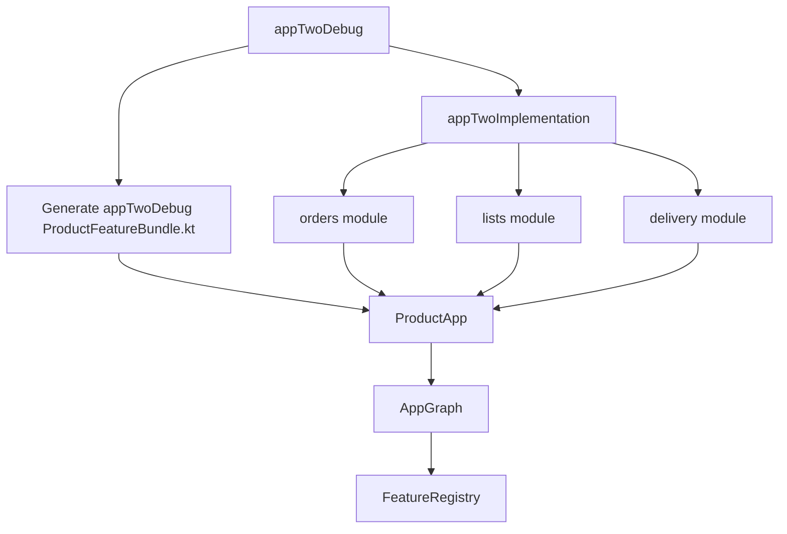

## 14. KMP iOS Build Mechanism

iOS KMP builds one framework name:

```text
SharedLogic.framework
```

The contents of that framework change depending on the selected product bundle.

### 14.1 Product Selection

Xcode or CLI passes:

```bash
./gradlew -PiosProductBundle=appTwo :shared:application:embedAndSignAppleFrameworkForXcode
```

The shared application Gradle script resolves that property:

```kotlin
val iosProductBundle = providers.gradleProperty("iosProductBundle").orElse("superApp")
val iosFeatureBundles = productBuildConfigs.associate { product ->
    product.getValue("swiftName").toString() to productFeatures(product)
}
val selectedIosFeatures = iosFeatureBundles[iosProductBundle.get()]
    ?: error("Unknown iosProductBundle '${iosProductBundle.get()}'.")
```

### 14.2 Selected iOS Dependencies

Only selected features become `iosMain` dependencies:

```kotlin
iosMain.dependencies {
    selectedIosFeatures.forEach { featureId ->
        api(project(featureModulePaths.getValue(featureId)))
    }
}
```

For AppTwo, `iosMain` receives Orders, Lists, and Delivery, not Catalog/Product Details.

### 14.3 Generated iOS Actuals

KMP uses `expect`/`actual` to provide platform feature definitions.

Common declaration:

```kotlin
internal expect fun platformFeatureDefinitions(): List<FeatureDefinitionSpec>

internal expect fun platformFeatureRuntimeContributors(): List<FeatureRuntimeContributor>
```

Generated iOS actual for AppTwo:

```kotlin
internal actual fun platformFeatureDefinitions(): List<FeatureDefinitionSpec> = listOf(
    OrdersFeature.definition,
    ListsFeature.definition,
    DeliveryFeature.definition,
)

internal actual fun platformFeatureRuntimeContributors(): List<FeatureRuntimeContributor> = listOfNotNull(
    OrdersFeature.runtimeContributor,
    ListsFeature.runtimeContributor,
    DeliveryFeature.runtimeContributor,
)
```

### 14.4 KMP iOS Build Diagram

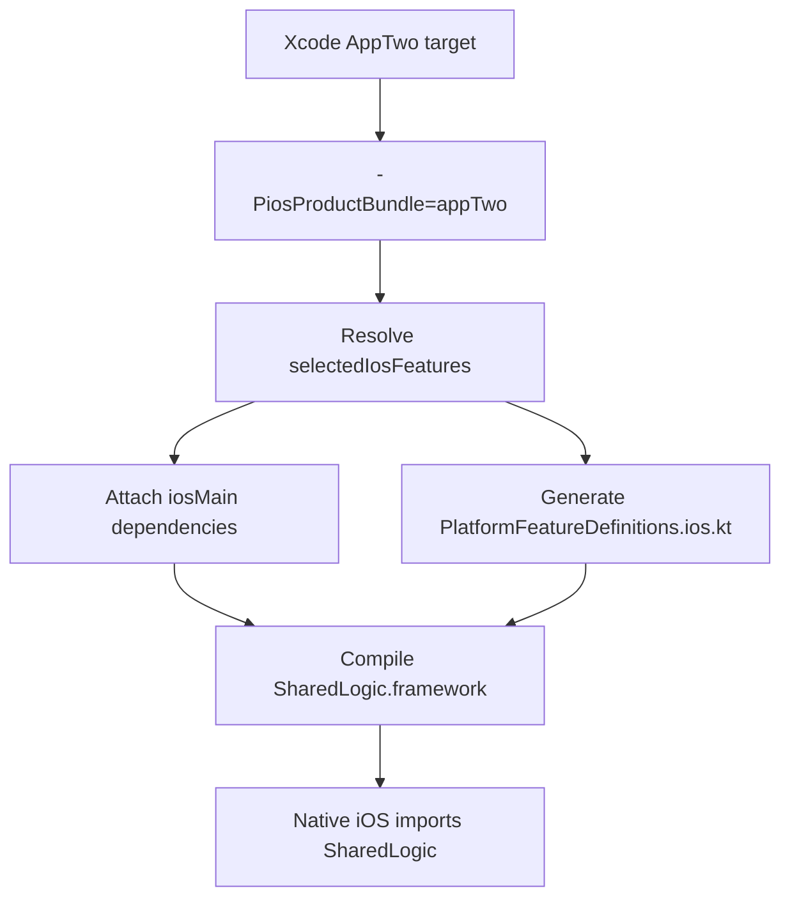

## 15. Native iOS Swift Build Mechanism

The KMP framework controls shared feature code. Native iOS still needs its own feature UI composition.

Relevant files:

```text
iosApp/Package.swift
iosApp/SharedIOS/Core
iosApp/SharedIOS/Features/*
iosApp/AppOne/AppOneFeatureRegistry.swift
iosApp/AppTwo/AppTwoFeatureRegistry.swift
iosApp/AppSuper/SuperAppFeatureRegistry.swift
```

### 15.1 Dynamic SwiftPM Manifest

`iosApp/Package.swift` reads `config/product-feature-bundles.json`:

```swift
private func loadFeatureBundleConfig() -> FeatureBundleConfig {
    let packageDirectory = URL(fileURLWithPath: #filePath).deletingLastPathComponent()
    let configURL = packageDirectory
        .deletingLastPathComponent()
        .appendingPathComponent("config/product-feature-bundles.json")

    let data = try Data(contentsOf: configURL)
    return try JSONDecoder().decode(FeatureBundleConfig.self, from: data)
}
```

It creates one feature library per Swift feature target:

```swift
swiftFeatures.values
    .sorted { $0.libraryName < $1.libraryName }
    .map { feature in
        Product.library(name: feature.libraryName, targets: [feature.targetName])
    }
```

It also creates product-level feature libraries:

```swift
featureBundleConfig.products.map { product in
    Product.library(
        name: product.iosFeatureProductName,
        targets: ["SharedIOSCore"] + product.bundledFeatures.map { featureTarget(for: $0).targetName }
    )
}
```

For AppTwo, SwiftPM describes:

```text
AppTwoIOSFeatures
  SharedIOSCore
  FeatureOrders
  FeatureLists
  FeatureDelivery
```

### 15.2 Generated Product Registries

The root Gradle task generates product registries:

```bash
./gradlew generateIOSProductFeatureBundles
```

Generated AppTwo registry:

```swift
// Generated by ./gradlew generateIOSProductFeatureBundles.
// Source: config/product-feature-bundles.json

@MainActor
extension CommerceFeatureRegistry {
    static let appTwo = CommerceFeatureRegistry(
        modules: [
            OrdersFeatureModule.module,
            ListsFeatureModule.module,
            DeliveryFeatureModule.module,
        ]
    )
}
```

### 15.3 Native iOS Build Diagram

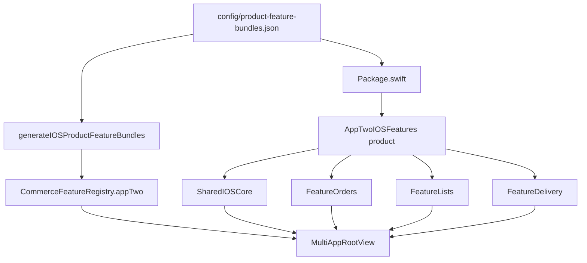

## 16. End-To-End Runtime Flow

Once the product build is assembled, runtime still applies session-level rules.

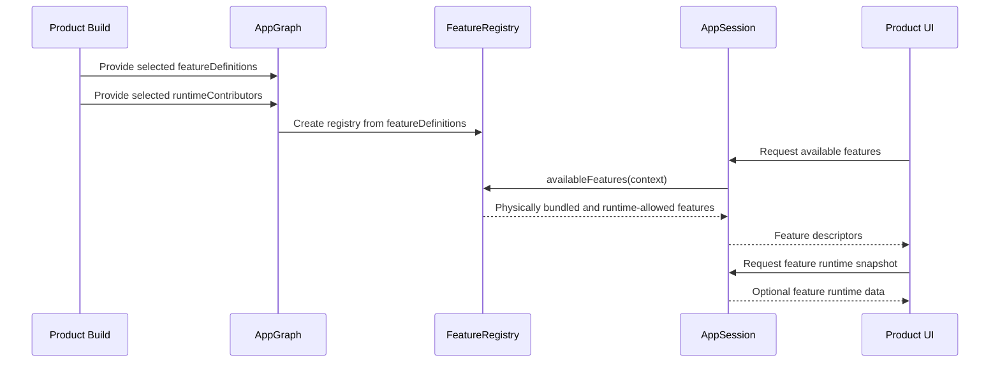

Important point:

The runtime can only show features that are physically present. It cannot recover a feature excluded from the product build.

## 17. How To Add A Feature

Example feature: `payments`.

### 17.1 Add KMP Feature Module

Create:

```text
shared/features/payments
```

Add it to Gradle settings:

```kotlin
include(":shared:features:payments")
```

Create the feature object:

```kotlin
package com.aeshma.multiapp.feature.payments

object PaymentsFeature : CommerceFeatureModule {
    override val definition: FeatureDefinitionSpec = FeatureDefinitionSpec(
        id = FeatureId("payments"),
        title = "Payments",
        requiredPermission = PermissionId("payments.view"),
    )
}
```

If it owns runtime state:

```kotlin
object PaymentsFeature : CommerceFeatureModule {
    override val definition: FeatureDefinitionSpec = paymentsDefinition

    override val runtimeContributor: FeatureRuntimeContributor =
        PaymentsRuntimeContributor(repository = SamplePaymentsRepository())
}
```

### 17.2 Add Shared Model/Permission Config

Add any feature ids, permissions, capability presets, or experience support needed by the app.

Example:

```kotlin
val Payments = FeatureId("payments")
```

Add product/experience support where required.

### 17.3 Add Bundle Metadata

Update `config/product-feature-bundles.json`:

```json
{
  "featureModules": {
    "payments": ":shared:features:payments"
  },
  "featureKotlinObjects": {
    "payments": "com.aeshma.multiapp.feature.payments.PaymentsFeature"
  },
  "featureSwiftTargets": {
    "payments": {
      "libraryName": "FeaturePayments",
      "targetName": "FeaturePayments",
      "moduleName": "PaymentsFeatureModule",
      "path": "SharedIOS/Features/Payments"
    }
  }
}
```

Then add `"payments"` to each product that should physically include it:

```json
{
  "flavorName": "appOne",
  "bundledFeatures": ["orders", "catalog", "product-details", "delivery", "payments"]
}
```

### 17.4 Add Native iOS Feature UI

Create:

```text
iosApp/SharedIOS/Features/Payments/PaymentsFeatureModule.swift
```

Example:

```swift
#if SWIFT_PACKAGE
import SharedIOSCore
#endif

@MainActor
public enum PaymentsFeatureModule {
    public static let module = GenericCommerceFeatureModule.make(
        id: "payments",
        tabSystemImage: "creditcard"
    )
}
```

If the feature needs custom Swift UI:

```swift
@MainActor
public enum PaymentsFeatureModule {
    public static let module = AnyCommerceFeatureModule(
        id: "payments",
        tabSystemImage: "creditcard",
        viewFactory: { feature, store in
            AnyView(PaymentsFeatureContentView(feature: feature, store: store))
        }
    )
}
```

### 17.5 Regenerate

```bash
./gradlew generateIOSProductFeatureBundles
```

Android and KMP iOS generated sources are generated as part of their compile tasks. The native iOS product constants/registries are checked-in generated files, so regenerate them when JSON changes.

### 17.6 Verify

```bash
JAVA_HOME=/opt/homebrew/opt/openjdk@21/libexec/openjdk.jdk/Contents/Home ./gradlew :androidApp:compileAppOneDebugKotlin :androidApp:compileAppTwoDebugKotlin :androidApp:compileSuperAppDebugKotlin

JAVA_HOME=/opt/homebrew/opt/openjdk@21/libexec/openjdk.jdk/Contents/Home ./gradlew -PiosProductBundle=appOne :shared:application:compileKotlinIosSimulatorArm64
JAVA_HOME=/opt/homebrew/opt/openjdk@21/libexec/openjdk.jdk/Contents/Home ./gradlew -PiosProductBundle=appTwo :shared:application:compileKotlinIosSimulatorArm64
JAVA_HOME=/opt/homebrew/opt/openjdk@21/libexec/openjdk.jdk/Contents/Home ./gradlew -PiosProductBundle=superApp :shared:application:compileKotlinIosSimulatorArm64

swift package --package-path iosApp describe
swift build --package-path iosApp
```

To prove a product excludes the feature:

```bash
JAVA_HOME=/opt/homebrew/opt/openjdk@21/libexec/openjdk.jdk/Contents/Home ./gradlew :androidApp:dependencyInsight --configuration appTwoDebugCompileClasspath --dependency shared:features:payments

JAVA_HOME=/opt/homebrew/opt/openjdk@21/libexec/openjdk.jdk/Contents/Home ./gradlew -PiosProductBundle=appTwo :shared:application:dependencyInsight --configuration iosSimulatorArm64CompileKlibraries --dependency shared:features:payments
```

Expected result:

```text
No dependencies matching given input were found
```

## 18. How To Remove A Feature From A Product

Example: remove `catalog` from AppOne.

### 18.1 Remove From Product Metadata

Update:

```text
config/product-feature-bundles.json
```

Before:

```json
"bundledFeatures": ["orders", "catalog", "product-details", "delivery"]
```

After:

```json
"bundledFeatures": ["orders", "product-details", "delivery"]
```

### 18.2 Regenerate Native iOS Files

```bash
./gradlew generateIOSProductFeatureBundles
```

This updates:

```text
iosApp/SharedIOS/Core/ProductFeatureBundles.generated.swift
iosApp/AppOne/AppOneFeatureRegistry.swift
iosApp/AppTwo/AppTwoFeatureRegistry.swift
iosApp/AppSuper/SuperAppFeatureRegistry.swift
```

### 18.3 Build Android

```bash
JAVA_HOME=/opt/homebrew/opt/openjdk@21/libexec/openjdk.jdk/Contents/Home ./gradlew :androidApp:compileAppOneDebugKotlin
```

The generated AppOne Android `ProductFeatureBundle.kt` should no longer import `CatalogFeature`.

### 18.4 Build KMP iOS

```bash
JAVA_HOME=/opt/homebrew/opt/openjdk@21/libexec/openjdk.jdk/Contents/Home ./gradlew -PiosProductBundle=appOne :shared:application:compileKotlinIosSimulatorArm64
```

The generated iOS `PlatformFeatureDefinitions.ios.kt` should no longer import `CatalogFeature`.

### 18.5 Build Native iOS

```bash
swift package --package-path iosApp describe
swift build --package-path iosApp
```

The described AppOne product should no longer list `FeatureCatalog`.

### 18.6 Prove Absence

```bash
JAVA_HOME=/opt/homebrew/opt/openjdk@21/libexec/openjdk.jdk/Contents/Home ./gradlew :androidApp:dependencyInsight --configuration appOneDebugCompileClasspath --dependency shared:features:catalog

JAVA_HOME=/opt/homebrew/opt/openjdk@21/libexec/openjdk.jdk/Contents/Home ./gradlew -PiosProductBundle=appOne :shared:application:dependencyInsight --configuration iosSimulatorArm64CompileKlibraries --dependency shared:features:catalog
```

Expected:

```text
No dependencies matching given input were found
```

## 19. How To Remove A Feature Entirely

If no product uses a feature anymore:

1. Remove the feature id from every product's `bundledFeatures`.
2. Remove its entry from `featureModules`.
3. Remove its entry from `featureKotlinObjects`.
4. Remove its entry from `featureSwiftTargets`.
5. Remove or archive the KMP module from `shared/features`.
6. Remove or archive the native Swift folder from `iosApp/SharedIOS/Features`.
7. Remove unused permissions/capability presets if no other feature uses them.
8. Run generation and verification commands.

Be careful with shared runtime APIs. If the feature owns state, policy, repositories, or session APIs, those should live in the feature module before the feature is removed. Otherwise the shared app may keep depending on code that should have been excluded.

## 20. Verification Checklist

Use this checklist for every bundling change.

| Check | Command or action |
|---|---|
| Generate iOS product files | `./gradlew generateIOSProductFeatureBundles` |
| Android compile | `./gradlew :androidApp:compileAppOneDebugKotlin :androidApp:compileAppTwoDebugKotlin :androidApp:compileSuperAppDebugKotlin` |
| KMP iOS compile per product | `./gradlew -PiosProductBundle=<bundle> :shared:application:compileKotlinIosSimulatorArm64` |
| Swift package manifest | `swift package --package-path iosApp describe` |
| Swift package build | `swift build --package-path iosApp` |
| Dependency absence on Android | `./gradlew :androidApp:dependencyInsight --configuration <flavor>DebugCompileClasspath --dependency <module>` |
| Dependency absence on iOS KMP | `./gradlew -PiosProductBundle=<bundle> :shared:application:dependencyInsight --configuration iosSimulatorArm64CompileKlibraries --dependency <module>` |
| Whitespace sanity | `git diff --check` |

## 21. Common Failure Modes

| Failure | Likely cause | Fix |
|---|---|---|
| Android product cannot import feature object | Product excludes the feature dependency. | Add the feature to `bundledFeatures` or remove the import. |
| Generated Android bundle references missing object | Missing or wrong `featureKotlinObjects` entry. | Fix JSON object reference. |
| KMP iOS compile fails for generated actual | Selected bundle references a feature without iOS dependency metadata. | Fix `featureModules` or `featureKotlinObjects`. |
| Swift package manifest fails | Bad `featureSwiftTargets` path/name or malformed JSON. | Fix JSON and rerun `swift package describe`. |
| Swift registry references missing module enum | `moduleName` does not match Swift source. | Fix `featureSwiftTargets.<feature>.moduleName`. |
| Feature visible in runtime but native UI missing | KMP bundle and Swift registry are out of sync. | Regenerate Swift files and verify `bundledFeatures`. |
| Product still ships excluded code | Shared module has direct dependency on feature. | Move feature-specific APIs behind `FeatureRuntimeContributor` or shared abstractions. |

## 22. Rationale Behind The Design

### 22.1 One Product Config

The config is intentionally explicit. It has more metadata than a minimal file, but that makes the build graph easier to audit.

Benefits:

- Product feature membership is visible in one file.
- Android, KMP, and native iOS all use the same feature ids.
- Adding/removing a feature is mostly a config update plus feature source code.
- Verification can be automated around one config.

Tradeoff:

- The JSON contains platform-specific metadata. A future enhancement could move to a typed DSL or schema-validated config.

### 22.2 Generated Product Registries

Generated registries avoid hand-maintained lists such as:

```kotlin
listOf(
    OrdersFeature.definition,
    ListsFeature.definition,
    DeliveryFeature.definition,
)
```

and:

```swift
modules: [
    OrdersFeatureModule.module,
    ListsFeatureModule.module,
    DeliveryFeatureModule.module,
]
```

Benefits:

- Fewer drift points.
- Compile-time proof if the config references a missing feature.
- Platform-specific build files become adapters around the same product metadata.

### 22.3 Runtime Contributors

Moving Delivery runtime state into a feature contributor was important for consistency. If the shared application layer directly exposes `deliveryPolicy()` or `deliveryOrders()`, then every product may need Delivery on the classpath even when the UI excludes it.

Feature contributors keep feature-owned runtime behavior physically movable.

### 22.4 Runtime Filtering Still Matters

Physical bundling does not replace permissions.

Example:

- AppTwo physically includes Orders.
- A logged-in user may still lack `orders.edit`.
- Runtime filtering hides the edit action.

The model is layered:

```text
Product build includes feature -> Experience supports feature -> User has permission -> UI displays feature/action
```

## 23. What This POC Achieved

This POC demonstrates:

- A single product feature config can drive multiple platform build systems.
- Android can physically compile only product-selected feature modules.
- KMP iOS can physically compile only product-selected feature modules into `SharedLogic.framework`.
- Native iOS Swift UI can split feature renderers into product-selected SwiftPM targets.
- Product registries can be generated instead of hand-maintained.
- Feature-owned runtime logic can live with the feature module.
- Runtime permission filtering can remain layered on top of physical bundling.
- Dependency absence can be proven with Gradle dependency insight.

The POC moves the project from "all features are compiled and then hidden" toward "product build graphs define what feature code exists."

## 24. What Is Still POC-Level

| Area | Current state | Production recommendation |
|---|---|---|
| Config validation | Basic Gradle validation exists in build scripts. | Add a dedicated `validateFeatureBundles` task with full schema/path/object checks. |
| Shared build logic | Parsing/generation logic is repeated across Gradle files. | Move to `buildSrc` or a convention plugin. |
| SwiftPM manifest | Reads JSON dynamically. | Acceptable for POC; for stricter builds, generate a static manifest or validate in CI. |
| Xcode project membership | SwiftPM products are generated; Xcode target folder exclusions may still be manual. | Automate only if product count grows or Xcode drift becomes painful. |
| Binary measurement | Dependency absence verified. | Add APK/IPA size reports per product. |
| CI | Commands are manual. | Add CI jobs for generation, compile, dependency absence, and Swift manifest verification. |

## 25. Recommended Future Enhancements

### 25.1 Move Build Logic To A Convention Plugin

Current scripts parse the same JSON in several places:

- Root `build.gradle.kts`
- `androidApp/build.gradle.kts`
- `shared/application/build.gradle.kts`
- `iosApp/Package.swift`

Recommended next step:

```text
buildSrc/src/main/kotlin/FeatureBundleConfig.kt
buildSrc/src/main/kotlin/FeatureBundleValidation.kt
buildSrc/src/main/kotlin/FeatureBundleGenerators.kt
```

Benefits:

- Typed config model.
- One validation implementation.
- Easier testing of generator behavior.
- Less duplicated string generation.

### 25.2 Add `validateFeatureBundles`

Suggested checks:

- Every `bundledFeatures` entry exists in `featureModules`.
- Every `bundledFeatures` entry exists in `featureKotlinObjects`.
- Every `bundledFeatures` entry exists in `featureSwiftTargets`.
- Every Gradle project path exists.
- Every Swift feature path exists.
- Every `iosFeatureRegistryFile` is unique.
- Every `flavorName`, `swiftName`, and `productId` is unique.
- Generated files are up to date.

Example command:

```bash
./gradlew validateFeatureBundles
```

### 25.3 Add `verifyFeatureBundles`

Suggested task:

```bash
./gradlew verifyFeatureBundles
```

It can depend on:

- `validateFeatureBundles`
- `generateIOSProductFeatureBundles`
- Android compile tasks
- KMP iOS compile tasks for every product
- dependency absence checks

### 25.4 Generate Product Matrix Documentation

Generate a small markdown table from JSON:

```text
docs/generated/product-feature-matrix.md
```

This keeps Confluence/source docs aligned with actual build config.

### 25.5 Escape Generated Strings

Current generated values work for existing strings. A production generator should escape:

- quotes
- backslashes
- newlines
- non-ASCII if required by project policy

### 25.6 Binary Size Reporting

Add per-product reports:

- Android APK/AAB size by flavor.
- iOS framework size by `iosProductBundle`.
- Native Swift product target membership.

### 25.7 Xcode Integration Automation

If products grow, automate or validate:

- Xcode run script passes the correct `-PiosProductBundle`.
- Xcode target links the intended SwiftPM product.
- Unused feature folders are not accidentally target members.

## 26. Applying This Concept To Another Project

This POC can be adapted to another multi-product mobile project if that project has:

- A stable feature id model.
- Separatable feature modules or packages.
- A product build matrix.
- A DI or composition layer where feature definitions can be injected.
- A way to run platform-specific build variants.

Recommended adoption sequence:

1. Inventory current features and products.
2. Define stable feature ids.
3. Move feature metadata into feature-owned modules.
4. Replace global feature imports with injected feature lists.
5. Add product feature config.
6. Generate product registries from that config.
7. Attach platform dependencies from product feature config.
8. Keep runtime permission filtering as a second layer.
9. Add validation and CI checks.
10. Measure dependency and size differences.

The pattern is not limited to KMP. The same concept applies to:

- Native Android modular apps.
- Native iOS Swift package modular apps.
- React Native apps with native feature packages.
- White-label commerce apps.
- Multi-brand apps with product-specific capability sets.

The core architecture is always:

```text
Product feature config -> Build dependency selection -> Generated product registry -> Runtime permission filtering
```

## 27. Final Conclusion

The POC proves that feature bundling can move from runtime-only visibility rules to true product-specific build graphs.

Before this mechanism, a product could hide a feature but still compile and ship its code. With this POC, the product's physical dependency graph follows the product's feature bundle:

- Android flavors compile only selected KMP feature modules.
- KMP iOS framework builds include only selected shared feature modules.
- Native iOS Swift products include only selected feature UI targets.
- Product registries are generated from one config instead of hand-maintained.
- Runtime permissions still decide what the user can see after login.

This gives the project a practical foundation for scalable multi-product builds. In a production migration, the next step should be validation and CI automation, followed by binary size measurement and tighter Xcode project integration.
