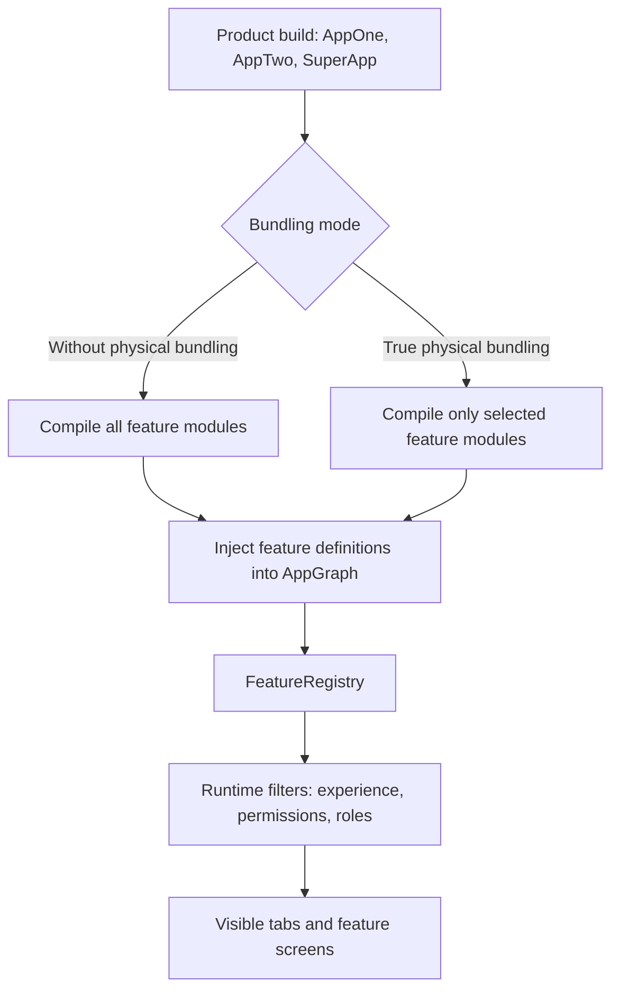
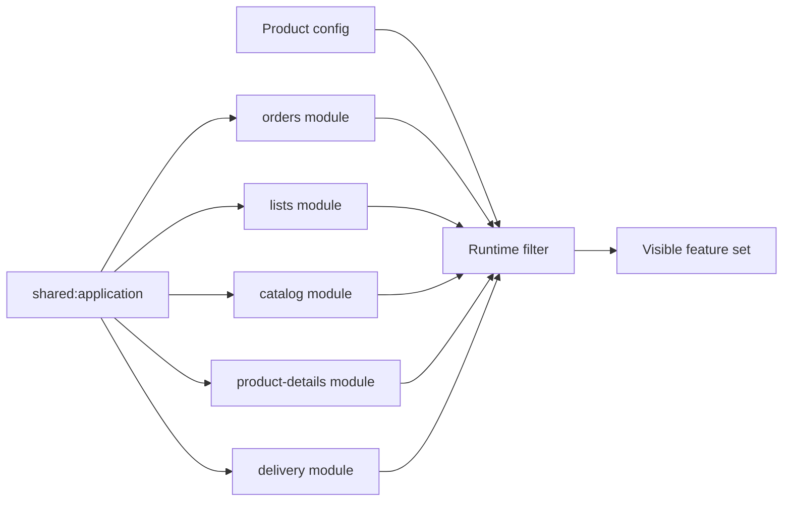
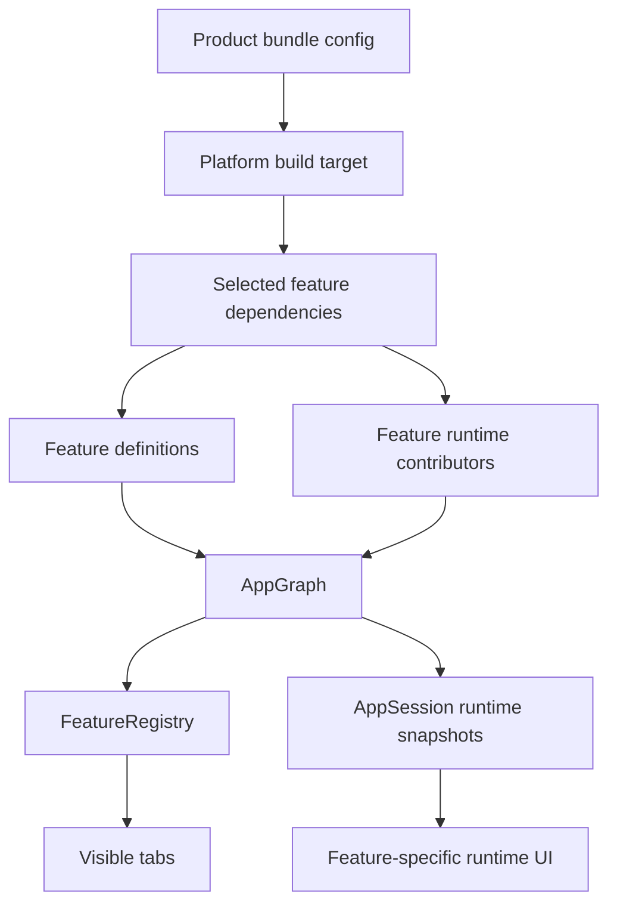
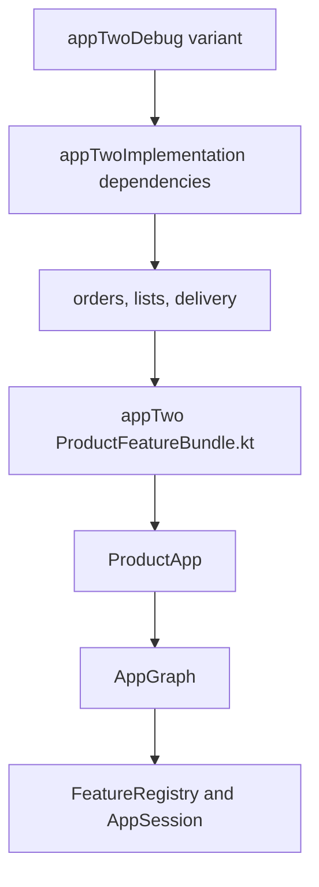
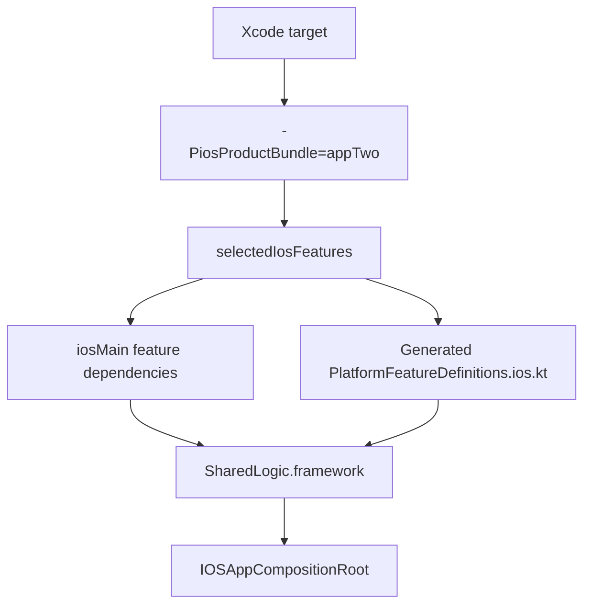
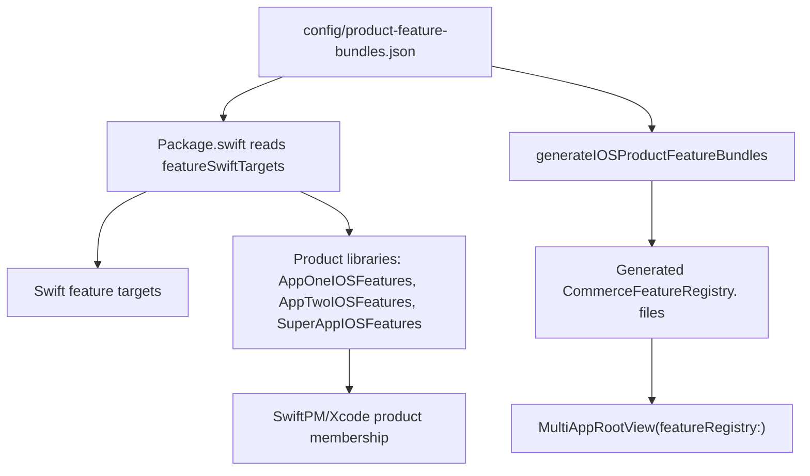
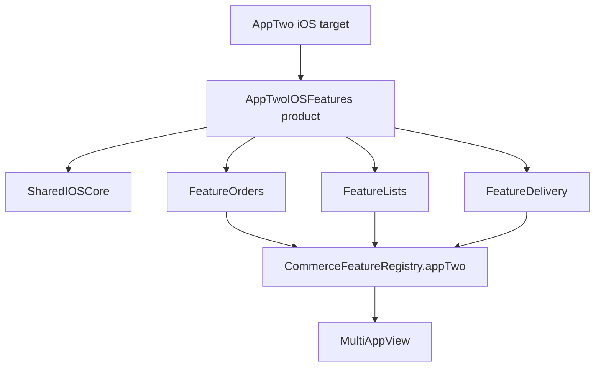
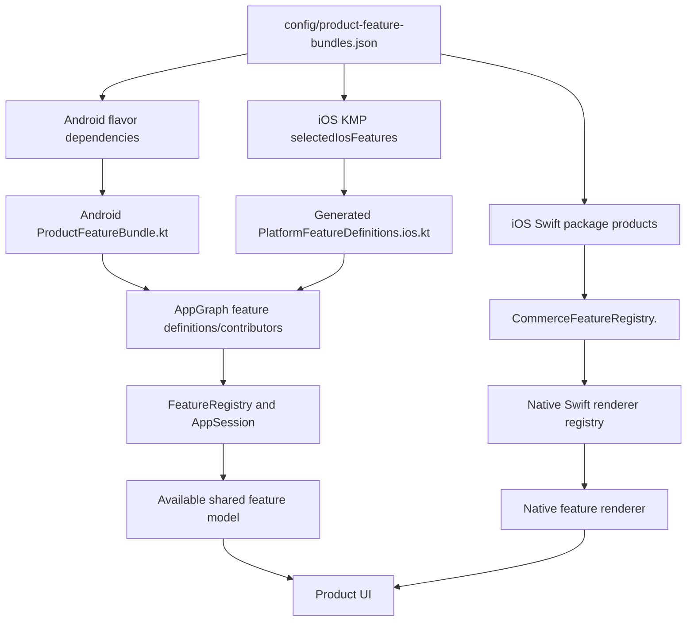

# Feature Bundling Mechanism

Status: Draft for engineering review
Audience: iOS, Android, KMP, and platform engineers
Scope: Feature bundling only. This page compares runtime-only bundling with true physical bundling and explains how to add or remove features safely.

## Summary

Feature bundling answers one question:

> Which feature modules are included in a product build?

There are two ways to answer it:

| Mode | What happens | Binary impact | Best use |
|---|---|---|---|
| Without true physical bundling | Every feature module is compiled, then the app filters visible features at runtime. | All feature code is still present in the app binary/framework. | Fast prototypes, demos, simple product gates. |
| True physical bundling | The product build only depends on the feature modules selected for that product. | Excluded feature code is not compiled or linked into that product build. | Real product splits, app size control, stronger module isolation. |

Current implementation uses true physical bundling for:

- Android product flavors.
- KMP iOS framework builds selected with `-PiosProductBundle`.
- Native iOS Swift feature UI targets selected through Swift package product registries.

Runtime permission checks still exist in both modes. Physical bundling controls what code is in the build. Runtime filtering controls what the logged-in user can see.



## Terms

| Term | Meaning |
|---|---|
| Feature module | A KMP module such as `:shared:features:orders` or `:shared:features:delivery`. |
| Native iOS feature target | A Swift Package target such as `FeatureOrders` or `FeatureDelivery`. |
| Feature definition | Static metadata used by the app to show tabs, permission rows, actions, and UI blocks. |
| Runtime contributor | Optional feature-owned runtime data provider. Delivery uses this for delivery-specific runtime state. |
| Physical bundle | The set of modules that are actually compiled into a product. |
| Runtime availability | The set of features the current user/session can see after login, experience, and permission checks. |

## Product Feature Source Of Truth

The product-to-feature mapping lives in:

```text
config/product-feature-bundles.json
```

Example:

```json
{
  "featureModules": {
    "orders": ":shared:features:orders",
    "lists": ":shared:features:lists",
    "catalog": ":shared:features:catalog",
    "product-details": ":shared:features:productdetails",
    "delivery": ":shared:features:delivery"
  },
  "featureKotlinObjects": {
    "orders": "com.aeshma.multiapp.feature.orders.OrdersFeature",
    "lists": "com.aeshma.multiapp.feature.lists.ListsFeature",
    "catalog": "com.aeshma.multiapp.feature.catalog.CatalogFeature",
    "product-details": "com.aeshma.multiapp.feature.productdetails.ProductDetailsFeature",
    "delivery": "com.aeshma.multiapp.feature.delivery.DeliveryFeature"
  },
  "products": [
    {
      "flavorName": "appTwo",
      "swiftName": "appTwo",
      "productId": "AppTwoStandalone",
      "displayName": "AppTwo",
      "androidApplicationId": "com.aeshma.apptwo",
      "supportedExperiences": ["newport-buckhead"],
      "bundledFeatures": ["orders", "lists", "delivery"]
    }
  ]
}
```

This file documents the intended product bundle. Platform build files still need to express the physical dependencies because Gradle and SwiftPM decide compilation from dependency graphs, not from JSON.

## Without True Physical Bundling

In a runtime-only setup, the application layer imports every feature module and builds one global registry.

```kotlin
private val features = listOf(
    descriptor(OrdersFeature.definition),
    descriptor(ListsFeature.definition),
    descriptor(CatalogFeature.definition),
    descriptor(ProductDetailsFeature.definition),
    descriptor(DeliveryFeature.definition),
)
```

Then each product or session filters the global list:

```kotlin
fun availableFeatures(context: AppContext): List<FeatureDescriptor> =
    features.filter { it.id in context.supportedFeatures && it.isAvailable(context) }
```

That hides tabs, but it does not remove code from the binary.



### Runtime-Only Characteristics

| Area | Behavior |
|---|---|
| Build dependencies | App depends on all feature modules. |
| Feature discovery | Usually static imports or one central all-feature registry. |
| Excluded feature code | Still compiled into the product. |
| UI visibility | Controlled by runtime config and permissions. |
| Compile-time safety | A product can accidentally import a feature it should not ship. |
| App size | No meaningful feature-level size reduction. |

Runtime-only bundling is still useful when product separation is only a UI or permission concern. It is not enough when the product binary must avoid shipping excluded features.

## True Physical Bundling

In true physical bundling, the product build provides the feature list from the outside. The shared application layer no longer imports every feature directly.

```kotlin
class FeatureRegistry(featureDefinitions: List<FeatureDefinitionSpec>) {
    private val features = featureDefinitions.map(::descriptor)

    fun availableFeatures(context: AppContext): List<FeatureDescriptor> =
        features.filter { it.id in context.supportedFeatures && it.isAvailable(context) }
}
```

`CommerceFeatureModule` is the feature contract:

```kotlin
interface CommerceFeatureModule {
    val definition: FeatureDefinitionSpec
    val runtimeContributor: FeatureRuntimeContributor?
        get() = null
}
```

Feature-owned runtime data uses `FeatureRuntimeContributor`:

```kotlin
interface FeatureRuntimeContributor {
    val featureId: FeatureId

    fun snapshot(context: AppContext): FeatureRuntimeSnapshot
}
```

Delivery uses this pattern, so delivery policy/repository behavior lives with the Delivery feature instead of in the common application layer.



### True Physical Characteristics

| Area | Behavior |
|---|---|
| Build dependencies | Product depends only on selected feature modules. |
| Feature discovery | Product-specific injection supplies definitions and contributors. |
| Excluded feature code | Not compiled or linked into that product. |
| UI visibility | Still controlled by runtime config and permissions after compilation. |
| Compile-time safety | Importing an excluded feature from that product should fail. |
| App size | Can reduce size when a product excludes feature modules. |

## Android Mechanism

Android uses product flavors, flavor-specific dependencies, and generated flavor bundle source. The source of truth is `config/product-feature-bundles.json`.

```kotlin
dependencies {
    productBuildConfigs.forEach { product ->
        val configurationName = "${product.getValue("flavorName")}Implementation"
        productFeatures(product).forEach { featureId ->
            add(configurationName, project(featureModulePaths.getValue(featureId)))
        }
    }
}
```

Each Android variant gets a generated bundle file:

```text
androidApp/build/generated/productFeatureBundles/appTwoDebug/kotlin/com/aeshma/multiapp/android/ProductFeatureBundle.kt
```

Example generated shape:

```kotlin
object ProductFeatureBundle {
    val featureDefinitions: List<FeatureDefinitionSpec> = listOf(
        OrdersFeature.definition,
        ListsFeature.definition,
        DeliveryFeature.definition,
    )

    val featureRuntimeContributors: List<FeatureRuntimeContributor> = listOfNotNull(
        OrdersFeature.runtimeContributor,
        ListsFeature.runtimeContributor,
        DeliveryFeature.runtimeContributor,
    )
}
```

Compile flow:



If `appTwo` tries to import `CatalogFeature`, compilation should fail because `appTwoImplementation` does not include `:shared:features:catalog`.

## iOS KMP Mechanism

iOS builds the same framework name, `SharedLogic.framework`, but the selected feature set changes per Xcode target.

The selected product is passed to Gradle:

```bash
./gradlew -PiosProductBundle=appOne :shared:application:embedAndSignAppleFrameworkForXcode
./gradlew -PiosProductBundle=appTwo :shared:application:embedAndSignAppleFrameworkForXcode
./gradlew -PiosProductBundle=superApp :shared:application:embedAndSignAppleFrameworkForXcode
```

`shared/application/build.gradle.kts` derives bundle names from `config/product-feature-bundles.json`:

```kotlin
val iosFeatureBundles = productBuildConfigs.associate { product ->
    product.getValue("swiftName").toString() to productFeatures(product)
}
```

Only selected features become `iosMain` dependencies:

```kotlin
iosMain.dependencies {
    selectedIosFeatures.forEach { featureId ->
        api(project(featureModulePaths.getValue(featureId)))
    }
}
```

The build also generates the iOS actual implementation:

```kotlin
internal actual fun platformFeatureDefinitions(): List<FeatureDefinitionSpec> = listOf(
    OrdersFeature.definition,
    ListsFeature.definition,
    DeliveryFeature.definition,
)

internal actual fun platformFeatureRuntimeContributors(): List<FeatureRuntimeContributor> = listOfNotNull(
    OrdersFeature.runtimeContributor,
    ListsFeature.runtimeContributor,
    DeliveryFeature.runtimeContributor,
)
```

That generated file is the KMP side of the iOS physical bundle.



## Native iOS Swift UI Mechanism

KMP physical bundling controls what shared feature code goes into `SharedLogic.framework`. Native Swift feature UI is split separately through Swift Package targets. The Swift package products are derived from `config/product-feature-bundles.json`, and product registry files are generated by:

```bash
./gradlew generateIOSProductFeatureBundles
```

`Package.swift` reads `featureSwiftTargets` and `products` from the JSON:

```swift
private let packageProducts: [Product] = [
    .library(name: "SharedIOSCore", targets: ["SharedIOSCore"]),
] +
    swiftFeatures.values.map { feature in
        Product.library(name: feature.libraryName, targets: [feature.targetName])
    } +
    featureBundleConfig.products.map { product in
        Product.library(
            name: product.iosFeatureProductName,
            targets: ["SharedIOSCore"] + product.bundledFeatures.map { featureTarget(for: $0).targetName }
        )
    }
```

Each product registry file is generated from the same `bundledFeatures` list:

```swift
// Generated by ./gradlew generateIOSProductFeatureBundles.
// Source: config/product-feature-bundles.json

@MainActor
extension CommerceFeatureRegistry {
    static let appTwo = CommerceFeatureRegistry(
        modules: [
            OrdersFeatureModule.module,
            ListsFeatureModule.module,
            DeliveryFeatureModule.module,
        ]
    )
}
```

Native Swift package flow:



The generated registry shape is:

```swift
@MainActor
extension CommerceFeatureRegistry {
    static let appTwo = CommerceFeatureRegistry(
        modules: [
            OrdersFeatureModule.module,
            ListsFeatureModule.module,
            DeliveryFeatureModule.module,
        ]
    )
}
```

Swift UI flow:



## How The Layers Connect

The full chain looks like this:



Think of it as two parallel registries:

| Registry | Platform | Contains | Purpose |
|---|---|---|---|
| KMP feature definition registry | Android and iOS | Feature metadata and runtime contributors. | Tells shared runtime what product features exist. |
| Native iOS feature renderer registry | iOS only | Swift renderers/modules. | Tells Swift UI how to render selected feature screens. |

Both registries must agree for iOS. If the KMP bundle includes Delivery but the Swift registry does not include `DeliveryFeatureModule`, shared runtime can expose Delivery but native Swift UI will fall back to generic rendering or fail to provide the intended feature UI.

## Adding A Feature

Use this checklist when adding a new feature such as `payments`.

### 1. Add The KMP Feature Module

Create:

```text
shared/features/payments
```

Add it to Gradle settings and create a module dependency shape matching the existing feature modules.

Feature module shape:

```kotlin
object PaymentsFeature : CommerceFeatureModule {
    override val definition: FeatureDefinitionSpec = FeatureDefinitionSpec(
        id = FeatureId.Payments,
        title = "Payments",
        requiredPermission = PermissionId.PaymentsView,
        tweakPermissions = emptyList(),
        permissionRows = emptyList(),
        actions = emptyList(),
        uiBlocks = emptyList(),
    )
}
```

If the feature owns runtime state, keep that state inside the feature module:

```kotlin
object PaymentsFeature : CommerceFeatureModule {
    override val definition: FeatureDefinitionSpec = TODO()

    override val runtimeContributor: FeatureRuntimeContributor =
        PaymentsRuntimeContributor(
            repository = SamplePaymentsRepository(),
        )
}
```

### 2. Add The Feature Id And Permissions

Add the feature id to the shared model/config layer:

```kotlin
enum class FeatureId {
    Orders,
    Lists,
    Catalog,
    ProductDetails,
    Delivery,
    Payments,
}
```

Add any required permissions and capability presets needed by product or experience config.

### 3. Add It To Product Bundle Metadata

Update:

```text
config/product-feature-bundles.json
```

Example:

```json
{
  "featureModules": {
    "payments": ":shared:features:payments"
  }
}
```

Then add `"payments"` to each product that should physically include it.

### 4. Wire Android Physical Bundles

Add the feature to `featureModules`, `featureKotlinObjects`, and each product's `bundledFeatures` in `config/product-feature-bundles.json`. Android then adds the right flavor dependencies and generates `ProductFeatureBundle.kt` for each variant.

```json
{
  "featureModules": {
    "payments": ":shared:features:payments"
  },
  "featureKotlinObjects": {
    "payments": "com.aeshma.multiapp.feature.payments.PaymentsFeature"
  }
}
```

Do not add handwritten `ProductFeatureBundle.kt` files under `androidApp/src/<flavor>`. Those files are generated under `androidApp/build/generated/productFeatureBundles`.

### 5. Wire iOS KMP Physical Bundles

The iOS KMP bundle also reads product membership, feature module paths, and Kotlin object references from `config/product-feature-bundles.json`. The build generates `PlatformFeatureDefinitions.ios.kt` and adds selected `iosMain` feature dependencies automatically.

### 6. Wire Native iOS Swift UI Metadata

Create:

```text
iosApp/SharedIOS/Features/Payments
```

Add a feature module, for example:

```swift
@MainActor
public enum PaymentsFeatureModule {
    public static let module = GenericCommerceFeatureModule.make(
        id: "payments",
        tabSystemImage: "creditcard"
    )
}
```

Add the Swift target metadata to `config/product-feature-bundles.json`:

```json
{
  "featureSwiftTargets": {
    "payments": {
      "libraryName": "FeaturePayments",
      "targetName": "FeaturePayments",
      "moduleName": "PaymentsFeatureModule",
      "path": "SharedIOS/Features/Payments"
    }
  }
}
```

Then add `"payments"` to each product's `bundledFeatures`. `Package.swift` will derive the product-level Swift package library targets, and the generator will rewrite each product registry file.

```bash
./gradlew generateIOSProductFeatureBundles
```

### 7. Verify

Compile all affected products:

```bash
JAVA_HOME=/opt/homebrew/opt/openjdk@21/libexec/openjdk.jdk/Contents/Home ./gradlew :androidApp:compileAppOneDebugKotlin :androidApp:compileAppTwoDebugKotlin :androidApp:compileSuperAppDebugKotlin
JAVA_HOME=/opt/homebrew/opt/openjdk@21/libexec/openjdk.jdk/Contents/Home ./gradlew -PiosProductBundle=appOne :shared:application:compileKotlinIosSimulatorArm64
JAVA_HOME=/opt/homebrew/opt/openjdk@21/libexec/openjdk.jdk/Contents/Home ./gradlew -PiosProductBundle=appTwo :shared:application:compileKotlinIosSimulatorArm64
JAVA_HOME=/opt/homebrew/opt/openjdk@21/libexec/openjdk.jdk/Contents/Home ./gradlew -PiosProductBundle=superApp :shared:application:compileKotlinIosSimulatorArm64
swift build --package-path iosApp
```

Prove excluded products do not compile the new feature:

```bash
JAVA_HOME=/opt/homebrew/opt/openjdk@21/libexec/openjdk.jdk/Contents/Home ./gradlew :androidApp:dependencyInsight --configuration appTwoDebugCompileClasspath --dependency shared:features:payments
JAVA_HOME=/opt/homebrew/opt/openjdk@21/libexec/openjdk.jdk/Contents/Home ./gradlew -PiosProductBundle=appTwo :shared:application:dependencies --configuration iosSimulatorArm64CompileKlibraries
```

## Removing A Feature From A Product

Use this checklist when a product should stop shipping a feature.

### 1. Remove It From Product Metadata

Update:

```text
config/product-feature-bundles.json
```

Remove the feature from that product's `bundledFeatures`.

### 2. Let Android Regenerate The Product Bundle

No handwritten Android bundle file needs to be edited. The next Android build recalculates flavor dependencies and regenerates that variant's `ProductFeatureBundle.kt` from `config/product-feature-bundles.json`.

### 3. Let iOS KMP Regenerate The Product Bundle

No `iosFeatureBundles` map needs to be edited. The next KMP iOS build derives selected features from the JSON and regenerates `PlatformFeatureDefinitions.ios.kt`.

### 4. Let Native iOS Swift Regenerate The Product Bundle

No product-level Swift package library or product registry file needs to be hand-edited. `Package.swift` derives product library targets from `bundledFeatures`, and `./gradlew generateIOSProductFeatureBundles` rewrites each `CommerceFeatureRegistry.<product>` file.

The feature Swift target can remain in `featureSwiftTargets` if other products still use it.

### 5. Move Feature-Owned Runtime APIs With The Feature

If the removed feature owns policy, repositories, session APIs, or state, those must not remain as hard dependencies in shared application code.

Use `FeatureRuntimeContributor` for feature-specific runtime data:

```kotlin
override val runtimeContributor: FeatureRuntimeContributor =
    DeliveryRuntimeContributor(
        policyResolver = DeliveryPolicyResolver(),
        repository = SampleDeliveryRepository(),
    )
```

The common app should access it generically:

```kotlin
fun featureRuntimeSnapshot(featureId: FeatureId): FeatureRuntimeSnapshot? =
    featureRuntimeContributors
        .firstOrNull { it.featureId == featureId }
        ?.snapshot(context)
```

This keeps the mechanism consistent across every feature. If a future product excludes Delivery, the shared application layer does not need a direct Delivery module dependency.

### 6. Verify Absence

Run compile checks for the product that excludes the feature and dependency checks proving the feature is absent.

```bash
JAVA_HOME=/opt/homebrew/opt/openjdk@21/libexec/openjdk.jdk/Contents/Home ./gradlew :androidApp:compileAppTwoDebugKotlin
JAVA_HOME=/opt/homebrew/opt/openjdk@21/libexec/openjdk.jdk/Contents/Home ./gradlew :androidApp:dependencyInsight --configuration appTwoDebugCompileClasspath --dependency shared:features:catalog
JAVA_HOME=/opt/homebrew/opt/openjdk@21/libexec/openjdk.jdk/Contents/Home ./gradlew -PiosProductBundle=appTwo :shared:application:compileKotlinIosSimulatorArm64
swift build --package-path iosApp
```

Expected result: dependency insight should not show the removed feature in the excluded product's compile classpath.

## Current Product Matrix

| Product | Android flavor | iOS bundle | KMP feature modules | Native iOS feature targets |
|---|---|---|---|---|
| AppOneStandalone | `appOne` | `appOne` | Orders, Catalog, Product Details, Delivery | `FeatureOrders`, `FeatureCatalog`, `FeatureProductDetails`, `FeatureDelivery` |
| AppTwoStandalone | `appTwo` | `appTwo` | Orders, Lists, Delivery | `FeatureOrders`, `FeatureLists`, `FeatureDelivery` |
| SuperApp | `superApp` | `superApp` | Orders, Lists, Catalog, Product Details, Delivery | `FeatureOrders`, `FeatureLists`, `FeatureCatalog`, `FeatureProductDetails`, `FeatureDelivery` |

## Validation Checklist

Before considering a bundling change complete:

- Product metadata has the intended `bundledFeatures`.
- Android generated flavor dependencies match product metadata.
- Android generated `ProductFeatureBundle.kt` imports only included features.
- iOS generated bundle selection matches product metadata.
- Generated iOS KMP platform feature definitions reference only included features.
- `Package.swift` product targets match the native UI features included in that product.
- Generated product Swift registries include only available native feature modules.
- Runtime contributors live in their feature modules, not as direct application-layer dependencies.
- Excluded feature dependency checks pass.
- Android, iOS KMP, and SwiftPM builds pass.

## Common Failure Modes

| Failure | Cause | Fix |
|---|---|---|
| Feature tab missing | Feature is not in the physical bundle, not in `supportedFeatures`, or blocked by permissions. | Check physical bundle first, then experience config, then permissions. |
| Android compile error for feature import | Product flavor imports a feature module it does not depend on. | Add the dependency if the feature should ship, or remove the import if it should not. |
| iOS KMP compile error for feature import | Generated platform definitions reference a feature that is missing from the selected product or Kotlin object map. | Fix `config/product-feature-bundles.json` or `featureKotlinObjectRefs`. |
| Swift UI falls back to generic feature UI | KMP exposes the feature, but the native iOS registry does not include the matching Swift feature module. | Fix `featureSwiftTargets` or `bundledFeatures`, then run `./gradlew generateIOSProductFeatureBundles`. |
| Product still contains excluded feature code | A shared application module still depends on the feature directly. | Move feature-owned behavior behind `FeatureRuntimeContributor` or another small shared abstraction. |

## Decision Rule

Use runtime-only bundling when the product difference is only about visibility.

Use true physical bundling when any of these are true:

- A product must not ship feature code.
- App size matters.
- Features have product-specific native UI.
- A future product may exclude a feature that current products include.
- The team wants compile-time proof that product boundaries are respected.

For this project, true physical bundling is the preferred mechanism because product bundles are intended to represent actual shipped features, not only hidden tabs.
