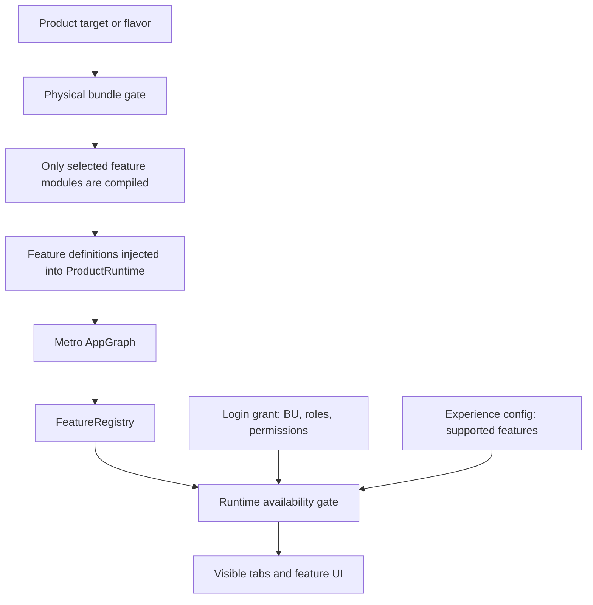
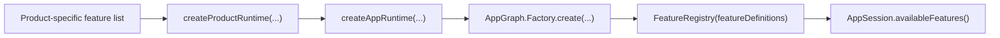
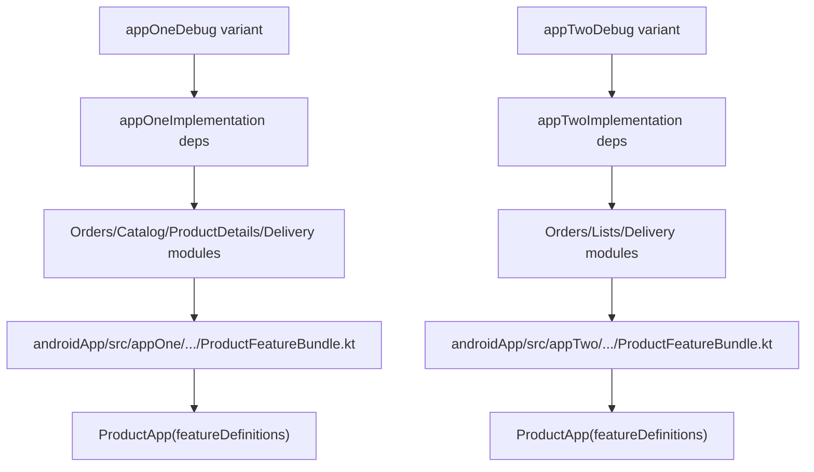
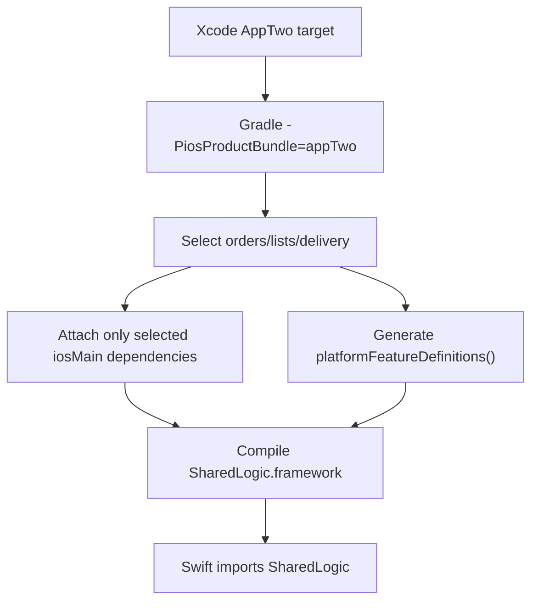
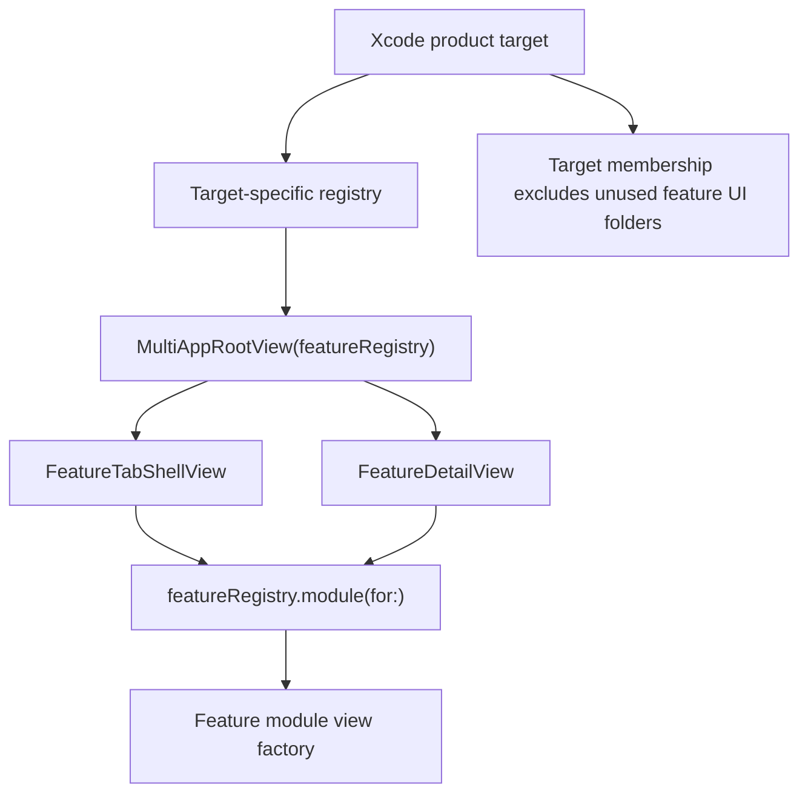
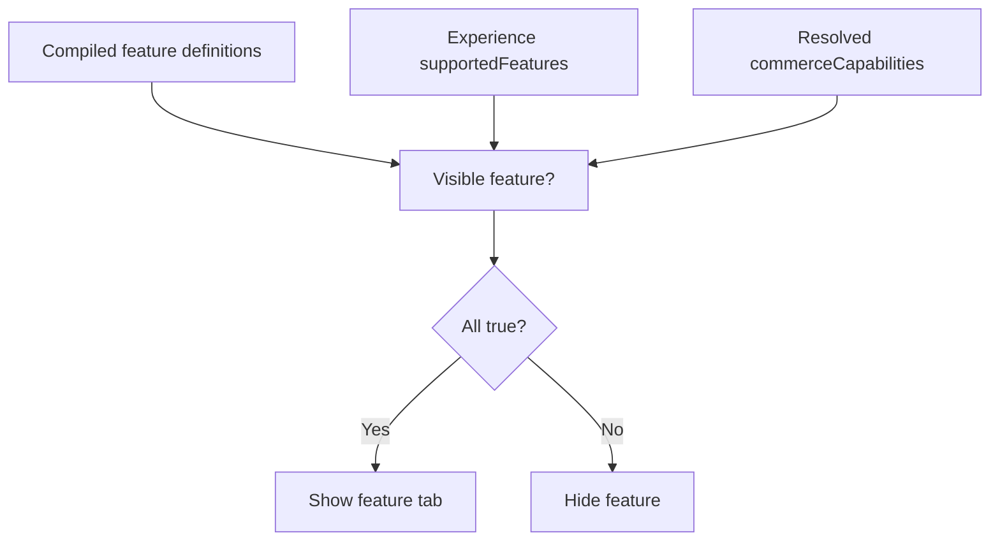

# Physical Feature Bundling

This document explains how this branch turns product feature bundles into actual compile-time/module inclusion instead of only runtime filtering.

## Goal

The app has three products:

| Product | Compiled feature modules |
|---|---|
| `AppOneStandalone` | Orders, Catalog, Product Details, Delivery |
| `AppTwoStandalone` | Orders, Lists, Delivery |
| `SuperApp` | Orders, Lists, Catalog, Product Details, Delivery |

Physical bundling means AppOne should not compile or link Lists, and AppTwo should not compile or link Catalog/Product Details. Runtime permissions still decide what the user can see, but unavailable product modules are not present in the product build in the first place.

## Two Layers

There are two different gates:

1. Physical bundle gate: decides what code is compiled into a product.
2. Runtime availability gate: decides what a logged-in user can see inside that product.



The physical gate protects the binary. The runtime gate protects the session.

## Source Of Truth

The high-level bundle metadata lives in:

```text
config/product-feature-bundles.json
```

It maps product ids to feature ids:

```json
{
  "productId": "AppOneStandalone",
  "bundledFeatures": ["orders", "catalog", "product-details", "delivery"]
}
```

The same file also maps feature ids to Gradle modules:

```json
{
  "orders": ":shared:features:orders",
  "lists": ":shared:features:lists",
  "catalog": ":shared:features:catalog",
  "product-details": ":shared:features:productdetails",
  "delivery": ":shared:features:delivery"
}
```

That config is still used for build metadata and display. The actual compile-time selection is expressed in Gradle source sets and product/flavor source files.

## Feature Module Shape

Each feature module owns a `FeatureDefinitionSpec`.

Example from Orders:

```kotlin
object OrdersFeature : CommerceFeatureModule {
    override val definition: FeatureDefinitionSpec = FeatureDefinitionSpec(
        id = FeatureId.Orders,
        title = "Orders",
        requiredPermission = PermissionId.OrdersView,
        // rows, actions, UI blocks...
    )
}
```

The application layer does not need to know how Orders, Lists, Catalog, or Product Details are implemented. It only needs the feature definitions from whatever modules were compiled into the product.

## Runtime Injection

The central inversion is that `FeatureRegistry` no longer imports every feature:

```kotlin
class FeatureRegistry(featureDefinitions: List<FeatureDefinitionSpec>) {
    private val features = featureDefinitions.map(::descriptor)

    fun availableFeatures(context: AppContext): List<FeatureDescriptor> =
        features.filter { it.id in context.supportedFeatures && it.isAvailable(context) }
}
```

`AppGraph` receives that list as a factory input:

```kotlin
@DependencyGraph
interface AppGraph {
    val featureDefinitions: List<FeatureDefinitionSpec>
    val session: AppSession

    @Provides
    fun provideFeatureRegistry(featureDefinitions: List<FeatureDefinitionSpec>): FeatureRegistry =
        FeatureRegistry(featureDefinitions)

    @DependencyGraph.Factory
    fun interface Factory {
        fun create(
            @Provides appId: AppId,
            @Provides appCatalog: AppCatalog,
            @Provides featureDefinitions: List<FeatureDefinitionSpec>,
        ): AppGraph
    }
}
```

So Metro still builds `AppSession`, `FeatureRegistry`, repositories, and analytics. The difference is that the product build now provides the feature list.



## Android Mechanism

Android uses product flavors plus flavor-specific dependencies.

In `androidApp/build.gradle.kts`, each flavor receives only its modules:

```kotlin
dependencies {
    add("appOneImplementation", projects.shared.features.orders)
    add("appOneImplementation", projects.shared.features.catalog)
    add("appOneImplementation", projects.shared.features.productdetails)
    add("appOneImplementation", projects.shared.features.delivery)

    add("appTwoImplementation", projects.shared.features.orders)
    add("appTwoImplementation", projects.shared.features.lists)
    add("appTwoImplementation", projects.shared.features.delivery)
}
```

Each flavor also has a Kotlin source file that imports only its compiled modules:

```kotlin
object ProductFeatureBundle {
    val featureDefinitions: List<FeatureDefinitionSpec> = listOf(
        OrdersFeature.definition,
        CatalogFeature.definition,
        ProductDetailsFeature.definition,
        DeliveryFeature.definition,
    )
}
```

`MainActivity` passes that into shared UI/runtime:

```kotlin
ProductApp(
    productId = ProductId.fromExternalName(BuildConfig.PRODUCT_ID),
    buildFeatureBundle = BuildConfig.BUNDLED_FEATURES.toFeatureIds(),
    featureDefinitions = ProductFeatureBundle.featureDefinitions,
)
```

Android compile flow:



If `appTwo` code tries to import `CatalogFeature`, it should fail to compile because `appTwoImplementation` does not include `:shared:features:catalog`.

## iOS Mechanism

iOS has two physical bundling layers:

1. KMP feature code inside `SharedLogic.framework`.
2. Native Swift feature UI modules.

### KMP Framework Bundle

iOS builds the same `SharedLogic.framework` name, but with a different KMP feature set per Xcode target.

Each Xcode target passes a Gradle property:

```bash
./gradlew -PiosProductBundle=appOne :shared:application:embedAndSignAppleFrameworkForXcode
./gradlew -PiosProductBundle=appTwo :shared:application:embedAndSignAppleFrameworkForXcode
./gradlew -PiosProductBundle=superApp :shared:application:embedAndSignAppleFrameworkForXcode
```

`shared/application/build.gradle.kts` maps that property to feature ids:

```kotlin
val iosFeatureBundles = mapOf(
    "appOne" to listOf("orders", "catalog", "productdetails", "delivery"),
    "appTwo" to listOf("orders", "lists", "delivery"),
    "superApp" to listOf("orders", "lists", "catalog", "productdetails", "delivery"),
)
```

Then it conditionally attaches iOS dependencies:

```kotlin
iosMain.dependencies {
    if ("orders" in selectedIosFeatures) api(projects.shared.features.orders)
    if ("lists" in selectedIosFeatures) api(projects.shared.features.lists)
    if ("catalog" in selectedIosFeatures) api(projects.shared.features.catalog)
    if ("productdetails" in selectedIosFeatures) api(projects.shared.features.productdetails)
}
```

It also generates the iOS implementation of `platformFeatureDefinitions()` into a product-specific generated source directory:

```text
shared/application/build/generated/iosProductFeatureDefinitions/appOne/kotlin/...
shared/application/build/generated/iosProductFeatureDefinitions/appTwo/kotlin/...
shared/application/build/generated/iosProductFeatureDefinitions/superApp/kotlin/...
```

Example generated shape for AppTwo:

```kotlin
internal actual fun platformFeatureDefinitions(): List<FeatureDefinitionSpec> = listOf(
    OrdersFeature.definition,
    ListsFeature.definition,
    DeliveryFeature.definition,
)
```

iOS compile flow:



The Swift code still imports `SharedLogic`. The physical difference is inside the framework produced for that target.

### Native Swift UI Bundle

Native Swift feature UI is split into package-style folders:

```text
iosApp/SharedIOS/Core
iosApp/SharedIOS/Features/Orders
iosApp/SharedIOS/Features/Lists
iosApp/SharedIOS/Features/Catalog
iosApp/SharedIOS/Features/ProductDetails
iosApp/SharedIOS/Features/Delivery
```

`Package.swift` defines package targets for each native feature UI module:

```swift
.target(
    name: "FeatureOrders",
    dependencies: ["SharedIOSCore"],
    path: "SharedIOS/Features/Orders"
)
```

It also defines product-level library products:

```swift
.library(
    name: "AppTwoIOSFeatures",
    targets: ["SharedIOSCore", "FeatureOrders", "FeatureLists", "FeatureDelivery"]
)
```

The app targets inject a `CommerceFeatureRegistry` instead of using a global registry:

```swift
MultiAppRootView(
    store: store,
    featureRegistry: CommerceFeatureRegistry.appTwo
)
```

Each product owns a tiny registry file:

```swift
extension CommerceFeatureRegistry {
    static let appTwo = CommerceFeatureRegistry(
        modules: [
            OrdersFeatureModule.module,
            ListsFeatureModule.module,
            DeliveryFeatureModule.module,
        ]
    )
}
```

The synchronized Xcode `SharedIOS` folder excludes unused native feature folders per target:

| Target | Excluded native feature folders |
|---|---|
| AppOne | `Features/Lists` |
| AppTwo | `Features/Catalog`, `Features/ProductDetails` |
| SuperApp | none |

So AppTwo does not compile the Catalog/Product Details Swift UI files, and AppOne does not compile the Lists Swift UI file.

Native iOS UI flow:



## Runtime Resolution Still Applies

Physical bundling does not replace permission/experience filtering.

`FeatureRegistry` still checks:

```kotlin
features.filter { it.id in context.supportedFeatures && it.isAvailable(context) }
```

That means:

- A feature must be compiled into the product.
- The selected experience must support the coarse feature id.
- The resolved permissions must include the feature's required permission.



## Delivery Caveat

Delivery is still linked from `shared:application` because `AppSession` directly owns delivery repository and policy APIs:

```kotlin
fun deliveryPolicy(): DeliveryPolicy =
    deliveryPolicyResolver.resolve(requireContext())

fun deliveryOrders(): List<DeliveryOrder> =
    deliveryRepository.orders()
```

Every current product bundles Delivery, so this does not weaken the current product split. If a future product excludes Delivery, split delivery policy/repository access behind a smaller shared abstraction or move delivery-specific session APIs into the delivery feature module.

## Verification Commands

Android compile checks:

```bash
JAVA_HOME=/opt/homebrew/opt/openjdk@21/libexec/openjdk.jdk/Contents/Home \
./gradlew :shared:application:testAndroidHostTest \
  :androidApp:compileAppOneDebugKotlin \
  :androidApp:compileAppTwoDebugKotlin \
  :androidApp:compileSuperAppDebugKotlin
```

iOS compile checks:

```bash
JAVA_HOME=/opt/homebrew/opt/openjdk@21/libexec/openjdk.jdk/Contents/Home \
./gradlew -PiosProductBundle=appOne :shared:application:compileKotlinIosSimulatorArm64

JAVA_HOME=/opt/homebrew/opt/openjdk@21/libexec/openjdk.jdk/Contents/Home \
./gradlew -PiosProductBundle=appTwo :shared:application:compileKotlinIosSimulatorArm64

JAVA_HOME=/opt/homebrew/opt/openjdk@21/libexec/openjdk.jdk/Contents/Home \
./gradlew -PiosProductBundle=superApp :shared:application:compileKotlinIosSimulatorArm64
```

Dependency proof examples:

```bash
./gradlew :androidApp:dependencyInsight \
  --configuration appOneDebugRuntimeClasspath \
  --dependency shared:features:lists

./gradlew -PiosProductBundle=appTwo :shared:application:dependencyInsight \
  --configuration iosSimulatorArm64CompileKlibraries \
  --dependency shared:features:catalog
```

Both should report no matching dependency.

## Adding A New Product

1. Add the product metadata in `config/product-feature-bundles.json`.
2. Add an Android flavor in `androidApp/build.gradle.kts`.
3. Add flavor-specific `...Implementation` dependencies for only the modules in that product.
4. Add `androidApp/src/<flavor>/kotlin/.../ProductFeatureBundle.kt`.
5. Add an iOS bundle entry in `iosFeatureBundles` inside `shared/application/build.gradle.kts`.
6. Update the Xcode target script to pass `-PiosProductBundle=<bundleName>`.
7. Add a native Swift feature registry file for the app target.
8. Update Xcode synchronized folder exceptions so unused `SharedIOS/Features/*` folders are not target members.
9. Add or update SwiftPM product-level libraries in `iosApp/Package.swift`.
10. Run compile and dependency-insight checks to prove excluded modules are absent.
